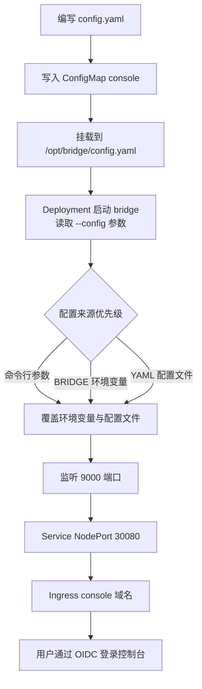

本目录介绍 KDO 平台 Console 的部署配置方式，包括配置文件来源、部署清单组成以及访问入口。

## 部署架构

```mermaid
flowchart TD
    A[编写 config.yaml] --> B[写入 ConfigMap console]
    B --> C[挂载到 /opt/bridge/config.yaml]
    C --> D[Deployment 启动 bridge<br/>读取 --config 参数]
    D --> E{配置来源优先级}
    E -->|命令行参数| F[覆盖环境变量与配置文件]
    E -->|BRIDGE 环境变量| F
    E -->|YAML 配置文件| F
    F --> G[监听 9000 端口]
    G --> H[Service NodePort 30080]
    H --> I[Ingress console 域名]
    I --> J[用户通过 OIDC 登录控制台]
```

配置加载优先级从高到低为命令行参数、`BRIDGE_` 前缀环境变量、YAML 配置文件。详细字段与部署清单见 [Kdo Web控制台](./console/)。
