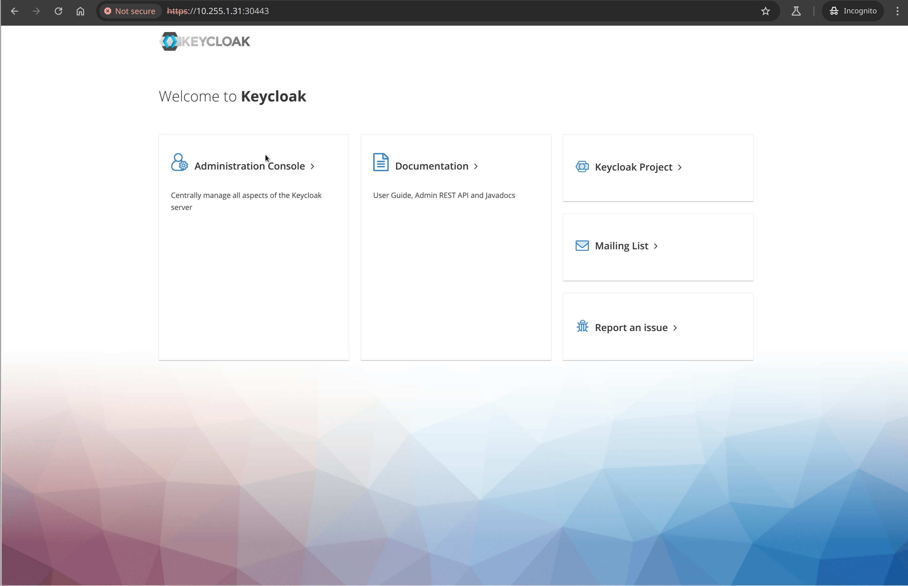

## 安装kdo平台
安装kdo平台有两种模式，一种是只有一个操作系统，没有Kubernetes集群，需要先安装Kubernetes集群后再安装kdo平台，另外一种有现存的Kubernetes集群，只需要安装kdo平台。


## 安装Kubernetes


### 1.使用KeyCloak域名

由于KeyCloak是通过web通过服务的，需要先确认对应的域名，比如:`sso.kube-do.cn`，如果有dns服务器，需要把这个域名指向kdo的master节点
如果需要在的master和集群coredns进行设置

### 1.使用IP地址

由于KeyCloak是通过web通过服务的，需要先确认对应的域名，比如:`sso.kube-do.cn`，如果有dns服务器，需要把这个域名指向kdo的master节点
如果需要在的master和集群coredns进行设置


### 2.创建证书
由于kubernetes要求oidc Issuer必须支持HTTPS，所以在安装KeyCloak前必须先安装好HTTPS证书，比

比如
集群默认域名: `*.kube-do.dev`
Master节点IP: `192.168.1.200`
```shell
openssl req -newkey rsa:2048 -nodes -keyout tls.key -subj "/C=CN/ST=Hunan/L=ChangSha/O=kubedo/OU=kdo/CN=*.kube-do.dev/emailAddress=admin@kube-do.cn" -out tls.csr

openssl x509 -req -extfile <(printf "subjectAltName=DNS:*.kube-do.dev,DNS:keycloak.kubedo-system.svc,DNS:keycloak.kubedo-system.svc.cluster.local,IP:10.255.1.31") -days 365 -in tls.csr -CA /etc/kubernetes/pki/ca.crt -CAkey /etc/kubernetes/pki/ca.key -CAcreateserial -out tls.crt

kubectl create secret tls -n kubedo-system keycloak-crt --cert=./tls.crt --key=./tls.key 
```

### 3. 安装KeyCloak
kdo平台是基于KeyCloak进行oidc认证的，所以需要安装KeyCloak，安装KeyCloak是通过Helm命令行进行安装的。

```shell
# 1. 定义环境变量
#KeyCloak管理员的用户
export kcUser=admin
#KeyCloak管理员的密码
export kcPass=1MKok8eCvp
#kdo安装节点Master的IP,如果有多个Master，就指定第一个
export nodeIP=10.255.1.31
#kdo集群的默认域名后缀
export defaultDomain=kube-do.cn


# 2. 安装nfs
# 如果没有nfs server，需要手动安装一个
mkdir -p /data/nfs
echo "/data/nfs *(rw,sync,no_root_squash,no_all_squash)" >> /etc/exports
systemctl restart nfs-server
systemctl enable nfs-server


# 如果已经有nfs server，把nfs.server和nfs.path改为对应的nfs参数
helm install nfs-subdir-external-provisioner oci://quay.io/kubedocharts/nfs-subdir-external-provisioner \
    --namespace kubedo-system \
    --create-namespace \
    --set storageClass.defaultClass=true \
    --version 4.0.18 \
    --set nfs.server=$nodeIP \
    --set nfs.path=/data/nfs

# 确认nfs provisioner已经启动
#[root@node31 etcd]# kubectl get pod -n kubedo-system 
#NAME                                               READY   STATUS    RESTARTS   AGE
#nfs-subdir-external-provisioner-788b59d4c9-q7mt7   1/1     Running   0          10s


# 3. 安装 keycloak
helm install keycloak  oci://quay.io/kubedocharts/keycloak \
     --version 15.1.4 --namespace kubedo-system \
     --set auth.adminUser=$kcUser \
     --set auth.adminPassword=$kcPass \
     --set tls.enabled=true \
     --set tls.autoGenerated=true \
     --set service.type=NodePort \
     --set service.nodePorts.https=30443
     
# 检查pod是否正常运行，确认keycloak-0已经ready
kubectl get pod -n kubedo-system 

#[root@node31 ~]# kubectl get pod -n kubedo-system
#NAME                                               READY   STATUS    RESTARTS      AGE
#keycloak-0                                         1/1     Running   0             36s
#keycloak-postgresql-0                              1/1     Running   0             36s


# 4. 更新ssl证书
openssl req -newkey rsa:2048 -nodes -keyout tls.key -subj "/C=CN/ST=Hunan/L=ChangSha/O=kubedo/OU=kdo/CN=*.$defaultDomain/emailAddress=$kcUser@$defaultDomain" -out tls.csr

# 这里使用kubernetes的ca证书作为ca
openssl x509 -req -extfile <(printf "subjectAltName=DNS:*.$defaultDomain,DNS:keycloak.kubedo-system.svc,DNS:keycloak.kubedo-system.svc.cluster.local,IP:$nodeIP") \
-days 3650 -in tls.csr -CA /etc/kubernetes/pki/ca.crt -CAkey /etc/kubernetes/pki/ca.key -CAcreateserial -out tls.crt


# 替换原来的证书，并且重启keycloak
kubectl delete secret -n kubedo-system keycloak-crt && kubectl create secret tls -n kubedo-system keycloak-crt --cert=./tls.crt --key=./tls.key  && kubectl rollout restart statefulset -n kubedo-system keycloak
```


### 4. 设置KeyCloak
key安装完成后，需要对其进行设置

```shell
# 在master节点执行
kubectl exec -it  -n kubedo-system keycloak-0 -- bash

# 进行容器后设置环境变量
export kcUser=admin
export kcPass=1MKok8eCvp
export kdoPass=kubedo
# 用户和密码选择创建keycloak时设置的用户和密码
# 1. 创建realm kdo
kcadm.sh create realms -s realm=kdo -s enabled=true --server http://localhost:8080 --realm master --user $kcUser --password $kcPass

# 添加client-scopes openid
kcadm.sh create client-scopes -r kdo \
-b '{"name":"openid","protocol":"openid-connect","attributes":{"include.in.token.scope":"true","display.on.consent.screen":"true","consent.screen.text":"openid","claim.name":"openid"}}'  \
--server http://localhost:8080 --realm master --user $kcUser --password $kcPass

# 添加client-scopes groups
kcadm.sh create client-scopes -r kdo \
-b '{"name":"groups","protocol":"openid-connect","assigned type":"default","attributes":{"include.in.token.scope":"true","display.on.consent.screen":"true","consent.screen.text":"groups","claim.name":"groups"}}'  \
--server http://localhost:8080 --realm master --user $kcUser --password $kcPass

# 2. 创建client kdo 在realm kdo
kcadm.sh create clients -r kdo -s clientId=kdo -s secret=kubedo -s 'redirectUris=["*"]' --server http://localhost:8080 --realm master --user $kcUser --password $kcPass

# 3. 创建kdo用户
kcadm.sh create users -s username=kdo -r kdo -s email=kdo@kube-do.cn -s emailVerified=true -s enabled=true  --server http://localhost:8080 --realm master --user $kcUser --password $kcPass
# 3. 设置kdo用户的密码
kcadm.sh set-password  --username kdo  -r kdo --new-password $kdoPass  --server http://localhost:8080 --realm master --user $kcUser --password $kcPass
```
