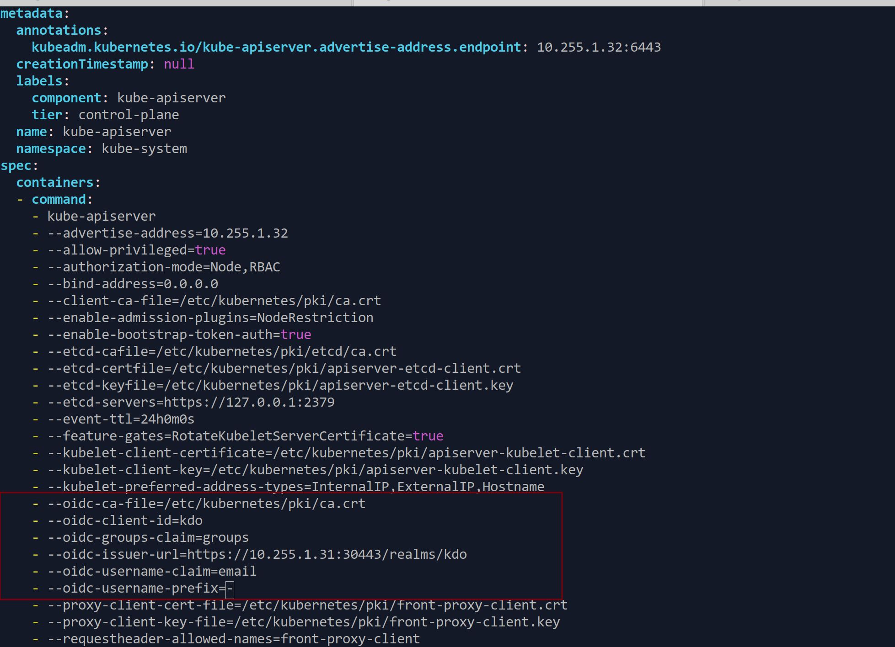

1. TOC
{:toc}


{: .note }
对于Linux环境下的安装，KDO平台既支持云端部署也支持本地部署，包括虚拟机和物理服务器等多种形式。
安装KDO平台有两种主要模式：
无现有Kubernetes集群的情况：如果您的环境中没有现成的Kubernetes集群，首先需要在Linux操作系统上安装Kubernetes集群。完成这一步骤后，再进行KDO平台的安装。这种方式适合希望从零开始构建整个云原生基础设施的用户。
已有Kubernetes集群的情况：如果您已经有了一套运行中的Kubernetes集群，则可以直接在其上安装KDO平台。这种方式简化了部署流程，使得您能够迅速利用现有的资源来管理和扩展应用


## 在现存的Linux操作系统安装kdo平台

要在现有的Linux操作系统上安装KDO平台，推荐使用REHL9(AlmaLinux 9/Rockey 9)或Ubuntu 22.04及以上版本。旧版本的操作系统由于内核较老，可能无法支持某些新特性。主要分为以下两个部分：
1. [安装Kubernetes集群](./kubernetes)
2. [安装KDO平台](./kdo)


## 在现存的Kubernetes集群上安装kdo平台

如果已经有Kubernetes集群(v1.28以上)，只需要安装KDO平台，主要有两个部分：
1. [根据OIDC平台设置Kubernetes](#根据oidc平台设置kubernetes)
2. [安装KDO平台](./kdo)


## 根据OIDC平台设置Kubernetes

{: .note }
通过vim打开`/etc/kubernetes/manifests/kube-apiserver.yaml`这个文件，在`spec->containers->command`添加对应的OIDC的参数。
如果是其他OIDC Provider，可以根据其提供的参数进行修改，[更多信息](https://kubernetes.io/zh-cn/docs/reference/access-authn-authz/authentication/)。
```shell
vim /etc/kubernetes/manifests/kube-apiserver.yaml
```


### 修改API Server参数

```yaml 
spec:
  containers:
  - command:
    # 在末尾添加以下参数，如果已经存在，需要修改这些参数
    - --oidc-ca-file=/etc/kubernetes/pki/ca.crt
    - --oidc-client-id=kdo
    - --oidc-groups-claim=groups
    - --oidc-issuer-url=https://${NodeIP}:30443/realms/kdo
    - --oidc-username-claim=email
    - --oidc-username-prefix=-
```
{: .warning }
如果有多个Master节点，那每个Master节点都需要更改。


## 平台组件访问

{: .note }
由于KDO是由多个开源组件组成的，所以需要通过不同的方式访问不同的组件，这里列出了KDO平台各个组件的访问地址。
`KDO`、`KeyCloak`、`Harbor`这些组件的控制台，是通过NODE_IP加端口访问，比如KDO平台控制台的默认访问地址是`http://$NODE_IP:30080`，
Grafana这些组件的访问地址是域名访问，比如`Grafana`的默认访问地址是`http://grafana.${DEFAULT_DOMAIN}`，这些需要在`/etc/hosts`文件中(Windows是`C:\Windows\System32\drivers\etc\hosts`)添加域名解析，或者通过域名解析访问。

### 默认项目
KDO平台默认创建了项目kdo, 里面有4个环境：`开发(dev)`、`测试(test)`、`预发(stage)`、`生产(prod)`。
如果是内置的KeyCloak平台，已经创建四个用户：项目管理员： `pa1`，项目开发者: `dev1`，项目测试人员: `qa1`, 项目运维人员: `ops1`, 他们的默认密码都是: `Kdo#2025`
现在可以在项目[kdo创建一个应用](/docs/dev/applications/repository#创建应用)来体验KDO平台了。

假设这个KDO集群的NODE_IP是**10.22.1.20**，默认域名后缀是**kube-do.dev**，那么访问地址如下：


| 控制台                                                  | 功能                   | 默认访问地址                                                            | 默认用户密码                                         |     
|:-----------------------------------------------------|:---------------------|:------------------------------------------------------------------|:-----------------------------------------------|
| KDO平台控制台 [管理员页面介绍](/docs/admin) [开发者页面介绍](/docs/dev) | KDO整体功能管理            | `http://${NODE_IP}:30080` 比如： http://10.22.1.20:30080             | 管理员账号：admin/Kdo@Pass#2025 ， 开发者账号：pa1/Kdo#2025 |
| KeyCloak控制台                                          | OIDC认证管理、用户管理        | `https://${NODE_IP}:30443` 比如： https://10.22.1.20:30443 (需要HTTPS) | 管理员账号：admin/Kdo@Pass#2025                      |              
| Harbor控制台                                            | 镜像仓库管理，一般不用操作        | `http://${NODE_IP}:30002`比如： http://10.22.1.20:30002              | 管理员账号：admin/Kdo@Pass#2025                      |              
| [Grafana控制台](/docs/observability/monitoring)         | 告警管理、自定义监控、监控/日志高级功能 | `http://grafana.${DEFAULT_DOMAIN}` 比如： http://grafana.kube-do.dev | admin/KdoGrafana2025 其他用户可以通过OIDC登录            |  