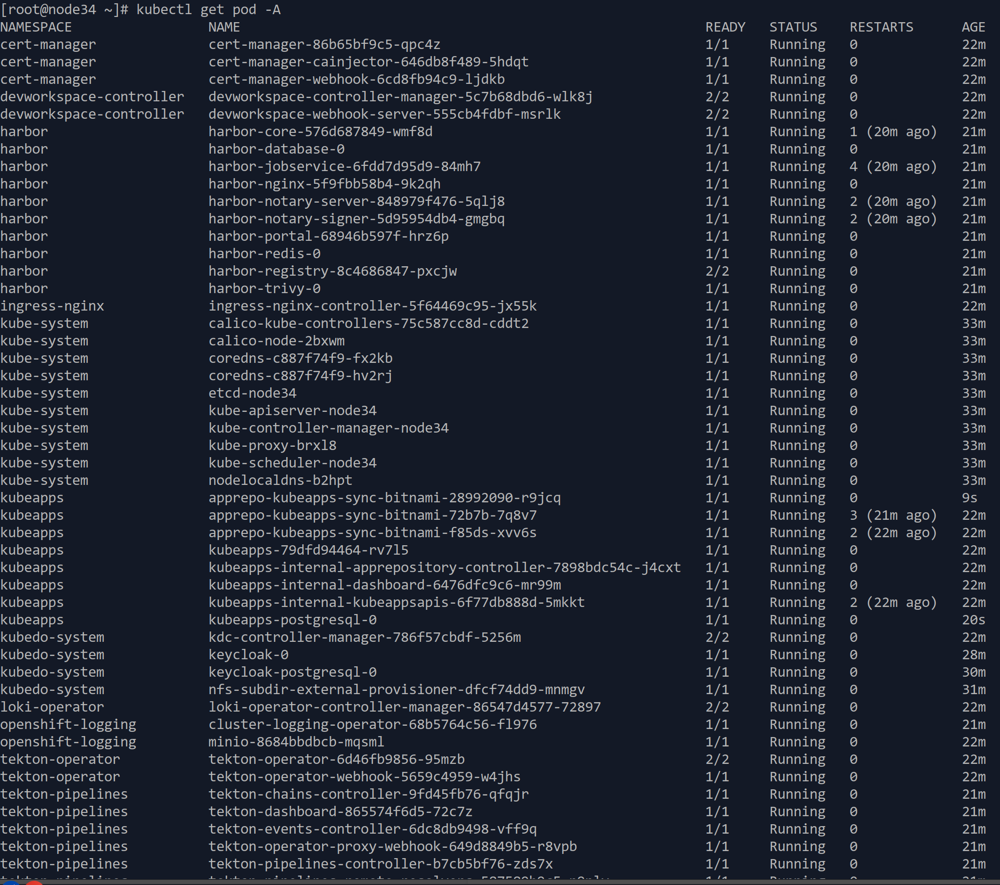

1. TOC
{:toc}


## 安装步骤
kdo平台的安装主要分为三个步骤：
1. **下载安装脚本**
2. **安装前检查**
3. **运行安装脚本**

## 下载安装脚本
首先下载KDO安装脚本到Kubernetes的Master节点，linux平台可以通过`wget`或`curl`下载。
[kdo平台安装脚本](https://gitee.com/kube-do/docs/releases/download/latest/install.zip)

```shell
#下载安装脚本
wget https://gitee.com/kube-do/docs/releases/download/latest/install.zip
# 解压文件,进入安装目录
unzip -x install.zip && cd install
# 设置安装脚本为可执行 
chmod +x kdo-install.sh
```

## 安装前检查
如果是其他的OIDC认证平台，需要通过`vim`手动修改这个`kdo-install.sh`脚本，把OIDC对应环境变量修改为对应OIDC认证平台的信息，
这里需要[Kubernetes的ODIC参数](../index.md#根据oidc平台设置kubernetes)保持一致。

```shell
vim kdo-install.sh
#如果是其他OIDC平台，需要设置这些环境变量
export OIDC_CLIENT_ID=kdo
export OIDC_CLIENT_SECRET=kubedo
export OIDC_ISSUER_URL=https://$NODE_IP:30443/realms/kdo
```

## 运行安装脚本

这个脚本自动化安装脚化，一般只需要两个参数就可以运行了，节点IP（注意，这个IP必须能被客户端访问到）和默认域名后缀。
如果采用的内置KeyCloak作为认证平台， 这两个参数需要和[安装KeyCloak](../keycloak#安装keycloak)的保持一致。
```shell
# 根据环境变量运行，NODE_IP和DEFAULT_DOMAIN这两个环境在安装KeyCloak已经设置过
./kdo-install.sh $NODE_IP $DEFAULT_DOMAIN
# 直接添加参数运行
./kdo-install.sh 10.22.1.20 kube-do.dev
```
这里由于NODE_IP和DEFAULT_DOMAIN已经在环境变量设置过，可以直接获取，当然也可以手动输入这两个参数。


### 中途确认

由于安装的组件比较多，有些组件需要等其他组件初始化完成后才能继续安装，这里另外打开一个Linux Terminal，
在Master节点运行 `kubectl get pod -A`确认所有Pod已经正常运行（ready）



### 安装验证


1. 安装完成后，运行`kubectl get pod -n kubedo-system`，根据提示确认console组件已经启动，就可以访问平台了, KDO平台默认访问地址是`http://$NODE_IP:30080`
2. 已经创建默认的项目kdo, 里面有4个环境：`开发(dev)`、`测试(test)`、`预发(stage)`、`生产(prod)`。 如果是内置的KeyCloak平台，已经创建四个用户: 项目管理员： pa1，项目开发者: dev1，项目测试人员: qa1, 项目运维人员: ops1, 他们的默认密码都是: Kdo#2025
   现在就可以通过这些用户来体验KDO平台了.

   
## 平台组件访问
由于KDO是由多个开源组件组成的，所以需要通过不同的方式访问不同的组件，这里列出了KDO平台各个组件的访问地址。 
KDO、KeyCloak、Harbor这些组件的控制台，是通过NODE_IP加端口访问，比如KDO平台控制台的默认访问地址是`http://$NODE_IP:30080`， 
Grafana这些组件的访问地址是域名访问，比如Grafana的默认访问地址是`http://grafana.${DEFAULT_DOMAIN}`，这些需要在`/etc/hosts`文件中(Windows是`C:\Windows\System32\drivers\etc\hosts`)添加域名解析，或者通过域名解析访问。
假设这个KDO集群的NODE_IP是**10.22.1.20**，默认域名后缀是**kube-do.dev**，那么访问地址如下：

| 控制台         | 功能                   | 默认访问地址                             | 默认用户密码              |     
|:------------|:---------------------|:-----------------------------------|:--------------------|
| KDO平台控制台    | KDO整体功能管理            | http://10.22.1.20:30080            | admin/Kdo@Pass#2025 |
| KeyCloak控制台 | OIDC认证管理,用户管理        | https://10.22.1.20:30443 (需要HTTPS) | admin/Kdo@Pass#2025 |              
| Harbor控制台   | 镜像仓库管理,一般不用操作        | http://10.22.1.20:30002            | admin/Kdo@Pass#2025 |              
| Grafana控制台  | 告警管理，自定义监控,监控/日志高级功能 | http://grafana.kube-do.dev         | admin/Kdo@Pass#2025 |          

