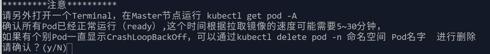
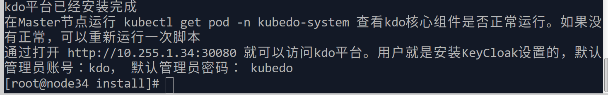

1. TOC
{:toc}


{: .note }
kdo组件的安装主要分为两个步骤：


## 下载安装脚本
首先下载kdo安装脚本到Kubernetes的Master节点，linux平台可以通过wget或curl下载。
[kdo平台安装脚本](https://gitee.com/kube-do/docs/releases/download/latest/install.zip)

```shell
#下载安装脚本
wget https://gitee.com/kube-do/docs/releases/download/latest/install.zip

# 解压文件
unzip -x install.zip

# 进入安装目录
cd install

# 设置安装脚本为可执行 
chmod +x kdo-install.sh  
```


## 运行安装脚本

### 安装前检查

这个脚本自动化安装脚化，一般只需要两个参数就可以运行了，节点IP和默认域名后缀，如果采用的内置KeyCloak作为认证平台，
这两个参数需要和[安装KeyCloak](../keycloak#安装keycloak)的保持一致。

如果是其他的OIDC认证平台，需要手动修改这个`kdo-install.sh`脚本，把OIDC对应环境变量修改为对应OIDC认证平台的信息。

```shell
export OIDC_CLIENT_ID=kdo
export OIDC_CLIENT_SECRET=kubedo
export OIDC_ISSUER_URL=https://$NODE_IP:30443/realms/kdo
```

### 开始安装
由于nodeIP和defaultDomain已经在环境变量设置过，可以直接获取，也可以手动输入这两个参数


### 中途确认

由于安装的组件比较多，有些组件需要等其他组件初始化完成后才能继续安装，这里另外打开一个Terminal，
在Master节点运行 kubectl get pod -A 确认所有Pod已经正常运行（ready）


### 安装验证 
安装完成后，根据提示确认console已经启动，就可以访问平台了。
