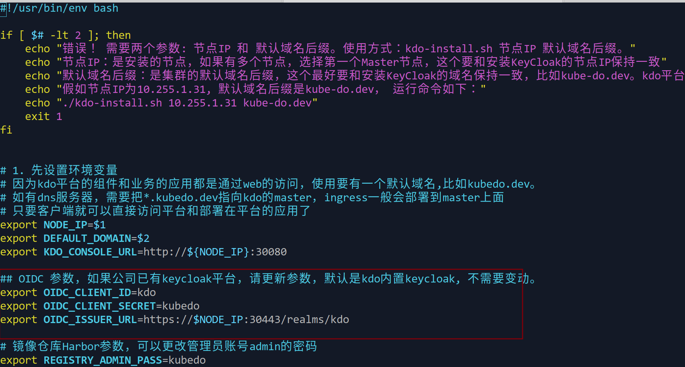
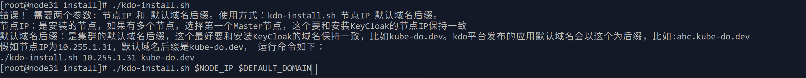
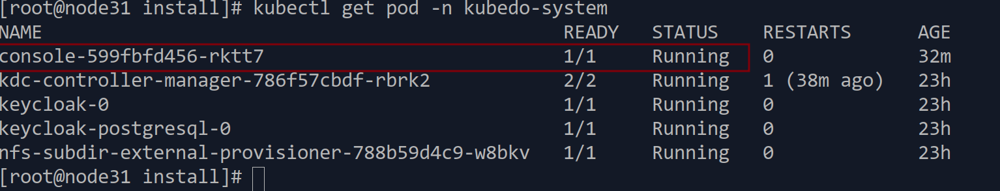

1. TOC
{:toc}


## 安装步骤
kdo平台的安装主要分为三个步骤：
1. **下载安装脚本**
2. **安装前检查**
3. **运行安装脚本**

## 下载安装脚本
首先下载KDO安装脚本到Kubernetes的Master节点，linux平台可以通过`wget`或`curl`下载。
[KDO平台安装脚本](https://gitee.com/kube-do/docs/releases/download/latest/install.zip)

```shell
#下载安装脚本
wget https://gitee.com/kube-do/docs/releases/download/latest/install.zip
# 解压文件,进入安装目录
unzip -x install.zip && cd install
# 设置安装脚本为可执行 
chmod +x kdo-install.sh
```

## 定制安装脚本
1. 可以通过调整脚本的环境变量`KC_PASS`来修改管理员的密码，默认为`Kdo@Pass#2025`
2. 如果是其他的OIDC认证平台，需要把OIDC对应环境变量修改为对应OIDC认证平台的信息，这里需要[Kubernetes的ODIC参数](/docs/install#根据oidc平台设置kubernetes)保持一致。


```shell
vim kdo-install.sh
# 平台管理员的密码
export KC_PASS=Kdo@Pass#2025

# 如果是其他OIDC平台，需要设置这些环境变量
export OIDC_CLIENT_ID=kdo
export OIDC_CLIENT_SECRET=kubedo
export OIDC_ISSUER_URL=https://$NODE_IP:30443/realms/kdo
```

## 运行安装脚本

这个脚本自动化安装脚化，一般只需要两个参数就可以运行了，节点IP（注意：这个IP必须能被客户端访问到）和默认平台域名后缀（这个域名后缀是部署在KDO平台的应用的域名后缀）。
```shell
# 直接添加参数运行
./kdo-install.sh 10.22.1.20 kube-do.dev
```
这里由于NODE_IP和DEFAULT_DOMAIN已经在环境变量设置过，可以直接获取，当然也可以手动输入这两个参数。



## 安装验证


1. 安装完成后，运行`kubectl get pod -n kubedo-system`，根据提示确认console组件已经启动，就可以访问平台了, KDO平台默认访问地址是`http://$NODE_IP:30080`。
[平台组件访问信息](/docs/install#平台组件访问)


   
        

