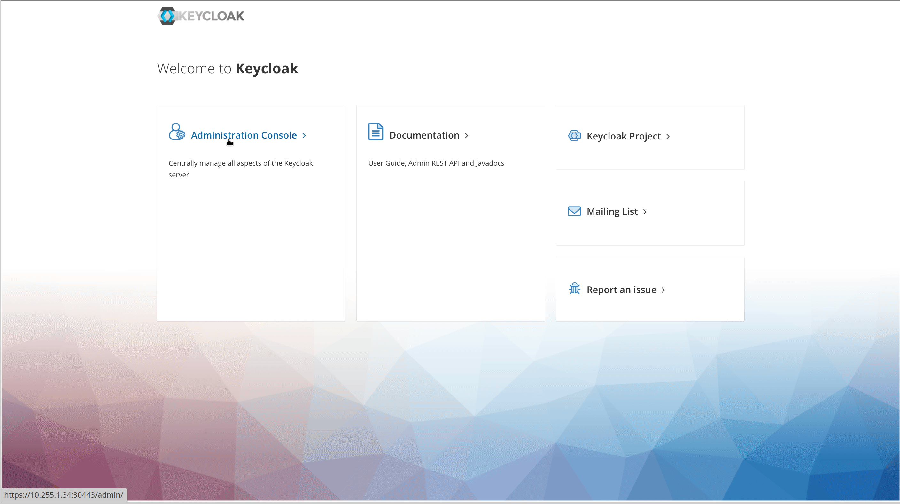

1. TOC
{:toc}


## 安装KeyCloak

{: .note }
由于KDO平台和Kubernetes均基于OIDC（OpenID Connect）协议进行用户认证管理，因此在没有现成的OIDC认证平台的情况下，您需要安装Keycloak以支持这一功能。
Keycloak的安装可以通过Helm命令行工具自动完成。在开始安装之前，请确保所有相关的环境变量已经正确设置。这一步骤对于保证Keycloak能够顺利部署以及后续与KDO平台和Kubernetes的集成至关重要。
[关于KeyCloak](https://www.keycloak.org/)


###  1. 定义环境变量
```shell
# 环境变量KC_USER  KeyCloak平台的管理员用户，这个会和kdo平台的保持一致
# 环境变量KC_PASS  KeyCloak平台的管理员的密码，这个会和kdo平台的保持一致
# 环境变量NODE_IP  KeyCloak安装节点Master的IP，如果有多个Master，就指定第一个，这个和安装kdo组件时节点IP要保持一致（这个IP必须能被客户端访问到）
# DEFAULT_DOMAIN  KDO平台应用的默认域名后缀，这个和安装kdo组件时的保持一致
export KC_USER=kdo
export KC_PASS=1MKok8eCvp
export NODE_IP=10.255.1.31
export DEFAULT_DOMAIN=kube-do.dev
```


###  2. 安装nfs-server和创建nfs-provisioner
```shell
# 如果没有nfs server，需要手动安装一个， Almalinux/CentOS运行以下命令，
# 如果Ubuntu需要运行sudo apt install nfs-kernel-server -y
dnf install nfs-utils -y
mkdir -p /data/nfs
echo "/data/nfs *(rw,sync,no_root_squash,no_all_squash)" >> /etc/exports
systemctl restart nfs-server && systemctl enable nfs-server

# 创建默认的storageclass, 如果已经有nfs服务器，
# 需要把nfs.server和nfs.path改为对应的nfs服务器的参数
helm install nfs-subdir-external-provisioner oci://quay.io/kubedocharts/nfs-subdir-external-provisioner \
    --namespace kubedo-system \
    --create-namespace \
    --set storageClass.defaultClass=true \
    --version 4.0.18 \
    --set nfs.server=$NODE_IP \
    --set nfs.path=/data/nfs


kubectl get pod -n kubedo-system 
# 确认nfs provisioner已经启动
#NAME                                               READY   STATUS    RESTARTS   AGE
#nfs-subdir-external-provisioner-788b59d4c9-q7mt7   1/1     Running   0          10s
```


### 3. 通过Helm安装 keycloak
```shell
helm install keycloak  oci://quay.io/kubedocharts/keycloak \
     --version 15.1.4 --namespace kubedo-system \
     --set auth.adminUser=$KC_USER \
     --set auth.adminPassword=$KC_PASS \
     --set tls.enabled=true \
     --set tls.autoGenerated=true \
     --set service.type=NodePort \
     --set service.nodePorts.https=30443 \
     --set service.nodePorts.http=30440
     

kubectl get pod -n kubedo-system
# 检查keycloak的pod是否正常运行，确认keycloak-0已经ready，
# 根据镜像拉取时间，大约需要3~5分钟。
#NAME                                               READY   STATUS    RESTARTS      AGE
#keycloak-0                                         1/1     Running   0             36s
#keycloak-postgresql-0                              1/1     Running   0             36s
```

### 4. 创建新的ssl证书，替换原来的证书
```shell
# 这里使用kubernetes apiserver的ca证书作为ca，便于管理维护，这里证书时间期限设置为10年。
openssl req -newkey rsa:2048 -nodes -keyout tls.key -subj "/C=CN/ST=Hunan/L=ChangSha/O=kubedo/OU=kdo/CN=*.$DEFAULT_DOMAIN/emailAddress=$KC_USER@$DEFAULT_DOMAIN" -out tls.csr  && \
openssl x509 -req -extfile <(printf "subjectAltName=DNS:*.$DEFAULT_DOMAIN,IP:$NODE_IP") -days 3650 -in tls.csr -CA /etc/kubernetes/pki/ca.crt -CAkey /etc/kubernetes/pki/ca.key -CAcreateserial -out tls.crt

# 替换原来的证书，并且重启keycloak
kubectl delete secret -n kubedo-system keycloak-crt && kubectl create secret tls -n kubedo-system keycloak-crt --cert=./tls.crt --key=./tls.key  && kubectl rollout restart statefulset -n kubedo-system keycloak
```


## 设置KeyCloak
KeyCloak安装完成后，需要对其进行设置，主要进行以下操作：
1. 创建realm kdo
2. 添加client-scopes openid和groups，这是OIDC协议必需的
3. 在realm kdo创建client kdo
4. 添加默认集群管理员kdo并设置密码
5. 添加普通用户dev1和dev2并设置密码

```shell
# 检查pod是否正常运行，确认keycloak-0已经ready
kubectl get pod -n kubedo-system 

#[root@node31 ~]# kubectl get pod -n kubedo-system
#NAME                                               READY   STATUS    RESTARTS      AGE
#keycloak-0                                         1/1     Running   0             36s
#keycloak-postgresql-0                              1/1     Running   0             36s

# 在master节点执行，需要进入keycloak容器里面进行执行
kubectl exec -it  -n kubedo-system keycloak-0 -- bash

# 进行容器后设置环境变量
# 普通用户的密码，这里可以设置其他密码,平台超级管理员admin用户的密码和KeyCloak是一致的
export devPass=kubedo

#***注意，由于kcadm.sh脚本机制问题，以下这些命令只能一条一条执行***
# 1. 创建realm kdo
kcadm.sh create realms -s realm=kdo -s enabled=true --server http://localhost:8080 --realm master --user $KEYCLOAK_ADMIN --password $KEYCLOAK_ADMIN_PASSWORD
# 调整session超时时间，不然会频繁登出
kcadm.sh update realms/kdo -s 'ssoSessionIdleTimeout=86400' -s 'accessTokenLifespan=43200' --server http://localhost:8080 --realm master --user $KEYCLOAK_ADMIN --password $KEYCLOAK_ADMIN_PASSWORD

# 2. 添加client-scopes openid和groups，这是oidc协议必要的
# 添加client-scopes openid
kcadm.sh create client-scopes -r kdo \
-b '{"name":"openid","protocol":"openid-connect","attributes":{"include.in.token.scope":"true","display.on.consent.screen":"true","consent.screen.text":"openid","claim.name":"openid"}}'  \
--server http://localhost:8080 --realm master --user $KEYCLOAK_ADMIN --password $KEYCLOAK_ADMIN_PASSWORD
# 添加client-scopes groups
kcadm.sh create client-scopes -r kdo \
-b '{"name":"groups","protocol":"openid-connect","attributes":{"include.in.token.scope":"true","display.on.consent.screen":"true","consent.screen.text":"groups","claim.name":"groups"}}'  \
--server http://localhost:8080 --realm master --user $KEYCLOAK_ADMIN --password $KEYCLOAK_ADMIN_PASSWORD

# 3. 创建client kdo 在realm kdo
kcadm.sh create clients -r kdo -s clientId=kdo -s secret=kubedo -s 'redirectUris=["*"]' -s implicitFlowEnabled=true --server http://localhost:8080 --realm master --user $KEYCLOAK_ADMIN --password $KEYCLOAK_ADMIN_PASSWORD

# 4. 添加默认集群管理员kdo并设置密码，kdo的密码和KeyCloak管理员的密码保持一致
kcadm.sh create users -s username=kdo -r kdo -s email=kdo@kube-do.dev -s emailVerified=true -s enabled=true  --server http://localhost:8080 --realm master --user $KEYCLOAK_ADMIN --password $KEYCLOAK_ADMIN_PASSWORD
kcadm.sh set-password  --username kdo -r kdo --new-password $KEYCLOAK_ADMIN_PASSWORD --server http://localhost:8080 --realm master --user $KEYCLOAK_ADMIN --password $KEYCLOAK_ADMIN_PASSWORD

# 5. 添加普通用户dev1和dev2并设置密码
kcadm.sh create users -s username=dev1 -r kdo -s email=dev1@kube-do.dev -s emailVerified=true -s enabled=true  --server http://localhost:8080 --realm master --user $KEYCLOAK_ADMIN --password $KEYCLOAK_ADMIN_PASSWORD
kcadm.sh create users -s username=dev2 -r kdo -s email=dev2@kube-do.dev -s emailVerified=true -s enabled=true  --server http://localhost:8080 --realm master --user $KEYCLOAK_ADMIN --password $KEYCLOAK_ADMIN_PASSWORD
kcadm.sh set-password --username dev1 -r kdo --new-password $devPass  --server http://localhost:8080 --realm master --user $KEYCLOAK_ADMIN --password $KEYCLOAK_ADMIN_PASSWORD
kcadm.sh set-password --username dev2 -r kdo --new-password $devPass  --server http://localhost:8080 --realm master --user $KEYCLOAK_ADMIN --password $KEYCLOAK_ADMIN_PASSWORD
```

## KeyCloak Web页面设置
通过命令行设置后，还需要通过web访问keycloak设置一下。访问地址`https://$NODE_IP:30443`，比如这个节点的IP是10.255.1.31，那就访问`https://10.255.1.31:30443`。
由于这是自签证书，可能会有证书错误，忽略即可。用户(`$KC_USER`)和密码(`$KC_PASS`)是上面的设置环境变量，比如上面设置的是：`kdo/1MKok8eCvp` 。


这样KeyCloak就设置好了


## 继续安装kdo平台组件
KeyCloak设置好后，就可以继续[安装kdo平台组件](../kdo)。
