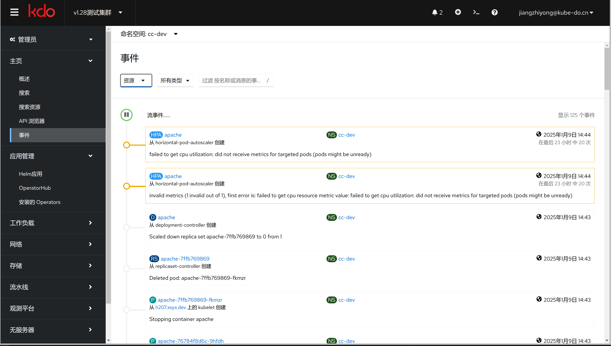
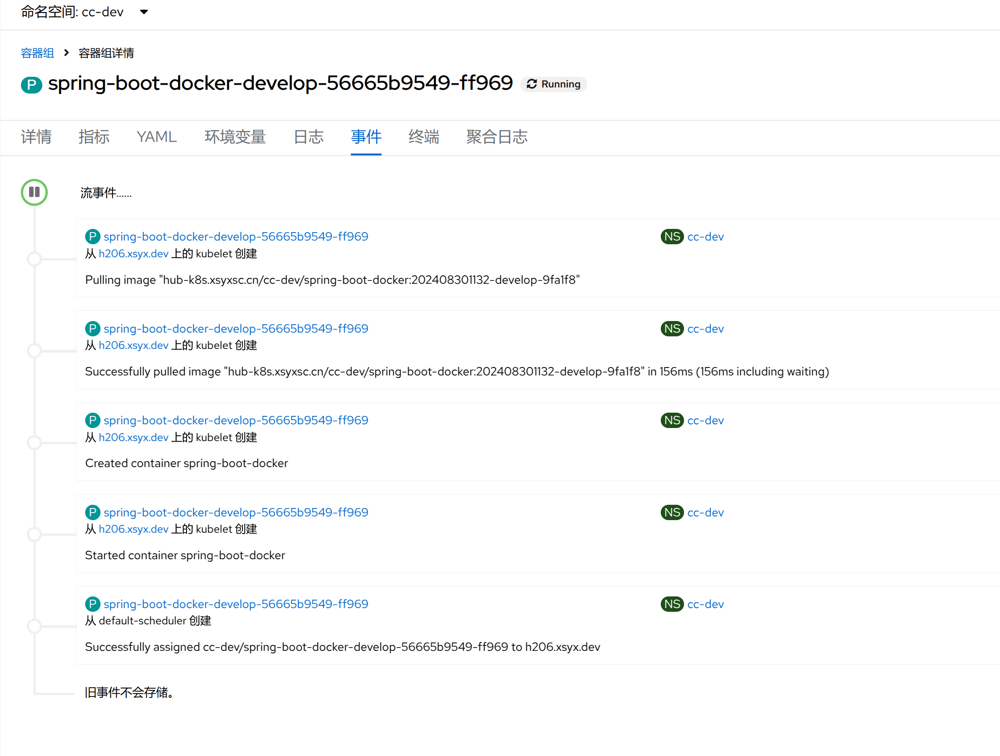
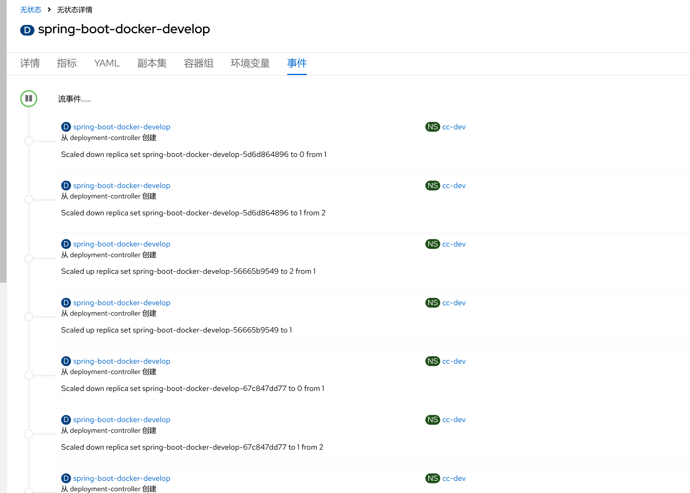
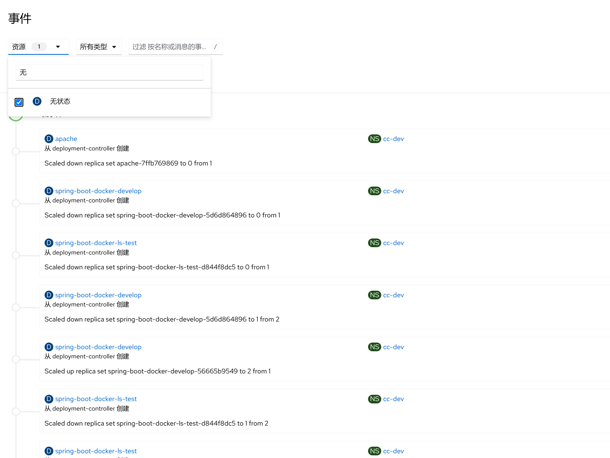

1. TOC
{:toc}

## 介绍

{: .note }
在 Kubernetes 中，事件(Event)是一种资源类型，用于记录集群内发生的各种活动和状态变化。
事件为集群操作提供了重要的上下文信息，帮助管理员诊断问题、了解系统行为以及跟踪关键操作。
每个事件都包含有关其来源（例如哪个组件触发了该事件）、涉及的对象（如 Pod、Service 等）以及发生的时间戳等详细信息。

## 主要特征
1. **对象相关性:** 事件通常与特定的 Kubernetes 资源对象关联，比如容器组(Pod)、无状态(Deployment)或者持久化卷声明(PersistentVolumeClaim)。
2. **来源:** 指明了事件是由哪个组件或控制器生成的，例如 kubelet、scheduler 或者 controller-manager。
3. **类型:** 可以是 Normal（正常操作的信息性消息）或 Warning（表示潜在的问题或错误）。
4. **原因:** 描述了导致事件的具体原因，如 FailedScheduling、PullingImage 等。
5. **消息:** 提供了一个简短的人类可读的消息，解释发生了什么。
6. **首次/最后出现时间:** 记录了事件首次和最近一次出现的时间。
7. **计数:** 显示自首次出现以来该事件发生的次数。

## 平台集成

{: .note }
在KDO平台中，众多资源对象（包括容器组、无状态应用、有状态应用及节点等）均已集成事件菜单。通过这些事件菜单，用户可以方便地获取每个资源对象相关的事件详情。

### 容器组

### 无状态

## 事件操作
在KDO平台中，用户能够对资源对象的事件进行灵活过滤，并且可以通过关键字快速查找特定事件。
这种强大的事件管理功能允许您根据具体需求定制视图，精准定位到关心的事件信息。

