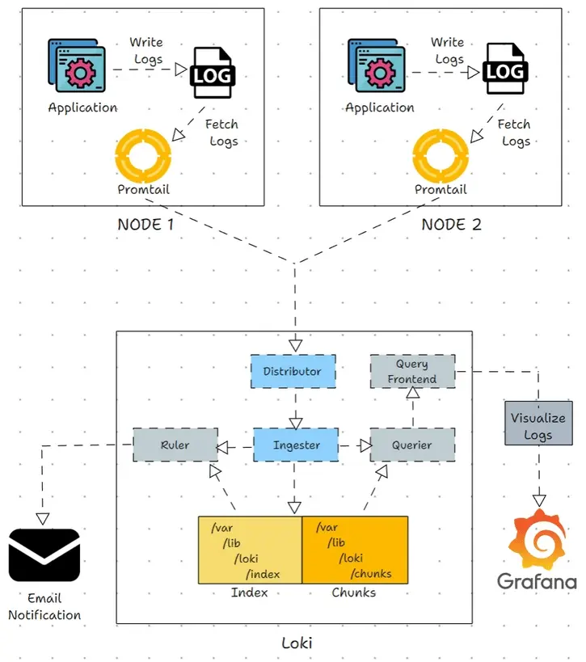
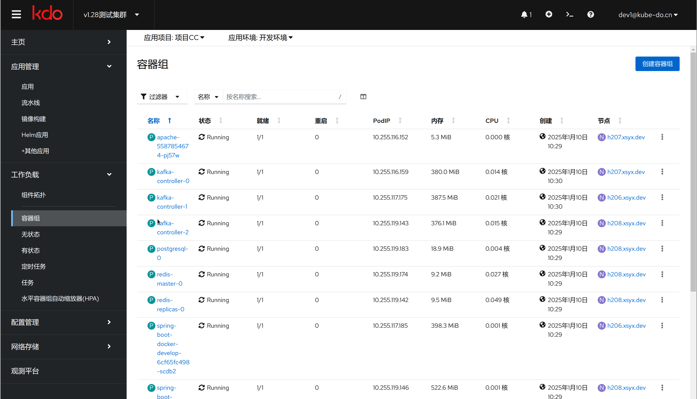
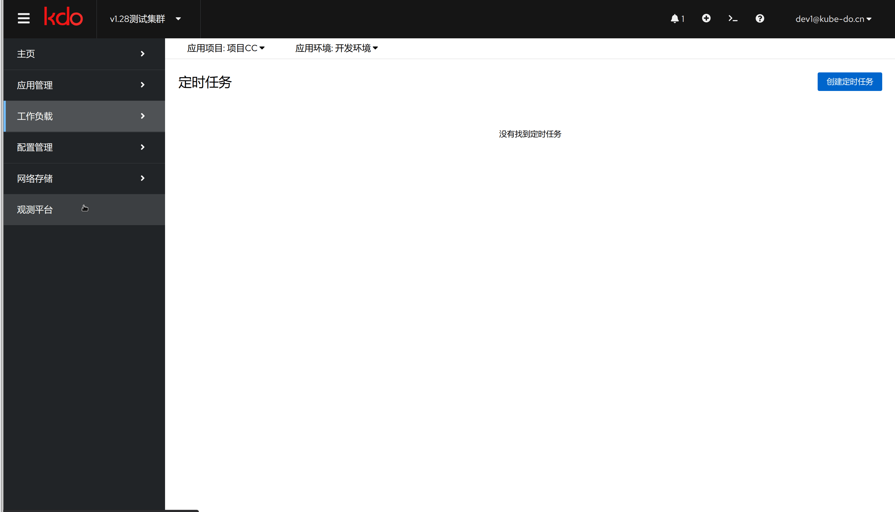

1. TOC
{:toc}

## 介绍

{: .note }
应用日志可以让你了解应用内部的运行状况。日志对调试问题和监控集群活动非常有用。 
大部分现代化应用都有某种日志记录机制。同样地，容器引擎也被设计成支持日志记录。
针对容器化应用，最简单且最广泛采用的日志记录方式就是写入标准输出和标准错误流。

## kdo日志平台(Grafana Loki)

{: .note }
kdo的日志平台采用基于[Grafana Loki](https://grafana.com/docs/loki/latest/), 它是由 Grafana Labs 开发的一个开源的日志聚合系统，它被设计为易于操作且成本效益高。
通过标签（label）来索引日志流，而不是对日志内容本身进行索引，这使得它的索引非常小。日志数据本身则被压缩成大块(chunk)存储，从而降低了存储成本。

###  Grafana Loki架构

{: .note }
现在，让我们看看 Grafana Loki Logging 是如何工作的。该图显示了 Grafana Loki 如何收集、存储、查询和可视化日志。

1. 在 Grafana Loki 中，agent 负责从文件、容器、pod、应用程序和系统日志中收集日志。
2. Loki 使用日志收集代理（agent）来收集日志，如果您在 Kubernetes 中使用 Loki，代理将作为守护程序集（Daemonset）部署，因为我们需要来自集群每个可用节点的日志。
3. Promtail 是该架构中使用的代理（agent），Promtail 收集日志，然后过滤和压缩日志以节省存储空间。
4. 压缩日志后，它会为日志提供一个标签并将其发送给 Loki。
5. 从 Promtail 接收到日志之后，Loki 将每个日志存储为一个块，该块将日志消息收集在一个文件中，以节省存储空间和有效检索。
它还为块提供标签和时间戳。每当存储块时，它都会为每个块创建一个索引，其中包含块的时间戳、标签和位置。
6. Loki 使用 LogQL 查询语言查询日志，LogQL 允许我们根据我们选择的标签和值过滤、聚合和分析日志。
7. 通过将 Loki 添加到 Grafana，您可以可视化查询的日志或使用 LogCLI 从 CLI 查询日志。

### Grafana Loki 组件

{: .note }
Grafana Loki 包含很多组件，promtail, distributor, ingester, querier, ruler, query frontend, Grafana

1. **Promtail:** 
Promtail 是充当 Loki 的日志代理（agent）的重要组件。它的功能是从系统中收集每个日志，标记它，然后将其发送给 Loki。Loki 从本地日志文件和系统日志中收集日志。 您必须在要收集日志的每个系统中安装 Promtail，同样，如果您在 Kubernetes 上使用 Loki，则必须在每个节点中部署 Promtail 作为守护进程集（Daemonset）。

2. **Distributor:** 
Distributor 是一个无状态组件，负责处理和验证从日志代理（如 Promtail）接收的日志，并将日志分发到 ingester。
当 Distributor 收到日志时，它首先验证日志是否符合配置，例如有效标签、不是较旧的时间戳以及日志是否太长。
验证完成后，Distributor 会根据一致性哈希将日志分发到每个 ingester，以确保平均分配给每个可用的 ingester。

3. **Ingester:** 
Ingester 负责在其文件系统上存储和索引从 Distributor 收到的日志，并定期将日志传输到持久性存储（长期存储），如 S3。
Ingester 根据配置设置保留策略（自动日志删除时间）。
它使用时间序列数据库以一定的结构格式存储日志，这简化了高效查询和日志过期的过程。

4. **Ruler:** 
Ruler 是 Loki 的监控和告警组件，其作用是记录指标并根据收到的日志数据触发告警。它不是直接衡量指标，而是将日志数据转换为指标。
Ruler 监控日志并在检测到任何问题时发出通知，并通过电子邮件或 Slack 发送通知。

5. **Querier:** 
顾名思义，Querier 负责使用 LogQL 查询语言从存储和 ingester 中查询日志。它根据用户查询（如时间戳、标签等）过滤和聚合日志。
查询器缓存之前的查询，以防止一次又一次地查询相同的日志，它只查询一次具有相同时间戳、标签和日志消息的日志。

6. **Query Frontend:** 
Query Frontend 是一个与用户交互的无状态组件，它负责处理查询请求、执行查询以及通过 Grafana 仪表板可视化日志。
Query Frontend 将大型查询拆分为多个较小的查询，并同时运行所有查询，这可以防止大型查询在单个查询中导致内存问题，并有助于加快执行速度。

7. **Grafana:**
Grafana 是一个开源工具，可帮助查询、可视化和监控日志。我们可以将 Loki 与 Grafana 集成，并在仪表板、图表等方式可视化日志数据。
Grafana 使用查询语言 LogQL 与 Grafana 集成，我们也可以在 Grafana 中编写 LogQL 查询来过滤和查询日志。

8. **Log Storage**
Loki 存储日志数据，提高查询和接收日志的效率。它将日志数据压缩成块，根据时间进行组织，并为其提供标签和时间戳。然后，它以键值对格式为每个块创建一个索引，其中块时间戳和标签等。
例如，将块的索引视为一本书的索引。
Chunks 和 Index 可以存储在各种后端对象存储或文件系统中。
一旦存储了块，它就会为数据创建一个保留期，并根据保留期自动删除。
如果您使用文件系统作为存储，则块和索引的默认存储路径是 /var/lib/loki/chunks 和 /var/lib/loki/index。

###  Grafana Loki的特点包括
1. **低成本:** 通过避免全文索引和高效压缩，Loki 减少了所需的存储空间和计算资源。 
2. **简单性:** 架构相对简单，易于部署和维护。 
3. **与Prometheus类似:** 使用与 Prometheus 相同的标签概念，使得学习曲线平缓，并且可以很好地与 Prometheus 配合使用。 
4. **查询语言:** 提供了一个类似于 PromQL 的查询语言，用于查询和聚合日志数据。 
5. **集成:** 与 Grafana 深度集成，可以方便地在 Grafana 中可视化日志数据。

### Grafana Loki 和 EFK Stack 之间的区别

| Grafana Loki                    | EFK Stack                                                                 |
|:--------------------------------|:--------------------------------------------------------------------------|
| Loki 收集日志、存储日志，使用 Grafana 可视化日志 | EFK Stack 使用 Elasticsearch 来收集和存储日志，使用 Logstash 来解析和处理日志，使用 Kibana 来可视化日志 |
| Loki 压缩日志并将它们存储为块               | EFK Stack 将每个日志条目存储在 Elasticsearch 的 JSON 文件中                             |
| Loki 以其效率和可扩展性而闻名               | EKS以其适应各种环境的能力而闻名                                                         |
| 水平缩放                            | 垂直缩放                                                                      |
| Loki 使用分布式架构                    | EFK Stack 使用客户端-服务器架构                                                     |
| 资源使用率低                          | 资源使用率高                                                                    |
| 使用 Grafana 可视化日志                | 使用 Kibana 可视化日志                                                           |

## 日志访问

访问日志主要有两种方式: 

### 容器组页面访问

{: .note }
访问容器组菜单，有`日志`和`聚合日志`两个菜单，其中`日志`是当前容器组打印到标准输出(stdout)的日志，`聚合日志`是存储在[kdo日志平台](#kdo日志平台grafana-loki))的日志.

### 观测平台访问

{: .note }
访问观测平台菜单，有`日志`菜单，这里可以根据容器组(Pod)查找日志，这里主要适合容器组已经被销毁的应用，在容器组菜单无法查询日志。

