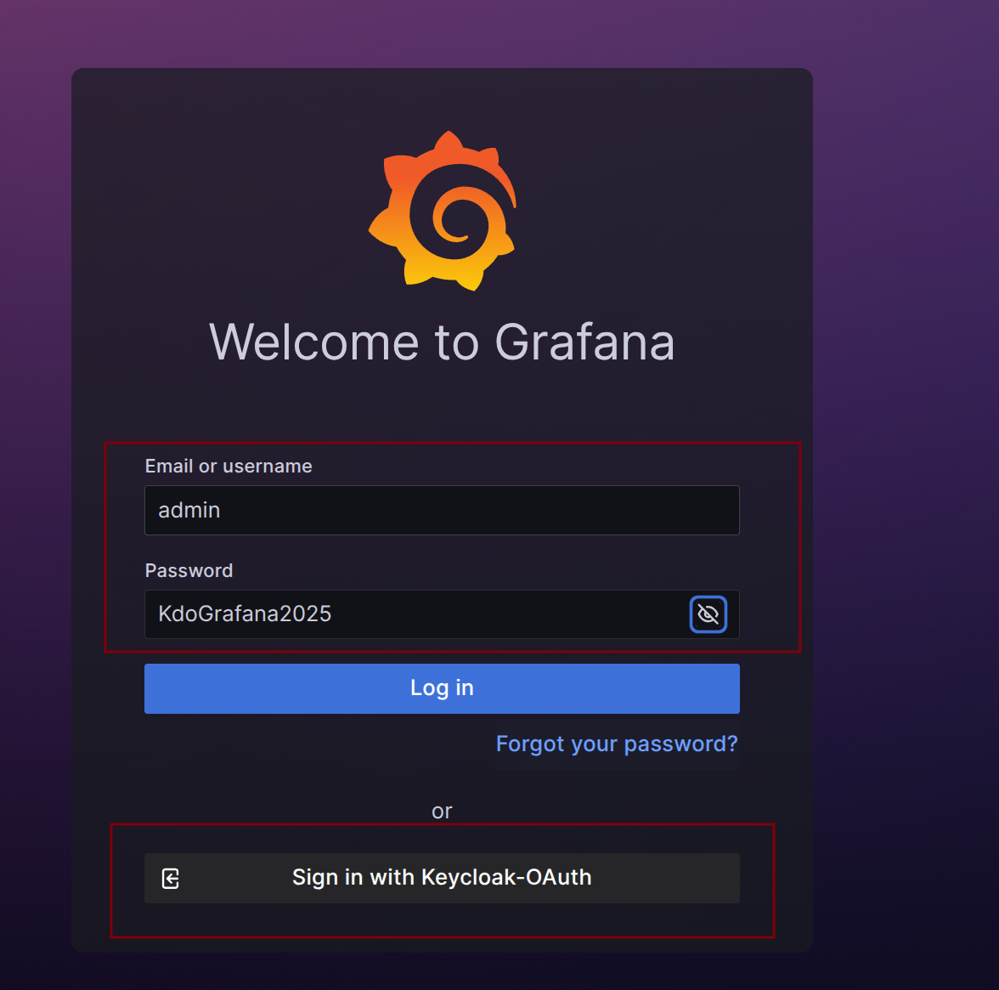

1. TOC
{:toc}

## 介绍
{: .note }
可观测性中心旨在提供全面的监控和可观测性支持，以确保系统的稳定性、性能和安全性。可观测性中心为企业提供了一个集中化的平台，使用户能够实时监控、分析和管理系统的运行状态和关键指标。它包括观测中心面板、监控大屏、全局日志、报警等功能，帮助用户快速发现和解决潜在的问题，提高系统的可靠性和可用性。
在本章节中，您将了解可观测性中心的各个组成部分的功能和优势，如何配置和使用这些功能，以及最佳实践和建议。

## 监控告警架构

从上图可以看到，整个 Prometheus 可以分为四大部分，分别是：

1. **Prometheus 服务器：** Prometheus Server 是 Prometheus组件中的核心部分，负责实现对监控数据的获取，存储以及查询。
2. **Exporter 业务数据源：** 业务数据源通过 Pull/Push 两种方式推送数据到 Prometheus Server。
3. **AlertManager 报警管理器：** Prometheus 通过配置报警规则，如果符合报警规则，那么就将报警推送到 AlertManager，由其进行报警处理。
4. **可视化监控界面：** Prometheus 收集到数据之后，由 WebUI 界面进行可视化图标展示。目前我们可以通过自定义的 API 客户端进行调用数据展示，也可以直接使用 Grafana 解决方案来展示。

## Grafana登录

Grafana是一个非常强大的开源监控和可视化工具，用于监控和可视化各种类型的数据，如应用程序、服务器、网络、数据库等。
具体操作文档，请参考：[Grafana官方文档](https://grafana.org.cn/docs/grafana/latest/).

Grafana的登录地址默认是 `http://grafana.${DEFAULT_DOMAIN}` 比如： http://grafana.kube-do.dev。
可以选择管理员账号登录，默认账号密码是`admin/KdoGrafana2025`。
也选择通过`OAuth`登录，这个和`KDO`平台的登录方式一致。

## KDO告警模块
KDO的告警模块基于Grafana，提供了告警规则、告警通知和告警状态等信息，它同时支持监控告警和日志告警。 
1. **监控告警：** 监控模块已经对接Prometheus和Alertmanager，可以配置告警规则和告警通知。
2. **日志告警：** [日志模块](../logging)已经对接Loki，可以配置日志查询和日志告警规则。

### [如何配置告警规则](https://grafana.org.cn/docs/grafana/latest/alerting/alerting-rules/)
警报规则由一个或多个查询和表达式组成，用于选择您要测量的数据。它包含触发警报的条件、确定规则评估频率的评估周期以及用于管理警报事件及其通知的其他选项

### [如何配置通知](https://grafana.org.cn/docs/grafana/latest/alerting/configure-notifications/)
Grafana提供了多种通知方式，如邮件、企业微信、钉钉、Webhook、PagerDuty等。

### [如何管理监控警报](https://grafana.org.cn/docs/grafana/latest/alerting/monitor-status/)
Grafana 警报功能提供监控警报和管理警报设置的功能。您可以获得警报的概览，跟踪警报状态的历史记录，并监控通知状态
