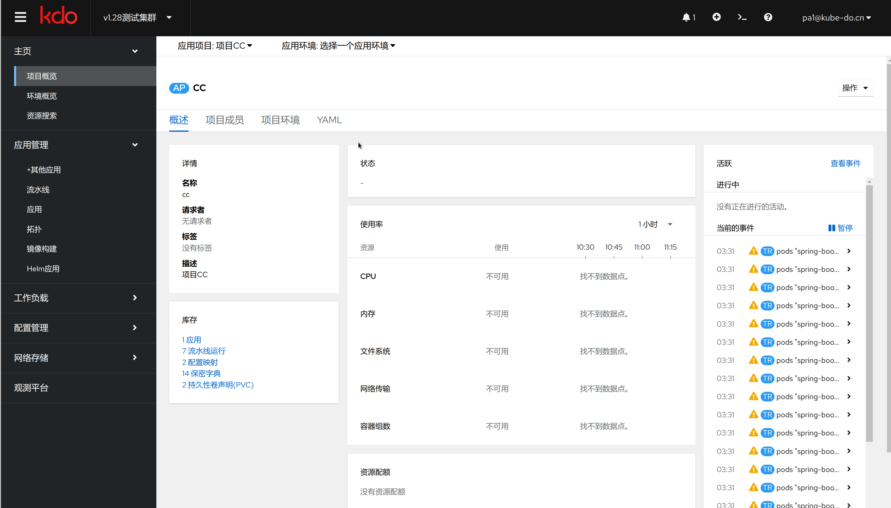

1. TOC
{:toc}
2. 
## 创建项目

{: .note }
项目只有集群管理员才能创建，菜单选择:管理->应用项目，点击新建

| 菜单    | 说明                         |
|:-------|:---------------------------|
| 名称    | 项目的英文名字                    |
| 显示名称 | 项目在kdo平台显示名字               |
| 描述 | 关于这个项目的描述                  |
| 启用的环境  | 默认启用的环境，主要有开发，测试，预发，生产四个环境 |
|项目负责人| 这个项目的负责人，负责人可以管理项目成员和项目环境  |

## 项目管理

{: .note }
项目作为应用开发的资源集合，可以管理整个项目，只有项目管理员才有权限管理项目

| 菜单     | 说明                                                      |
|:-------|:--------------------------------------------------------|
| 项目概述   | 项目整体概述，项目资源和应用展示                                        |
| 项目成员   | 对项目成员的管理，项目成员主要有项目管理员，开发人员，测试人员，运维人员这四种，每种人员在不同环境有不同的权限 |
| 项目环境   | 项目环境的管理 主要有开发，测试，预发，生产四个环境                              |
| YAML   | 资源的YAML配置文件                                             |

