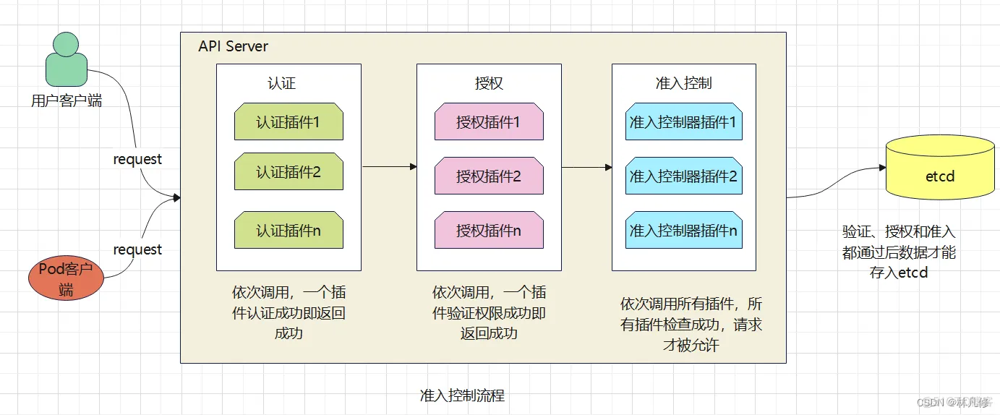
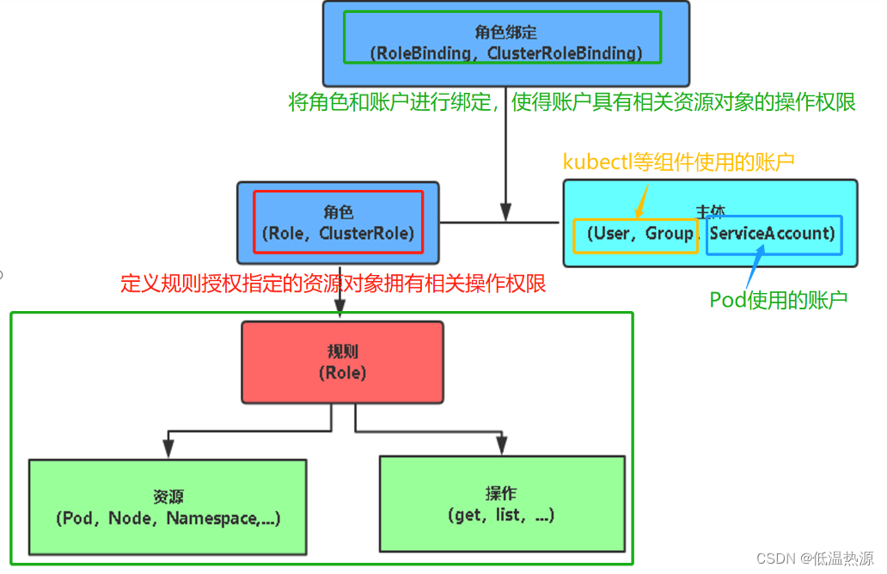
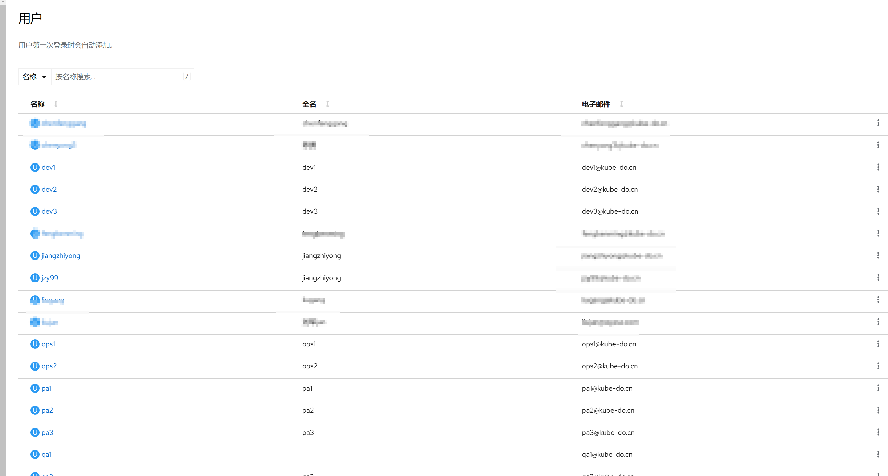
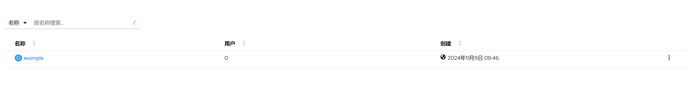
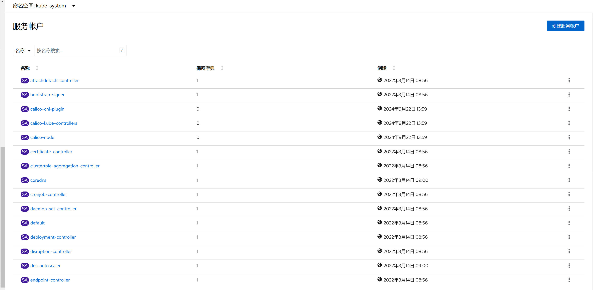
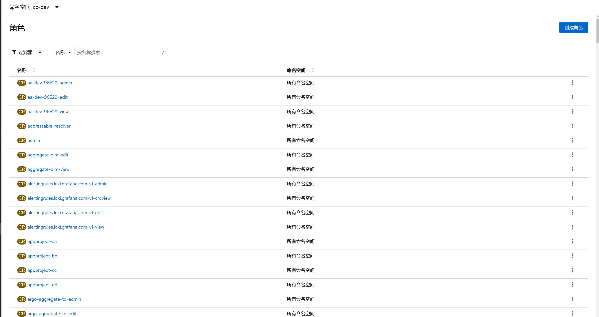
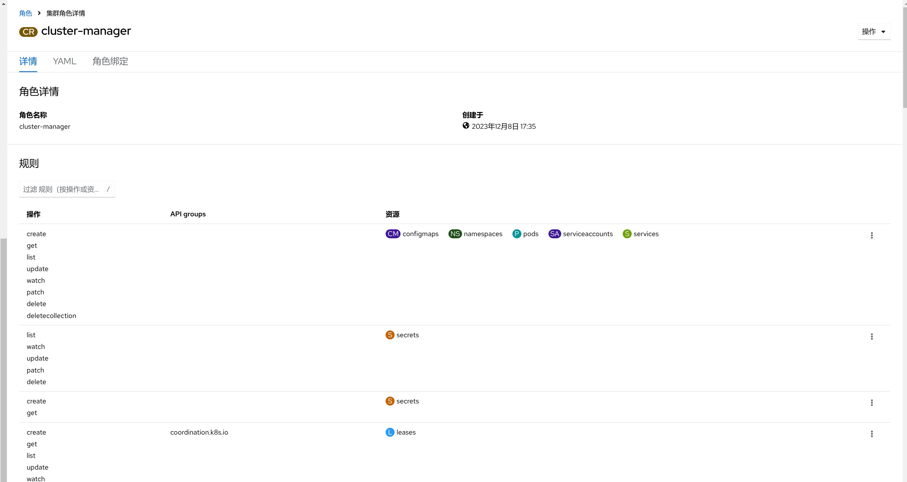
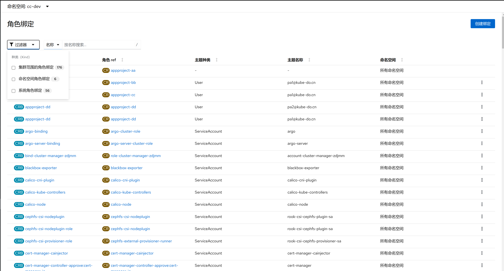
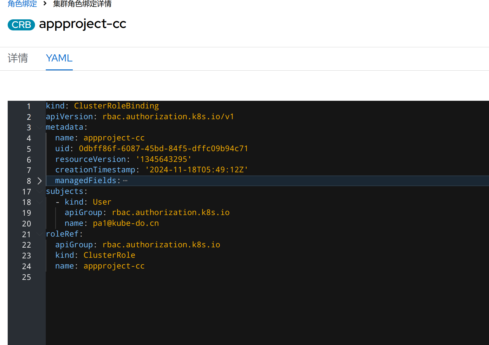

1. TOC
{:toc}

## 介绍

{: .note }
KDO平台的权限管理完全基于`Kubernetes`的基于角色的访问控制(RBAC)机制。因此，这部分内容主要针对Kubernetes的访问控制进行详细说明。
通过利用Kubernetes RBAC，KDO平台能够提供精细的权限管理，确保用户和应用程序仅能访问其被授权的资源，从而增强安全性并支持更灵活的角色与权限配置。

## Kubernetes的访问控制
{: .note }
Kubernetes的访问控制由三个核心环节组成：`认证`、`授权`和`准入`控制。这三个部分协同工作，犹如三道坚实的防线，全面守护您的集群安全。
**认证：** 确认用户或服务的身份，确保他们确实是其所声称的角色。
**授权：** 在认证通过后，授权步骤决定该用户或服务可以访问哪些资源，执行哪些操作。这一步骤基于设定的策略和角色来限制访问权限。
**准入控制：** 作为最后一道防线，准入控制可以在对象被创建、更新或删除之前对请求进行更细致的检查和修改，进一步保障集群的安全性和完整性。

### Kubernetes认证

身份验证插件负责对API请求的认证，支持的认证方式有：
- 令牌(Token): 常用于服务账户。
- X.509 客户端证书: 适合用户通过`kubectl`访问集群。
- OpenID Connect(OIDC): 常用于集成第三方身份提供商，比如`Google`或`Keycloak`，这也是kdo平台使用的认证方式。
- Webhook: 可以自定义认证逻辑。

API Server接收到访问请求时，它将调用认证插件尝试提取如下信息：
- Username: 用户名，如kubernetes-admin等。
- UID: 用户的数字标签符，用于确保用户身份的唯一性。
- Groups: 用户所属的组，用于权限指派和继承。
- Extra: 键值数据类型的字符串，用于提供认证时需要用到的额外信息。

### Kubernetes授权

{: .note }
成功通过身份认证后的操作请求还需要转交给授权插件进行许可权限检查，以确保其拥有执行相应的操作的许可。主要支持使用四类内建的授权

1. **Node:** 一种特殊的授权模块，基于 [节点(Node)](/docs/admin/management/nodes) 上运行的 容器组(Pod) 为 Kubelet 授权
2. **ABAC:** 基于属性的访问控制
3. **RBAC:** 基于角色的访问控制，这是现在主要的授权方式
4. **Webhook:** HTTP 请求回调，通过一个 web 应用鉴定是否有权限进行某项操作

## Kubernetes RBAC概念

{: .note }
Kubernetes的RBAC(Role-Based Access Control，基于角色的访问控制)是一种权限控制机制，它允许管理员通过定义角色来限制用户对集群资源的访问权限。
RBAC是Kubernetes中一个核心的授权策略，通过它，管理员可以实施精细化的权限管理，确保只有经过授权的用户或用户组才能执行特定的操作。

### Kubernetes RBAC的三要素

1. **Subjects**，也就是主体。可以是开发人员、集群管理员这样的自然人，也可以是- 系统组件进程，或者是 Pod 中的逻辑进程；在k8s中有以下三种类型：
   `User`：用户，这是有外部独立服务进行管理的。
   `Group`：组，这是用来关联多个账户的，集群中有一些默认创建的组，比如cluster-admin。
   `ServiceAccount`：服务账号，通过Kubernetes API 来管理的一些用户账号，和 namespace 进行关联的，适用于集群内部运行的应用程序，需要通过 API 来完成权限认证，所以在集群内部进行权限操作，都需要使用到 ServiceAccount。
2. **API Resource**，也就是请求对应的访问目标。在 Kubernetes 集群中也就是各类资源比如Pod、Deployment、Service等；
3. **Verbs**，对应为请求对象资源可以进行哪些操作，包括但不限于`get`，`list`, `watch`, `create`, `update`, `patch`, `delete`,`deletecollection`等。

### Kubernetes RBAC的四个关键组件

{: .note }
RBAC在Kubernetes中主要由四个关键组件构成：角色(Role)、集群角色(ClusterRole)、角色绑定(RoleBinding)和集群角色绑定(ClusterRoleBinding)。

1. **角色(Role):** 用于定义对命名空间内资源的访问权限。Role只能用于授予对某个特定命名空间中资源的访问权限。
2. **集群角色(ClusterRole):** 与Role类似，但用于定义对集群范围内资源的访问权限。ClusterRole可以授予对集群中所有命名空间的资源或非资源端点的访问权限。
3. **角色绑定(RoleBinding):** 用于将Role绑定到一个或多个用户(User)、服务账户(ServiceAccount)或用户组(Group)，从而控制这些实体对命名空间内资源的访问。
4. **集群角色绑定(ClusterRoleBinding):** 用于将ClusterRole绑定到一个或多个用户、服务账户或用户组，控制这些实体对集群范围内资源的访问。

## 用户管理

{: .note }
在 Kubernetes 中，用户(User)的概念主要体现在访问控制和认证上。
Kubernetes 本身并不直接管理用户账户；相反，它依赖外部的认证机制来验证用户身份，并通过 RBAC（基于角色的访问控制）等系统来授权用户可以执行的操作。

{: .warning }
在KDO平台中，用户和用户组的信息是从认证集成的第三方身份提供商（如Keycloak）同步而来的。
因此，在平台内部无法直接管理这些用户和用户组的信息，仅能进行展示。
这种设计确保了所有用户数据和权限管理都能在单一的身份提供商中集中处理，不仅简化了用户的管理工作，还增强了安全性和一致性。

## 组管理

{: .note }
在 Kubernetes 中，`用户组（Group）`并不是直接由 Kubernetes 管理的实体，而是通过外部认证服务或机制来定义和管理。当用户试图访问 Kubernetes API 时，认证插件负责验证用户的身份，并且可以将用户映射到一个或多个组中。
然后，Kubernetes 的 RBAC 或其他授权模块可以根据这些组来决定允许或拒绝特定用户的请求。

### 用户组的作用

{: .note }
用户组的主要作用是简化权限管理。你可以为一组用户分配相同的权限，而不需要单独为每个用户配置权限。
例如，你可能有一个开发团队，所有成员都需要对某些命名空间有读写权限。在这种情况下，你可以创建一个包含所有开发者的组，并为该组分配适当的权限。

## 服务账号

{: .note }
服务账号(ServiceAccount)是在 Kubernetes 中一种用于非人类用户的账号，在 Kubernetes 集群中提供不同的身份标识。 应用 Pod、系统组件以及集群内外的实体可以使用特定 ServiceAccount 的凭据来将自己标识为该 ServiceAccount。 这种身份可用于许多场景，包括向 API 服务器进行身份认证或实现基于身份的安全策略。
服务账号以 ServiceAccount 对象的形式存在于 API 服务器中。

### 服务账号具有以下属性：
1. **名字空间限定:** 每个服务账号都与一个 Kubernetes 名字空间绑定。 每个名字空间在创建时，会获得一个名为 default 的 ServiceAccount。
2. **轻量级:** 服务账号存在于集群中，并在 Kubernetes API 中定义。你可以快速创建服务账号以支持特定任务。
3. **可移植性:** 复杂的容器化工作负载的配置包中可能包括针对系统组件的服务账号定义。 服务账号的轻量级性质和名字空间作用域的身份使得这类配置可移植。

## Role和ClusterRole管理

{: .note }
Kubernetes RBAC 的角色(Role)或 集群角色(ClusterRole) 中包含一组代表相关权限的规则。

### Role/ClusterRole区别

1. 角色(Role) 总是用来在某个名字空间内设置访问权限； 在你创建 角色(Role) 时，你必须指定该 角色(Role) 所属的名字空间。
2. 集群角色(ClusterRole) 则是一个集群作用域的资源。这两种资源的名字不同（Role 和 ClusterRole） 是因为 Kubernetes 对象要么是名字空间作用域的，要么是集群作用域的，不可两者兼具。 
3. 集群角色(ClusterRole) 有若干用法。你可以用它来： 定义对某名字空间域对象的访问权限，并将在个别名字空间内被授予访问权限； 为名字空间作用域的对象设置访问权限，并被授予跨所有名字空间的访问权限； 
4. 为集群作用域的资源定义访问权限。 如果你希望在名字空间内定义角色，应该使用 角色(Role)； 如果你希望定义集群范围的角色，应该使用 集群角色(ClusterRole)。

### 角色说明

## RoleBinding和ClusterRoleBinding管理 

{: .note }
角色绑定(RoleBinding)是将角色中定义的权限赋予一个或者一组用户。它包含若干主体（Subject),比如用户、组或服务账户的列表和对这些主体所获得的角色的引用。 

### RoleBinding/ClusterRoleBinding区别

1. 角色绑定(RoleBinding)在指定的名字空间中执行授权，而 集群角色绑定(ClusterRoleBinding) 在集群范围执行授权。
2. 一个 角色绑定(RoleBinding)可以引用同一的名字空间中的任何 Role。 或者，一个 角色绑定(RoleBinding) 可以引用某 集群角色(ClusterRole) 并将该 集群角色(ClusterRole) 绑定到 角色绑定(RoleBinding) 所在的名字空间。 
3. 如果你希望将某 集群角色(ClusterRole) 绑定到集群中所有名字空间，你要使用 集群角色绑定(ClusterRoleBinding)。 角色绑定(RoleBinding) 或 集群角色绑定(ClusterRoleBinding) 对象的名称必须是合法的路径分段名称。

### 角色绑定说明

### 创建角色绑定

