1. TOC
{:toc}

## 介绍

{: .note }
持久化存储是指应用程序在运行过程中产生的数据，需要持久化保存的数据。如数据库、文件、日志等。 
在 Kubernetes 中，持久性卷 (PV) 和 持久性卷声明 (PVC) 是用于管理持久存储的核心概念。
它们提供了一种方式来解耦应用程序和存储资源，并允许动态管理和分配存储。[更多资料](https://kubernetes.io/zh-cn/docs/concepts/storage/persistent-volumes/)

## 存储概念

1. **持久性卷 (PersistentVolume PV):** 持久性卷 是集群中的一块存储(可以是网络存储或者本地存储)，它由管理员设置或通过动态供应自动创建。PV 是一个集群资源，独立于任何单个 Pod 的生命周期存在。PV 可以基于[多种后端存储](#持久性卷类型)提供。
PV 定义了存储的详细信息，比如大小、[访问模式](#访问模式)(ReadWriteOnce, ReadOnlyMany, ReadWriteMany)、[回收策略](#回收策略)(Retain,  Delete)等。PV 是静态配置的，即一旦创建就具有固定的属性。
2. **持久性卷声明 (PersistentVolumeClaim PVC):** 持久性卷卷声明 是用户对存储资源的请求。开发人员不需要关心底层存储的具体实现细节，只需要声明他们需要多少存储空间以及所需的访问模式。Kubernetes 集群会根据 PVC 的要求去寻找合适的 PV 进行绑定。
3. **存储类(StorageClass SC):** 提供了一种方式来描述不同类型的存储 "类别" 或者说存储 "级别"。它主要用于动态供应持久性卷声明(PV)，并且允许用户根据需要选择合适的存储选项。通过 StorageClass，集群管理员可以定义多种存储类型，并为每种类型设置不同的参数和策略
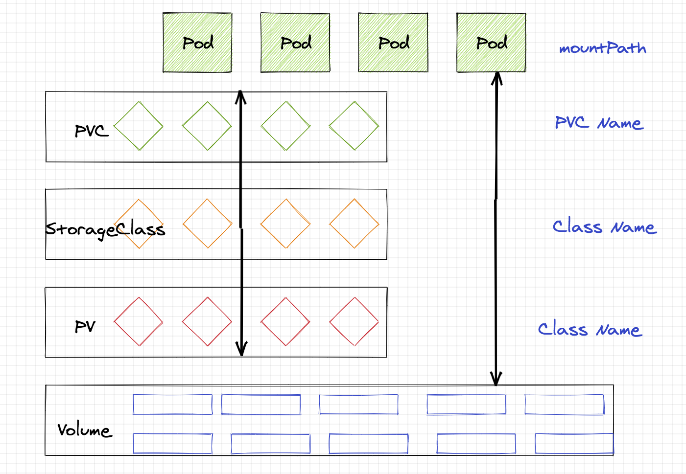

## 持久性卷类型

{: .note }
Kubernetes 持久性卷（Volume）是容器持久化数据的一种方式，允许你将数据保存在 Pod 的生命周期之外。即使 Pod 被销毁或重新创建，持久性卷中的数据依然存在。
Kubernetes 支持多种类型的持久性卷，以适应不同的使用场景和需求。

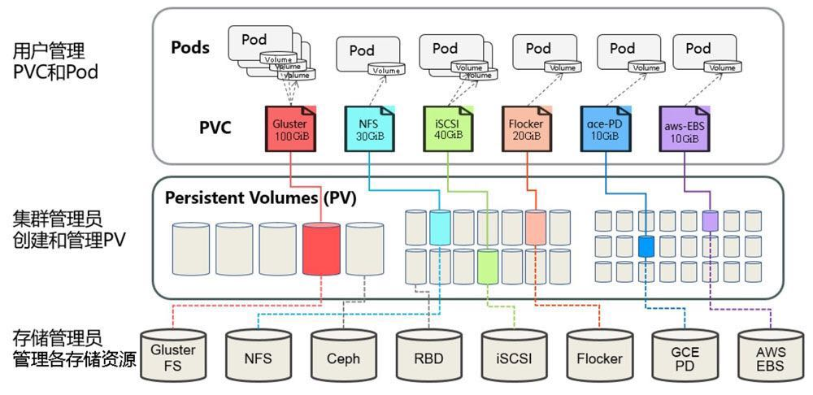

### 常见的 Kubernetes 持久性卷类型：
1. **EmptyDir:** 当 Pod 分配到 Node 上时，会创建一个空的目录。它的生命周期与 Pod 相同，当 Pod 从 Node 上移除时，EmptyDir 中的数据也会被删除。这种卷通常用于临时存储，例如缓存数据。
2. **HostPath:** 将主机节点文件系统上的文件或目录挂载到 Pod 中。这对于开发和调试非常有用，但在生产环境中需要小心使用，因为它紧密耦合了 Pod 和底层基础设施。
3. **持久性卷 (PV) 和 持久性卷声明 (PVC):** PV 是集群中的一块网络存储，由管理员设置。PVC 是用户对存储资源的请求，它会根据请求绑定到合适的 PV。这种方式提供了灵活的存储管理，并支持动态供应。
4. **ConfigMap 和 Secret:** [ConfigMap](../dev/configurations/configmaps) 用于存储配置数据，而 [Secret](../dev/configurations/secrets) 用于存储敏感信息如密码。它们都可以作为环境变量或者文件挂载到 Pod 中。
5. **其他云提供商特定的卷类型:** 比如 AWS EBS、GCE PD、Azure Disk 等等，这些是由云服务提供商提供的持久化存储解决方案。
6. **CSI (Container Storage Interface):** 这是一个标准接口，用来让存储供应商创建自己的插件，从而可以更容易地集成新的存储系统。
7. **Local:** 允许将本地磁盘直接用作持久卷，适合性能要求高的应用，但同样会引入可用性和调度问题。
8. **NFS (Network File System):** 可以通过 NFS 协议将远程服务器上的共享文件夹挂载为 Pod 的一部分。kdo平台默认会提供这种存储卷。
9. **CephFS, Glusterfs, iSCSI, RBD (Ceph Block Device), VsphereVolume 等等:** 这些都是企业级存储解决方案，适用于不同规模和需求的企业环境。

## 持久性卷声明(PVC)操作

{: .note }
对应用户来说，大部分的操作都基于持久性卷声明(PVC)，其他PV和SC基本都自动化操作。

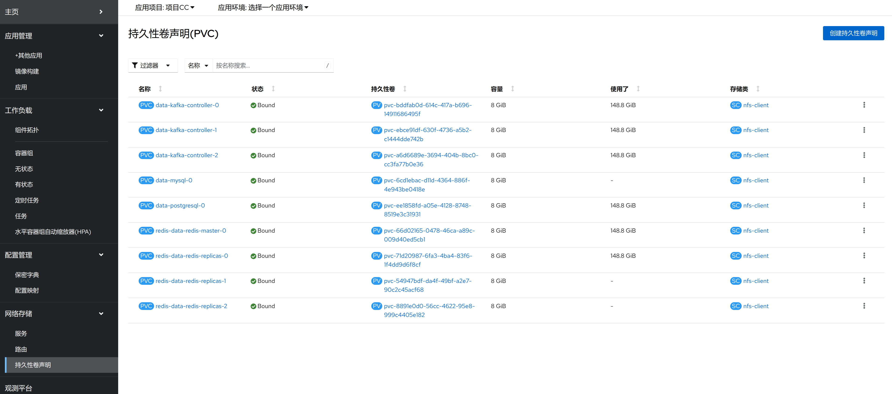

### 添加持久性卷声明(PVC)
点击添加存储，选择存储类型，存储名称、[访问模式](#访问模式)、存储大小等信息，点击确定即可。
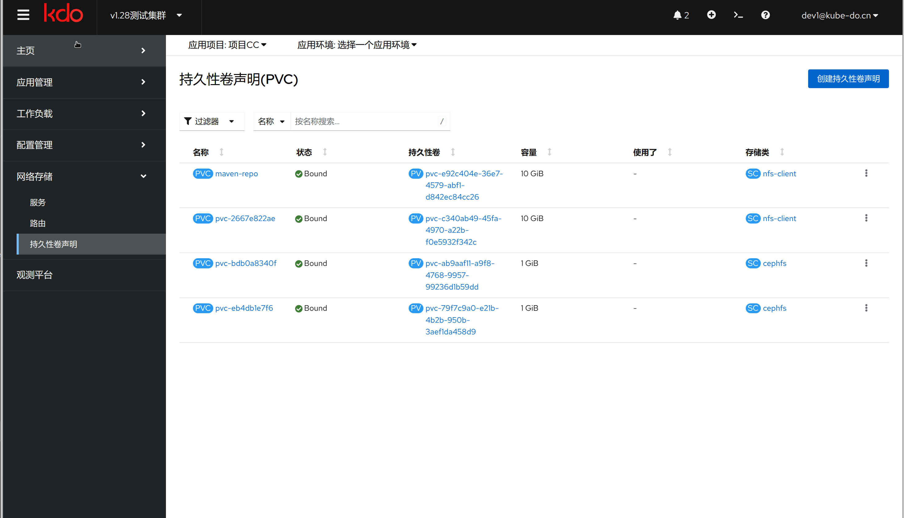

### 持久性卷声明(PVC)扩容
PVC扩容允许用户增加分配给应用程序的存储空间，而无需重新创建 PVC 或者关联的容器组
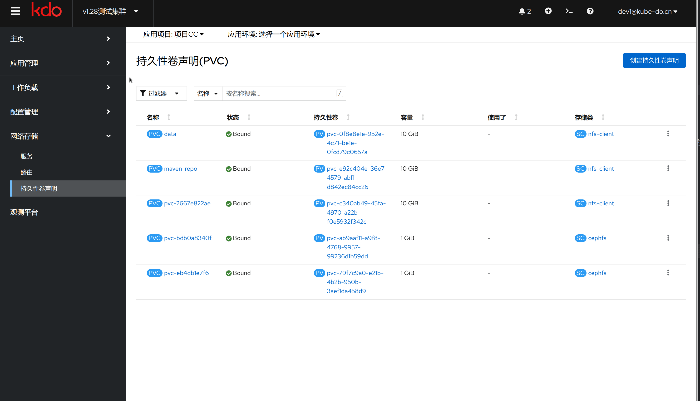

### 从工作负载中卸载(umount)持久性卷声明(PVC)
如果要从现有的工作负载(无状态应用、有状态应用) 卸载(umount)已经工作挂载的持久性卷声明(PVC)，需要到对应工作负载的页面操作。
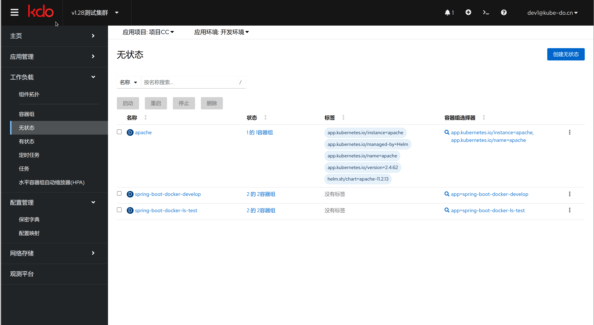

### 删除持久性卷声明(PVC)
当确定PVC已经被从工作负载中卸载后，就可以把PVC删除了。
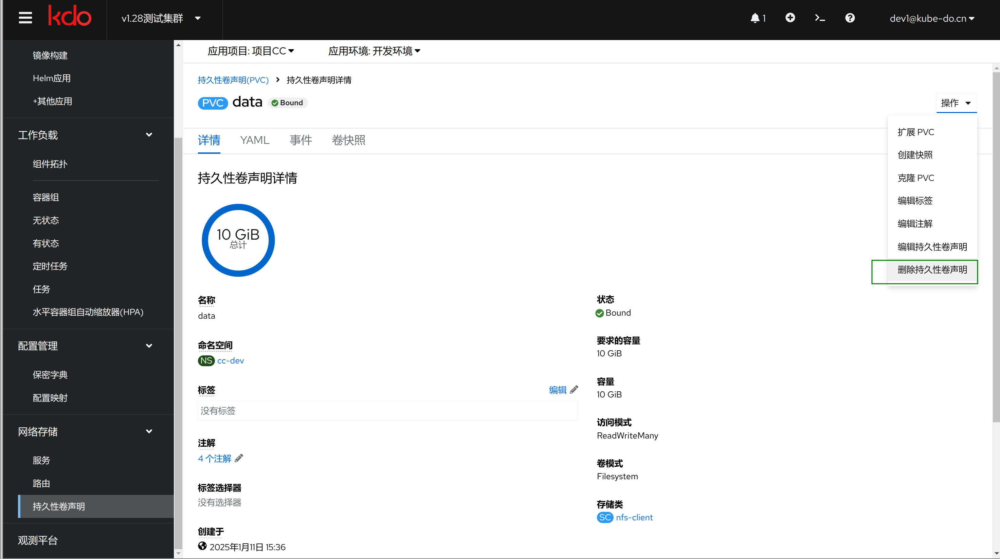

## 访问模式

{: .note }
Kubernetes 中的存储访问模式（Access Modes）定义了 PersistentVolume (PV) 或者通过 PersistentVolumeClaim (PVC) 请求的持久性卷可以如何被 Pod 访问。
不同的访问模式适用于不同类型的存储后端，并且不是所有的存储系统都支持所有访问模式。

### Kubernetes主要访问模式
1. **ReadWriteOnce (RWO):** 这是最常见地访问模式，表示该卷可以被单个节点以读写的方式挂载。 适用于大多数类型的存储，例如 AWS EBS、GCE PD 等。
2. **ReadOnlyMany (ROX):** 表示该卷可以被多个节点以只读方式挂载。 适合用于共享只读数据集，如配置文件或静态内容。 
3. **ReadWriteMany (RWX):** 允许多个节点同时对同一个卷进行读写操作。 通常包括某些网络文件系统（NFS）、分布式文件系统（GlusterFS, CephFS）等。

### 访问模式使用场景
1. **单个实例的应用程序:** 如果你的应用只需要一个副本，并且需要持久化数据，那么 ReadWriteOnce 是最常用的选择。
2. **多副本读取应用:** 如果应用程序有多个副本并且它们只需要读取相同的数据，则可以选择 ReadOnlyMany。
3. **多副本读写应用:** 对于那些要求多个Pod副本能够同时读写同一份数据的应用，你需要使用 ReadWriteMany 模式。然而，请注意并不是所有的云服务提供商或存储解决方案都支持 RWX。

## 回收策略

{: .note }
在 Kubernetes 中，PersistentVolumeClaim (PVC) 的回收策略是通过与之关联的 PersistentVolume (PV) 的 persistentVolumeReclaimPolicy 字段来定义的。
当 PVC 被删除时，PV 上设置的回收策略决定了如何处理底层存储资源。以下是三种可能的回收策略：

1. **Retain（保留）** 当 PVC 被删除后，PV 仍然存在，并且其状态变为 "Released"。这意味着数据卷还没有被清理或重新分配给其他 PVC。管理员需要手动回收资源，包括备份、清除数据或者删除 PV。
使用场景：适合那些希望对数据进行手动管理的情况，比如数据库等有状态应用。
2. **Delete（删除）** 对于支持此策略的卷插件，删除操作会将 PV 对象从 Kubernetes API 中移除，并且还会从外部基础设施中移除对应的存储资产（例如 Ceph RBD卷、GCE PD、Azure Disk 或 Cinder 卷）。动态供应的卷通常会继承其 StorageClass 中设置的默认回收策略，默认为 Delete。
使用场景：适用于临时存储或不需要保存数据的应用场景。

## 动态供应与静态供应
1. **静态供应:** 管理员预先创建好 PV 并指定回收策略。用户创建 PVC 请求存储时，Kubernetes 会尝试匹配合适的 PV 绑定给 PVC。
2. **动态供应:** 通过 StorageClass 来自动创建 PV。当用户创建一个没有找到合适静态 PV 的 PVC 时，系统可以根据 StorageClass 的配置动态生成新的 PV。此时，PV 的回收策略通常是根据 StorageClass 中定义的默认值来设定的。

## 卷快照

{: .note }
Kubernetes 卷快照（Volume Snapshots）功能允许用户创建现有 PersistentVolumeClaim (PVC) 的快照，从而可以在不中断服务的情况下备份数据。这为数据保护、灾难恢复以及开发和测试环境的创建提供了极大的便利。

### 卷快照资源

{: .note }
为了管理卷快照，Kubernetes 引入了三个新的 API 资源：

1. **卷快照(VolumeSnapshot)**: 这个资源表示一个 PVC 在某个时间点的状态快照。

2. **卷快照类(VolumeSnapshotClass)**: 是 Kubernetes 中用于定义卷快照(Volume Snapshot)行为的资源。它类似于 StorageClass，为用户提供了一种方式来配置和管理不同类型的卷快照。每个 VolumeSnapshotClass 都关联了一个特定的存储后端，并且可以包含有关如何创建和管理该类型快照的参数。
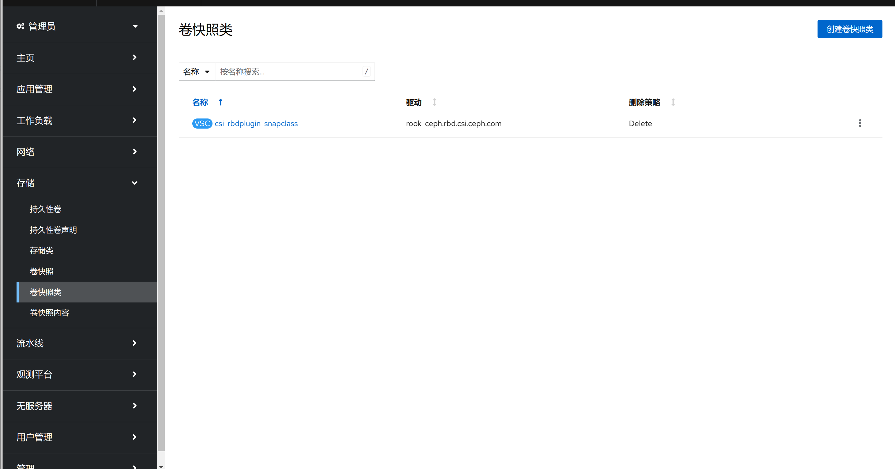
3. **卷快照类型(VolumeSnapshotContent)**: 类似于 PV 和 PVC 的关系，它是 VolumeSnapshot 的底层实现，通常由系统自动生成或由管理员手动创建。
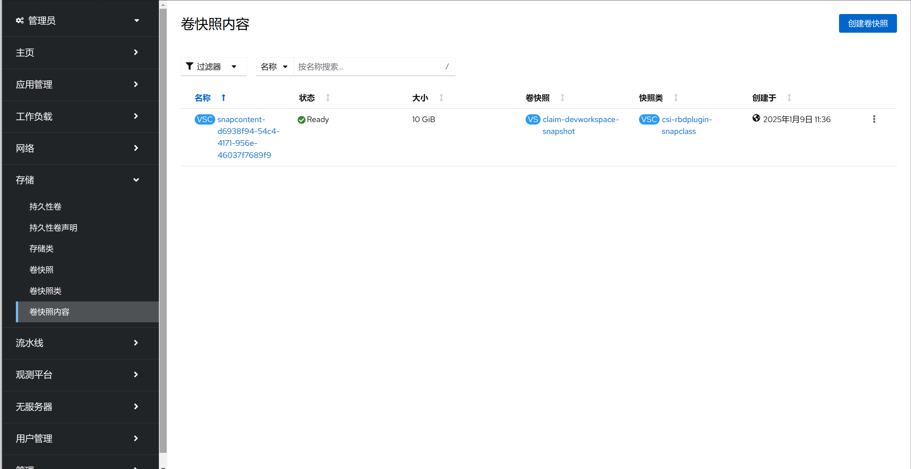

### 创建卷快照

{: .note }
要创建一个卷快照，你需要遵循以下步骤：

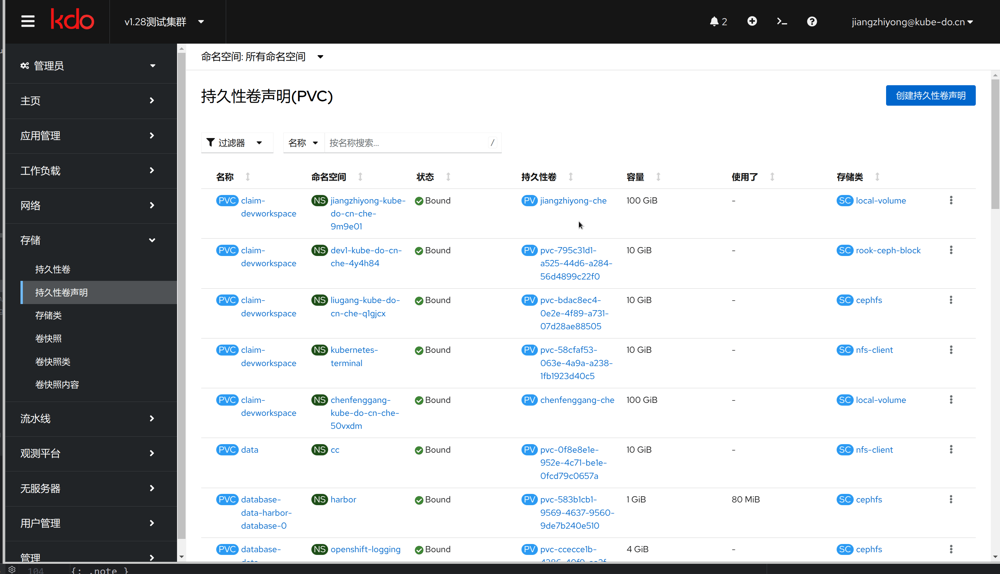

1. **确保 存储类(StorageClass) 支持快照:** 首先，确认你的 `StorageClass` 是否支持快照功能。这通常涉及到设置 `allowVolumeExpansion: true` 和指定正确的 provisioner，例如 AWS EBS、GCE PD 或者 CSI（Container Storage Interface）兼容的存储提供者。
2. **定义 卷快照 对象:** 通过菜单创建卷快照对象
3. **应用 卷快照 定义:** 通过菜单提交快照定义给 Kubernetes API 服务器。
4. **验证快照状态:** 查看快照的状态。当状态变为 "ReadyToUse" 时，说明快照已经成功创建。

### 恢复数据

{: .note }
要从快照中恢复数据，选择快照恢复为PVC即可。

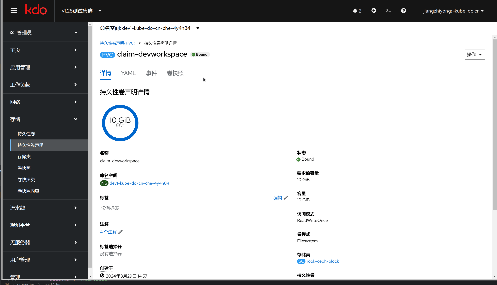

### 注意事项

1. **快照一致性**: 快照只捕捉到某一时刻的数据状态，因此在进行快照之前，确保应用程序处于一致状态非常重要。对于某些类型的应用程序，可能需要暂停写操作或者执行其他形式的一致性检查。
2. **成本与性能影响**: 创建快照可能会产生额外的成本，特别是在云环境中。此外，频繁创建快照也可能对性能造成一定影响，具体取决于所使用的存储解决方案。
3. **快照保留策略**: 根据业务需求制定合理的快照保留策略，包括保存多少份快照、多久创建一次新快照等。
4. **跨区域/可用区复制**: 不同的存储后端对于是否支持跨区域或可用区的快照有不同的规定，请根据实际情况选择合适的方案。

## KDO默认存储

{: .note }
NFS是 KDO 默认内置的存储类型，提供了一个简单的网络存储方案，支持快速创建持久性卷，适用于对性能和安全性要求不高地开发测试环境，对数据安全和性能有一定要求的需要采用企业级存储。

