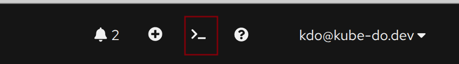
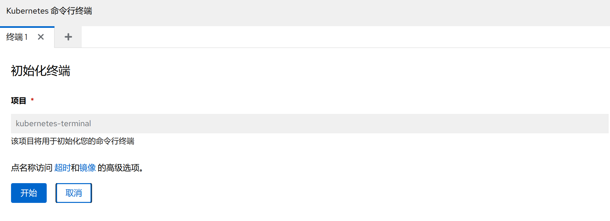
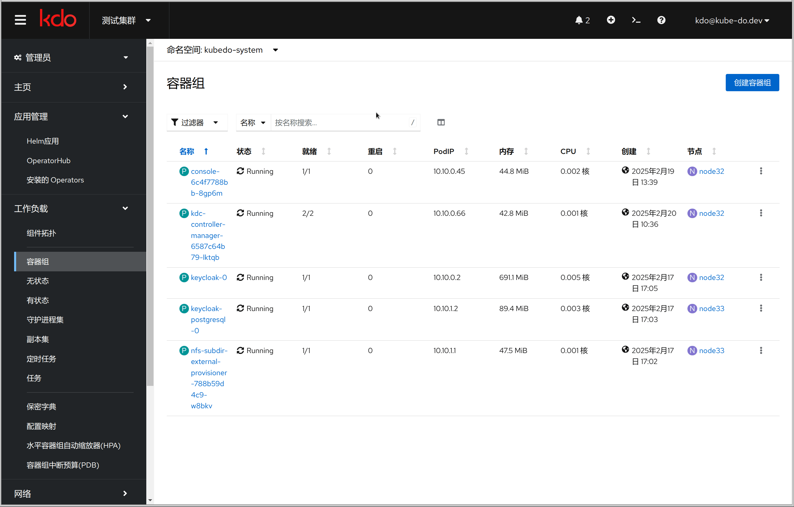
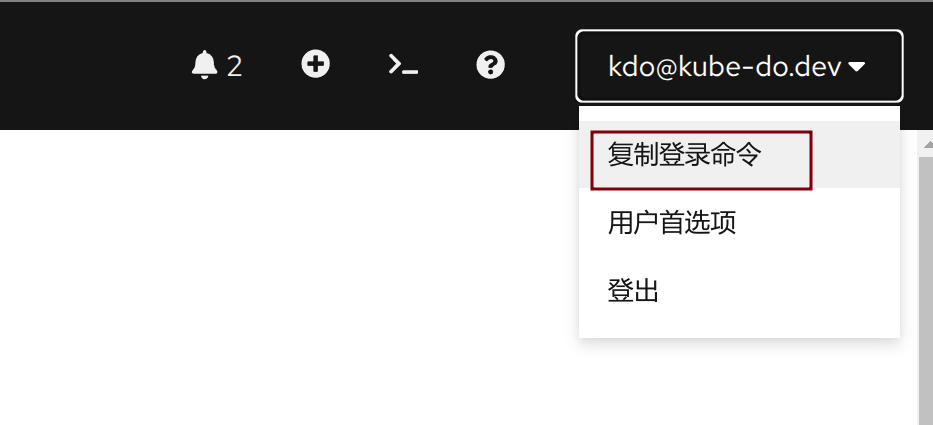
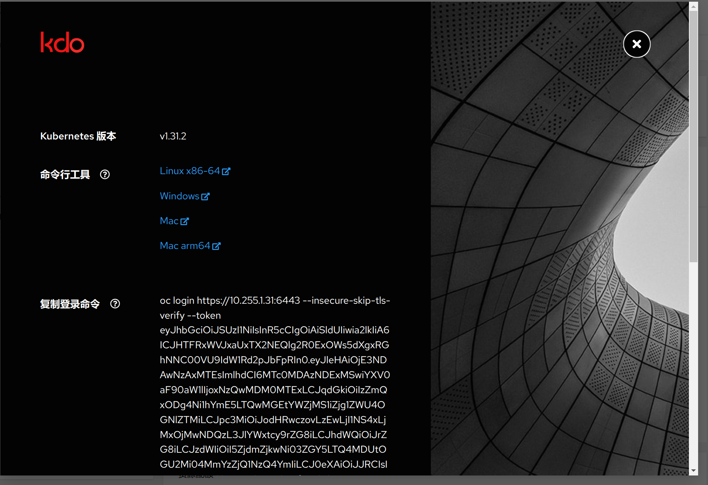
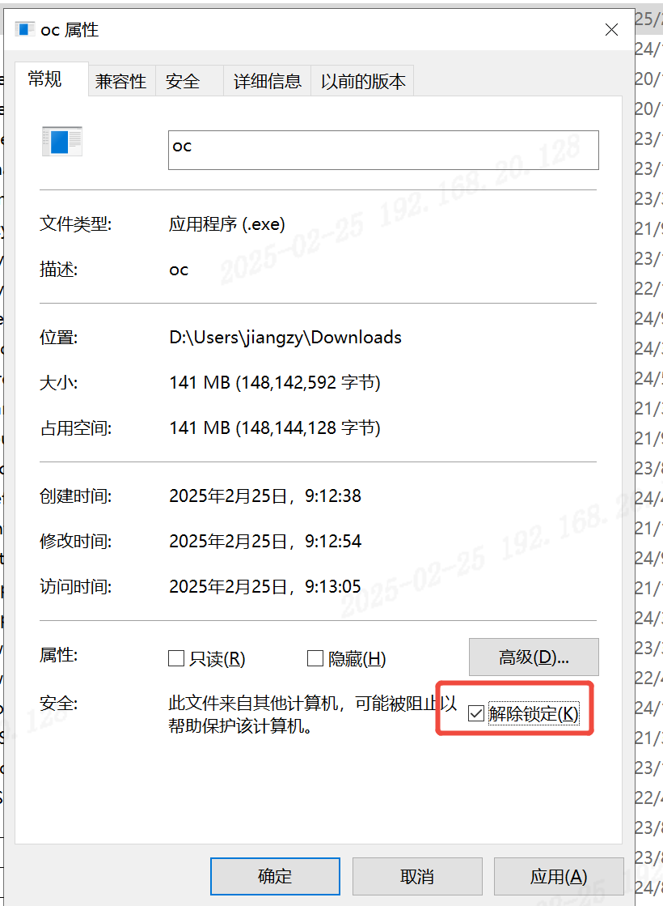
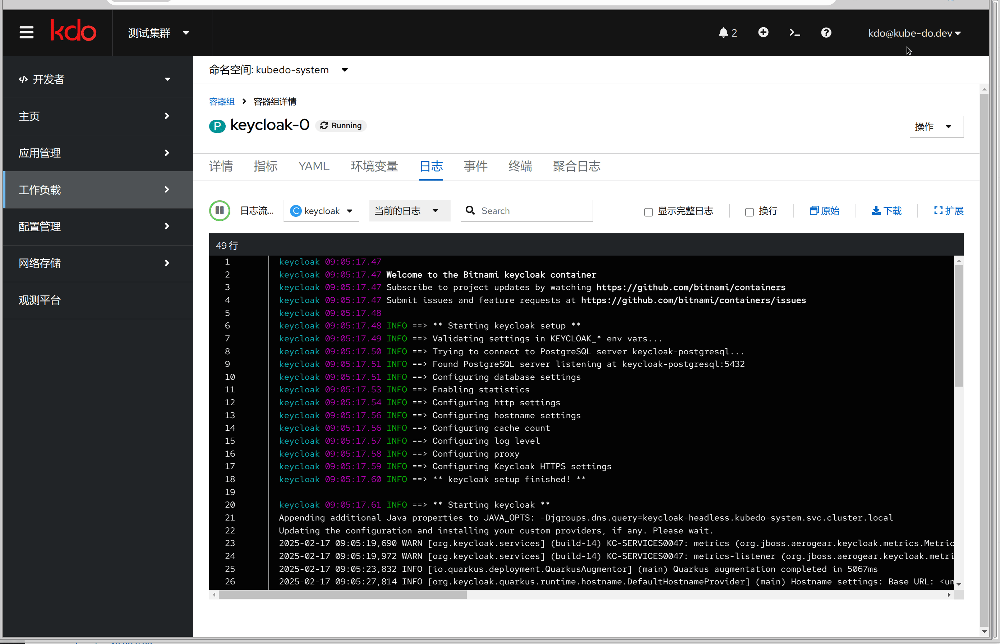

1. TOC
{:toc}

{: .note }
与其他容器云平台相比，KDO平台在命令行功能上表现出色，提供了强大的支持。
它不仅兼容 `CloudShell`，还支持 `LocalShell`，为运维人员和开发人员带来了极大的便利和高效的操作体验。
无论是云端还是本地环境，KDO平台都能满足多样化的需求，显著提升工作效率。

## CloudShell模式
CloudShell 主要面向对 Kubernetes 有深入了解的开发者和运维人员，它通过命令行提供了高效的问题处理能力。
用户不仅能够快速解决日常问题，还可以通过定制化脚本实现批量操作，从而大幅提升工作效率，让复杂任务变得简单而高效。

### CloudShell命令行界面优势
KDO CloudShell 是一种基于云的命令行界面（CLI），KDO CloudShell可以为用户提供一系列优势，主要包括：
1. **无需安装和配置：** 用户不需要在本地计算机上安装Kubernetes CLI工具(`kubectl、oc、helm、istioctl、tkn`等)或其他依赖项。这节省了设置环境的时间，特别是在需要快速访问集群进行管理和故障排查时。
2. **随时随地访问：** 只要有浏览器和互联网连接，就可以从任何地方访问您的Kubernetes集群。这对于远程工作或处理紧急问题非常有用。
3. **安全性高：** 由于 `CloudShell` 是直接与您的KDO账户集成的，因此它继承了KDO平台安全措施。这意味着您不需要担心密钥管理或SSH访问的问题。
4. **即时性：** 由于它是基于云的，所以能够立即反映最新的状态和更新，确保您总是使用最新版本的工具和访问最新的集群数据。
5. **内置认证：** 自动与您的KDO账户进行身份验证，省去了手动配置kubectl以连接到不同集群的麻烦。
6. **便捷的多集群管理：** 对于管理多个Kubernetes集群的用户来说，`CloudShell` 提供了一种简单的方法来切换不同的上下文，而无需重新配置本地环境。
总的来说，KDO CloudShell 为开发者和运维人员提供了便捷、高效且安全的方式来管理和操作Kubernetes集群，尤其适合那些希望减少本地环境配置复杂性的用户

### 访问CloudShell命令行界面
KDO CloudShell 集成在KDO的管理控制台中，点击KDO页面右上角的这个图标就可以访问

如果是集群管理员，默认会创建`kubernetes-terminal`这个命名空间，其他用户可以选择对应[项目的命名空间](../devops/project-manage)

### 日常操作
开启 KDO CloudShell，您将获得与在 Kubernetes 集群的 Master 节点上操作相似的体验，但无需直接访问 Master 节点，操作更加便捷。
此外，您还可以点击右上角的图标，轻松切换至全屏模式，享受更沉浸式的 CloudShell 操作体验。

### 数据存储
KDO Cloud Shell 本身运行在一个容器组中，因此在容器重启后，其内部状态将不会保留。
若您需要持久化存储数据，只需将数据保存至 `/data` 目录即可。
该目录已预先挂载了一个[持久化存储卷](../storage)，确保您的数据安全可靠，不会因容器重启而丢失。

## LocalShell模式
LocalShell主要用于促进本地环境与KDO平台之间的交互操作。例如，它允许用户通过kubectl在本地对平台进行操作，以及实现本地IDE与KDO平台之间的无缝连接。
这样的设置旨在提高开发效率和灵活性，使得开发者可以在熟悉的本地工具环境中高效工作，同时充分利用KDO平台的强大功能。

### 打开localshell
LocalShell集成在KDO的管理控制台中，访问KDO页面右上角用户菜单，点击`复制登录命令`

### 下载命令行工具

打开页面，里面`Windows`、`Linux`、`Mac`各种操作系统的命令行工具，访问对应操作系统的链接，下载对应的命令行工具`oc`。
确保有可执行的权限(linux/mac通过`chmod +x oc`设置，windows右键属性里设置`解除锁定`)，放置到对应的目录（注意：这里需要用到管理员的权限）
比如:Windows是`C:\Windows\System32\`，Linux和Mac是 `/usr/bin/` 。

### 操作localshell
点击下面`复制登录命令`，到终端运行后，就可以通过`oc`命令行工具访问KDO平台(如果本机有`kubectl`，通过`oc`登录后用`kubectl`也是一样)。

{: .note }
`oc` 是一个与 `kubectl` 兼容的命令行工具，它特别之处在于提供了 `kubectl` 所不具备的登录功能，使用户能够通过 `oc` 登录到集群。
一旦完成登录，您不仅可以使用 `oc` 命令执行各种操作，还可以无缝地使用 `kubectl` 的命令集。
例如，`oc get pod` 和 `kubectl get pod` 实现了相同的功能，即获取集群中Pod的列表信息。
实际上，除了提供登录功能外，`oc` 支持所有 `kubectl` 命令，使得用户在进行集群管理和应用部署时拥有更大的灵活性和便利性。