1. TOC
{:toc}


{: .note }
与其他容器云平台相比，KDO平台在命令行功能上表现出色，提供了强大的支持。
它不仅兼容 `CloudShell`，还支持 `LocalShell`，为运维人员和开发人员带来了极大的便利和高效的操作体验。
无论是云端还是本地环境，KDO平台都能满足多样化的需求，显著提升工作效率。


## CloudShell模式
CloudShell 主要面向对 Kubernetes 有深入了解的开发者和运维人员，它通过命令行提供了高效的问题处理能力。
用户不仅能够快速解决日常问题，还可以通过定制化脚本实现批量操作，从而大幅提升工作效率，让复杂任务变得简单而高效。
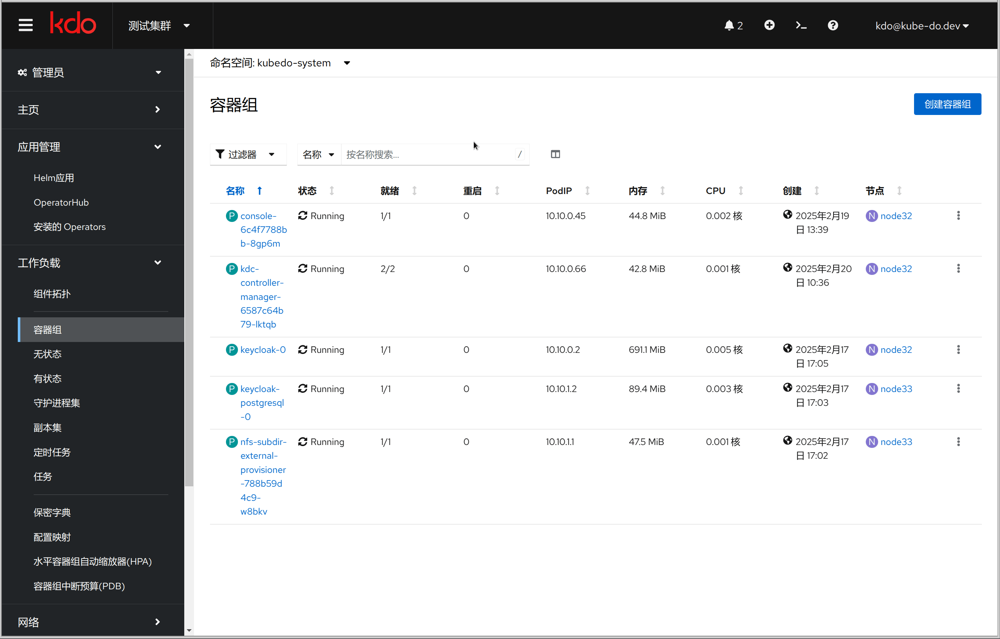
### CloudShell命令行界面优势
KDO CloudShell 是一种基于云的命令行界面（CLI），KDO CloudShell可以为用户提供一系列优势，主要包括：
1. **无需安装和配置：** 用户不需要在本地计算机上安装Kubernetes CLI工具(`kubectl、oc、helm、istioctl、tkn`等)或其他依赖项。这节省了设置环境的时间，特别是在需要快速访问集群进行管理和故障排查时。
2. **随时随地访问：** 只要有浏览器和互联网连接，就可以从任何地方访问您的Kubernetes集群。这对于远程工作或处理紧急问题非常有用。
3. **安全性高：** 由于 `CloudShell` 是直接与您的KDO账户集成的，因此它继承了KDO平台安全措施。这意味着您不需要担心密钥管理或SSH访问的问题。
4. **即时性：** 由于它是基于云的，所以能够立即反映最新的状态和更新，确保您总是使用最新版本的工具和访问最新的集群数据。
5. **内置认证：** 自动与您的KDO账户进行身份验证，省去了手动配置kubectl以连接到不同集群的麻烦。
6. **便捷的多集群管理：** 对于管理多个Kubernetes集群的用户来说，`CloudShell` 提供了一种简单的方法来切换不同的上下文，而无需重新配置本地环境。
总的来说，KDO CloudShell 为开发者和运维人员提供了便捷、高效且安全的方式来管理和操作Kubernetes集群，尤其适合那些希望减少本地环境配置复杂性的用户

### 访问CloudShell命令行界面
KDO CloudShell 集成在KDO的管理控制台中，点击KDO页面右上角的这个图标就可以访问
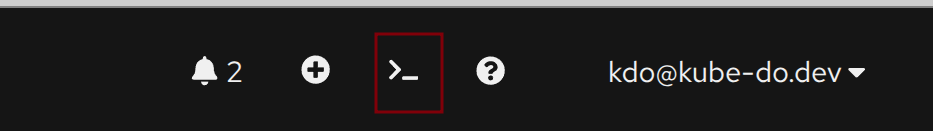
如果是集群管理员，默认会创建`kubernetes-terminal`这个命名空间，其他用户可以选择对应[项目的命名空间](/docs/devops/project-manage/)
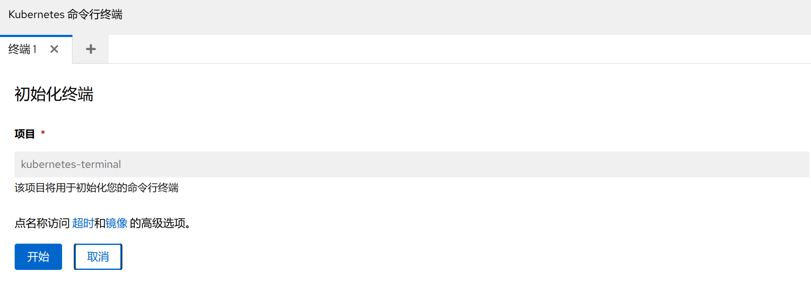


### 使用AI-Agent
CloudShell集成了[Hermes Agent](https://github.com/NousResearch/hermes-agent),实现通过各种通讯软件(比如:微信、企业微信、QQ、钉钉)来管理KDO平台，包括应用和流水线，排查问题，监控告警这些。

#### 打开CloudShell
首先通过新tab的方式打开CloudShell，主要terminal内容比较多，便于访问。
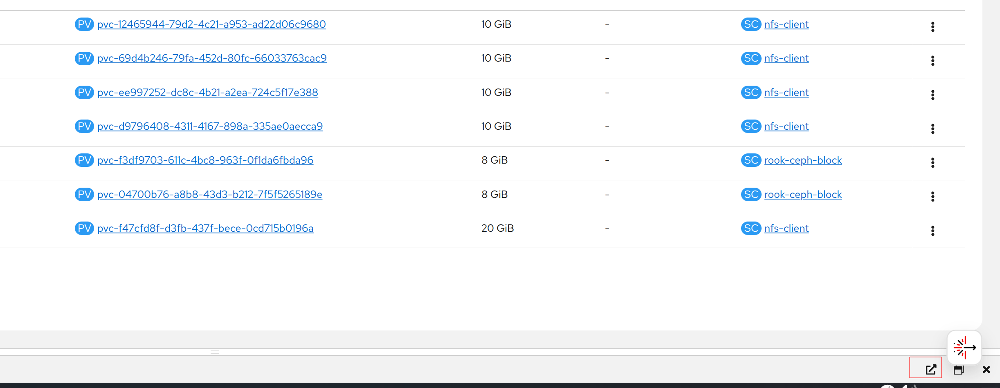

#### 配置大模型
**注意:** AI Agent需要提前获取对应大模型的api key，比如：deepseek、阿里云这些，这些大模型会按量收费。
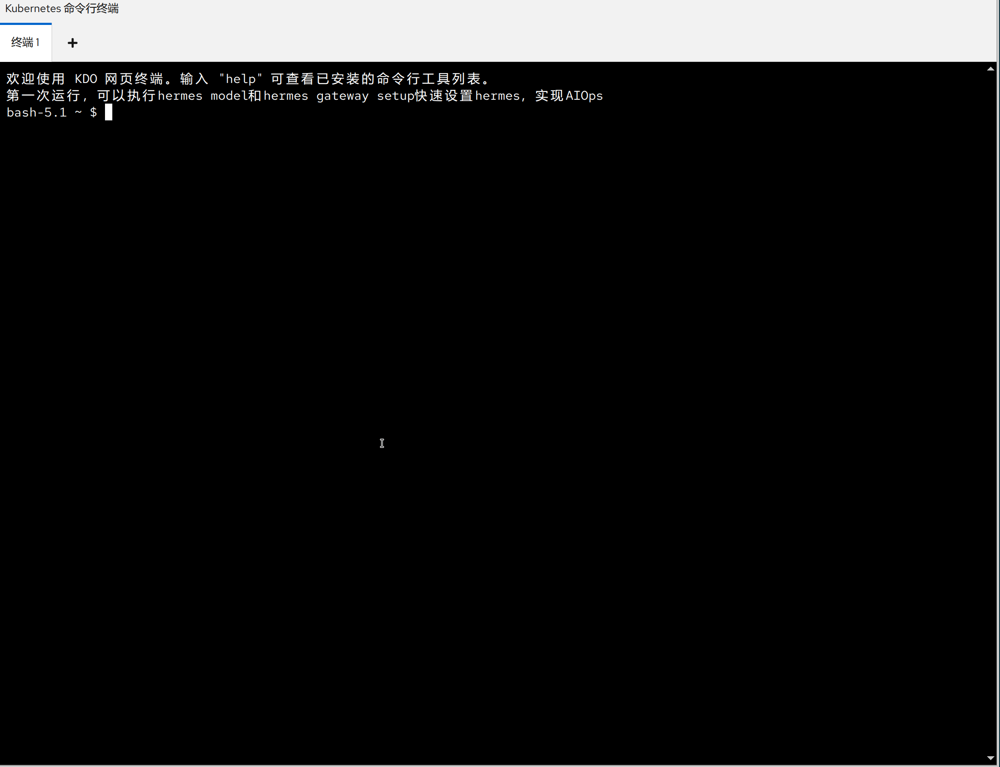

#### 配置消息通道
**注意:** Hermes在配置有些消息通道(比如企业微信)时不会自动重启gateway组件，一般建议手动运行一下 `hermes gateway restart`。
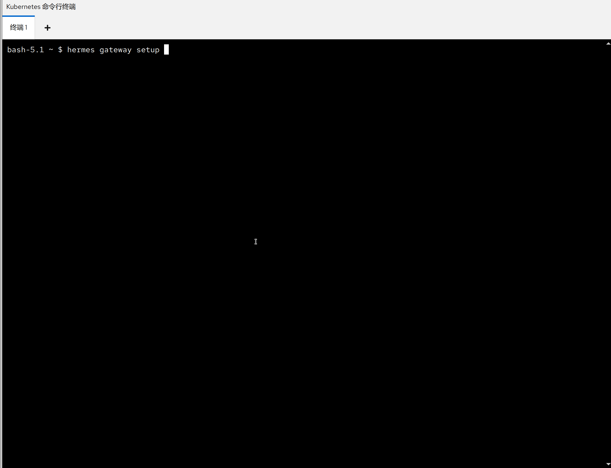

#### 验证Agent
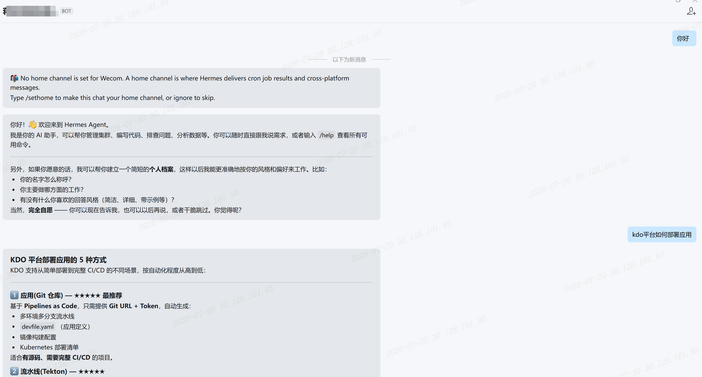

#### 注意事项
1. agent的权限和用户在Kdo平台的权限一致，比如普通用户只有对应项目的权限，没有集群相关权限，所以不用担心安全风险。
2. 访问Kdo平台的权限有时效性，如果发现无法访问Kdo，需要用户重新登陆一下Kdo平台，重新访问一下CloudShell。

### 预装工具

{: .note }
CloudShell 预装了常用的 Kubernetes 和云原生工具，开箱即用，无需额外安装。

| 工具 | 说明 | 常用命令示例 |
|------|------|-------------|
| **kubectl** | Kubernetes 命令行工具 | `kubectl get pods`、`kubectl apply -f` |
| **oc** | Kubernetes CLI（含登录功能） | `oc login`、`oc get pods` |
| **helm** | Kubernetes 包管理器 | `helm install`、`helm list` |
| **tkn** | Tekton Pipeline CLI | `tkn pipeline list` |
| **istioctl** | Istio 服务网格管理 | `istioctl analyze` |
| **jq** | JSON 处理工具 | `kubectl get pods -o json \| jq` |
| **yq** | YAML 处理工具 | `yq eval` |
| **curl** | HTTP 请求工具 | `curl https://api.example.com` |
| **git** | 版本控制工具 | `git clone`、`git status` |

{: .important }
CloudShell 中的工具版本会随平台更新而自动升级，始终使用最新版本。如需查看当前工具版本，可在终端中执行 `kubectl version` 或 `helm version` 等命令。

### 资源限制

{: .warning }
CloudShell 运行在 Kubernetes Pod 中，受到资源配额限制。请合理使用，避免因资源耗尽导致终端无响应。

| 资源 | 默认配额 | 说明 |
|------|---------|------|
| **CPU** | 1 核 | 单个终端会话的 CPU 限制 |
| **内存** | 1 Gi | 单个终端会话的内存限制 |
| **临时存储** | 1 Gi | `/tmp` 等临时目录的存储空间 |
| **持久化存储** | 5 Gi | `/home/user` 目录的持久化存储空间 |

### 网络访问

CloudShell 的网络访问能力取决于其运行的命名空间和网络策略配置：

| 访问目标 | 默认支持 | 说明 |
|---------|---------|------|
| **集群内服务** | 是 | 可直接通过 Service 名称访问集群内部服务 |
| **集群内 Pod** | 是 | 可通过 kubectl exec 进入 Pod 调试 |
| **外部网络** | 视配置 | 需要配置出口网络策略或代理 |
| **Kubernetes API** | 是 | 自动连接到当前集群的 API Server |

### 自定义环境

{: .note }
CloudShell 支持自定义 Shell 环境，常用的配置可以持久化到 `/home/user` 目录。

#### 设置别名

将常用命令的别名添加到 `/home/user/.bashrc` 文件中：

```bash
# 编辑持久化 bashrc
vi /data/.bashrc

# 添加常用别名
alias gp='kubectl get pods'
alias gs='kubectl get svc'
alias gd='kubectl get deployment'
alias kl='kubectl logs -f'
alias ocg='oc get pods'
```

使配置生效：

```bash
source /home/user/.bashrc
```

#### 持久化环境变量

将自定义环境变量写入 `/home/user/.bash_profile`：

```bash
# 编辑持久化 bash_profile
vi /home/user/.bash_profile

# 添加环境变量
export EDITOR=vim
export KUBE_EDITOR=vim
```

### 关闭终端会话

1. 直接关闭浏览器标签页或点击终端区域的关闭按钮
2. 终端会话将自动停止，`/data` 目录中的数据会保留
3. 下次打开 CloudShell 时，将创建新的终端会话

{: .note }
- 关闭终端不会影响正在运行的 Kubernetes 资源
- 如果在终端中运行了后台进程（如 `nohup`），关闭终端后进程可能会终止
- 需要长期运行的命令建议使用 [Jobs](/docs/dev/workloads/jobs/) 或 [CronJobs](/docs/dev/workloads/cronjobs/)


## LocalShell模式
LocalShell主要用于促进本地环境与KDO平台之间的交互操作。例如，它允许用户通过kubectl在本地对平台进行操作，以及实现本地IDE与KDO平台之间的无缝连接。
这样的设置旨在提高开发效率和灵活性，使得开发者可以在熟悉的本地工具环境中高效工作，同时充分利用KDO平台的强大功能。

### 打开localshell
LocalShell集成在KDO的管理控制台中，访问KDO页面右上角用户菜单，点击`复制登录命令`
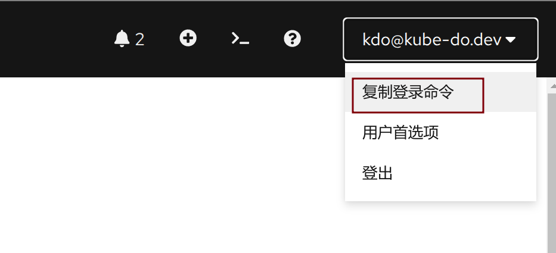


### 下载命令行工具
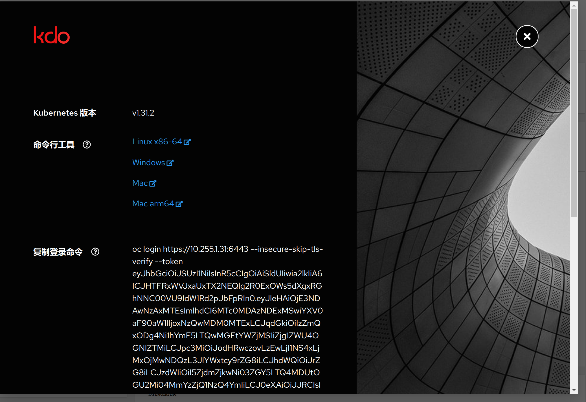
打开页面，里面`Windows`、`Linux`、`Mac`各种操作系统的命令行工具，访问对应操作系统的链接，下载对应的命令行工具`oc`。
确保有可执行的权限(linux/mac通过`chmod +x oc`设置，windows右键属性里设置`解除锁定`)，放置到对应的目录（注意：这里需要用到管理员的权限）
比如:Windows是`C:\Windows\System32\`，Linux和Mac是 `/usr/bin/` 。
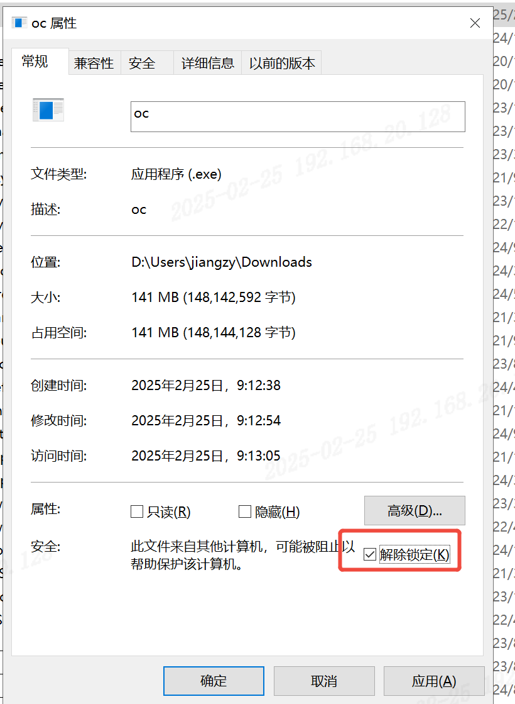

### oc 与 kubectl 对比

{: .note }
`oc` 是 Kubernetes 官方 CLI 工具 `kubectl` 的超集，在完全兼容 `kubectl` 的基础上，额外提供了 OpenShift/KDO 平台特有的功能。

| 功能 | `oc` | `kubectl` |
|------|------|-----------|
| 基础资源操作（get/delete/apply） | 支持 | 支持 |
| 集群登录（`oc login`） | 支持 | 不支持 |
| 项目切换（`oc project`） | 支持 | 不支持 |
| 应用创建向导（`oc new-app`） | 支持 | 不支持 |
| 路由管理（`oc expose`） | 支持 | 不支持 |
| 所有 kubectl 子命令 | 完全兼容 | 原生支持 |

{: .important }
登录 KDO 平台后，`oc` 和 `kubectl` 可以互换使用。例如 `oc get pods` 和 `kubectl get pod` 效果完全相同。推荐使用 `oc` 以获得更完整的平台管理体验。

### 登录方式

#### Token 登录

1. 登录 KDO 平台 Web 控制台
2. 点击右上角用户菜单，选择 `复制登录命令`
3. 在本地终端粘贴并执行该命令

```shell
# 登录命令示例
oc login --token=sha256~xxxxx --server=https://api.cluster.example.com:6443
```


执行后浏览器会自动打开，完成 OAuth 授权后终端将自动登录成功。

### 多集群管理

{: .note }
当需要管理多个 Kubernetes 集群时，`oc`/`kubectl` 通过上下文（context）机制进行切换。

#### 查看当前上下文

```shell
# 查看当前使用的上下文
oc config current-context

# 列出所有可用的上下文
oc config get-contexts
```

#### 切换集群上下文

```shell
# 切换到指定上下文
oc config use-context <context-name>

# 示例：切换到生产集群
oc config use-context production-cluster
```

#### 查看和管理 kubeconfig

```shell
# 查看完整的 kubeconfig 配置
oc config view

# 合并多个 kubeconfig 文件
export KUBECONFIG=~/.kube/config:~/.kube/config-production
oc config view --merge --flatten > merged-config.yaml
```

### 代理设置

如果本地环境需要通过代理访问集群，可以配置以下环境变量：

```bash
# HTTP 代理
export HTTP_PROXY=http://proxy.example.com:8080
export HTTPS_PROXY=http://proxy.example.com:8080

# 不代理的地址（集群内部地址）
export NO_PROXY=.cluster.local,10.0.0.0/8,172.16.0.0/12,192.168.0.0/16
```

将以上配置写入 `~/.bashrc` 或 `~/.bash_profile` 以持久化。

### IDE 集成

#### VS Code 集成

1. 安装 VS Code 扩展 **Kubernetes**（ms-kubernetes-tools.vscode-kubernetes-tools）
2. 配置 `kubeconfig` 路径指向 `oc` 登录后生成的配置文件
3. 在 VS Code 中直接浏览集群资源、查看日志、编辑 YAML

```json
// settings.json
{
  "vscode-kubernetes.kubectl-path": "/usr/bin/kubectl",
  "vscode-kubernetes.kubeconfig": "~/.kube/config"
}
```

#### JetBrains IDE 集成

1. 安装 **Kubernetes** 插件
2. 在 `Settings → Kubernetes` 中配置 kubeconfig 路径
3. 可在 IDE 内直接管理集群资源

### 操作localshell
点击下面`复制登录命令`，到终端运行后，就可以通过`oc`命令行工具访问KDO平台(如果本机有`kubectl`，通过`oc`登录后用`kubectl`也是一样)。
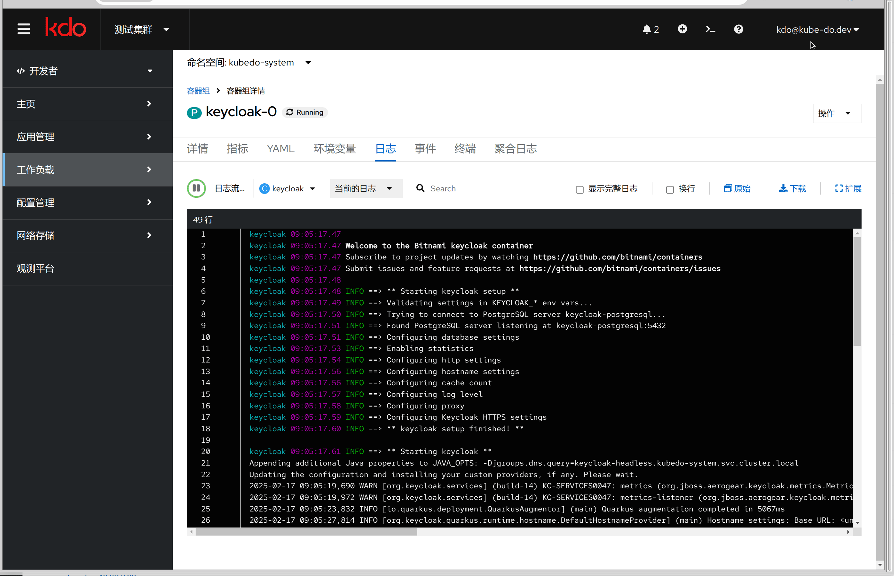

{: .note }
`oc` 是一个与 `kubectl` 兼容的命令行工具，它特别之处在于提供了 `kubectl` 所不具备的登录功能，使用户能够通过 `oc` 登录到集群。
一旦完成登录，您不仅可以使用 `oc` 命令执行各种操作，还可以无缝地使用 `kubectl` 的命令集。
例如，`oc get pod` 和 `kubectl get pod` 实现了相同的功能，即获取集群中Pod的列表信息。
实际上，除了提供登录功能外，`oc` 支持所有 `kubectl` 命令，使得用户在进行集群管理和应用部署时拥有更大的灵活性和便利性。


## 常用操作示例

{: .note }
以下为 CloudShell 和 LocalShell 中常用的 Kubernetes 操作命令速查表。

### 资源查看

```shell
# 查看所有命名空间的 Pod
kubectl get pods -A

# 查看 Pod 详细信息
kubectl get pods -o wide

# 以 YAML 格式输出资源
kubectl get deployment <name> -o yaml

# 查看资源描述
kubectl describe pod <pod-name>

# 查看所有命名空间
kubectl get ns

# 查看所有服务
kubectl get svc -A
```

### 资源管理

```shell
# 创建/更新资源
kubectl apply -f <file>.yaml

# 删除资源
kubectl delete -f <file>.yaml

# 扩缩容
kubectl scale deployment <name> --replicas=3

# 查看 Pod 日志
kubectl logs -f <pod-name>

# 查看多容器 Pod 日志
kubectl logs <pod-name> -c <container-name>

# 进入 Pod 终端
kubectl exec -it <pod-name> -- /bin/bash
```

### 调试排查

```shell
# 查看 Pod 事件
kubectl describe pod <pod-name> | grep -A 10 Events

# 查看资源使用情况
kubectl top pods
kubectl top nodes

# 端口转发（本地调试）
kubectl port-forward svc/<service-name> 8080:80

# 查看日志中的错误
kubectl logs <pod-name> | grep -i error
```

### Helm 操作

```shell
# 查看已安装的 Helm Release
helm list

# 安装 Helm Chart
helm install <release-name> <chart> -n <namespace>

# 升级 Helm Release
helm upgrade <release-name> <chart> -n <namespace>

# 卸载 Helm Release
helm uninstall <release-name> -n <namespace>

# 查看 Helm Release 状态
helm status <release-name> -n <namespace>
```


## FAQ / 故障排查

### CloudShell 相关

#### Q: CloudShell 打开后显示 "Connection refused" 或无法连接

**原因：** CloudShell Pod 可能尚未完全就绪，或命名空间配额不足。

**解决方法：**
1. 等待 10-30 秒后重试
2. 检查命名空间配额是否已满：`kubectl get resourcequota -n kubernetes-terminal`
3. 如持续无法连接，刷新页面重新打开 CloudShell

#### Q: CloudShell 中执行命令提示 "Permission denied"

**原因：** CloudShell Pod 以非 root 用户运行，部分系统目录无写入权限。

**解决方法：**
- 将文件写入 `/data` 目录（具有持久化存储和写入权限）
- 使用 `sudo` 执行需要 root 权限的命令（如可用）

#### Q: CloudShell 中工具版本较旧

**解决方法：** CloudShell 工具版本随平台更新，如发现版本较旧，联系平台管理员确认是否需要更新平台版本。

### LocalShell 相关

#### Q: 执行 `oc login` 后报 "certificate signed by unknown authority"

**原因：** 集群使用了自签名证书。

**解决方法：**
```shell
# 跳过 TLS 证书验证（仅开发环境）
oc login --token=<token> --server=https://api.cluster.example.com:6443 --insecure-skip-tls-verify=true
```

{: .warning }
生产环境不建议跳过证书验证，应配置正确的 CA 证书。

#### Q: `oc` 命令执行后报 "not found" 或无法识别

**原因：** `oc` 未添加到系统 PATH，或没有执行权限。

**解决方法：**
```shell
# Linux/Mac - 添加执行权限
chmod +x oc
sudo mv oc /usr/bin/

# 验证安装
oc version
```

#### Q: 登录后 `kubectl` 无法连接集群

**原因：** `kubectl` 未使用正确的 kubeconfig。

**解决方法：**
```shell
# 确认 kubeconfig 路径
kubectl config view

# 手动指定 kubeconfig
kubectl --kubeconfig=~/.kube/config get pods

# 或设置环境变量
export KUBECONFIG=~/.kube/config
```

#### Q: 多集群切换后命令返回其他集群的数据

**原因：** 上下文切换未生效。

**解决方法：**
```shell
# 确认当前上下文
oc config current-context

# 重新切换
oc config use-context <正确的上下文名称>

# 验证
oc whoami
```

### 网络相关

#### Q: CloudShell 中无法访问集群外部地址

**原因：** 集群网络策略限制了出站流量。

**解决方法：** 联系平台管理员检查出口网络策略（EgressNetworkPolicy）配置，确认是否允许 CloudShell 命名空间的出站访问。

#### Q: 本地 `oc` 连接集群超时

**原因：** 网络不通、代理未配置或 API Server 地址错误。

**解决方法：**
1. 检查网络连通性：`ping api.cluster.example.com`
2. 如需代理，配置 `HTTP_PROXY`/`HTTPS_PROXY` 环境变量
3. 确认 kubeconfig 中的 server 地址正确
