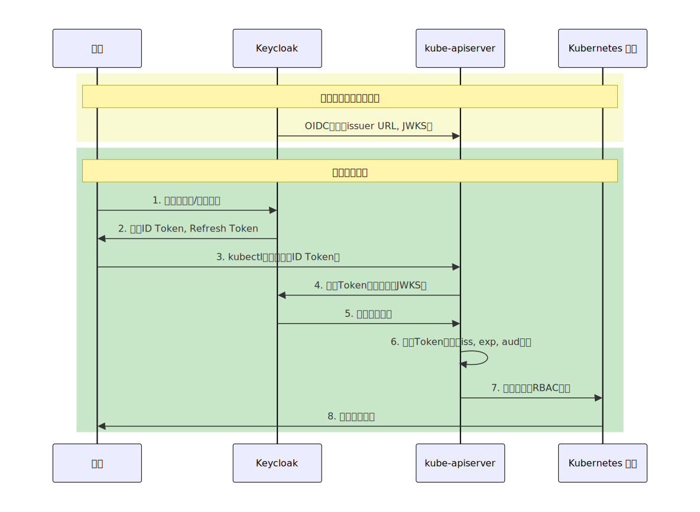
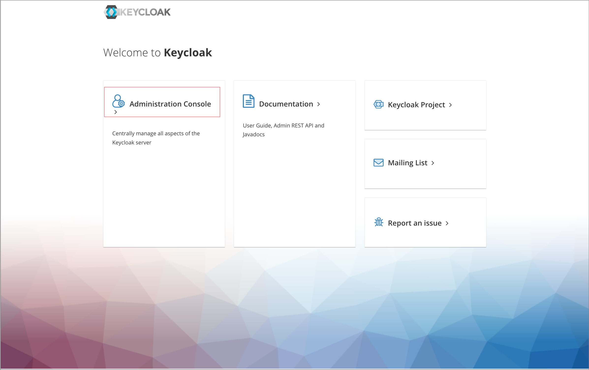
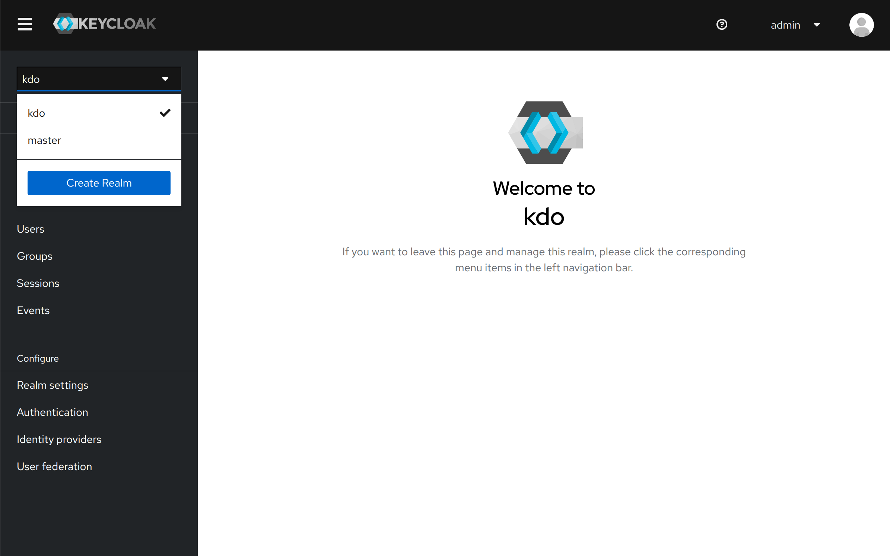
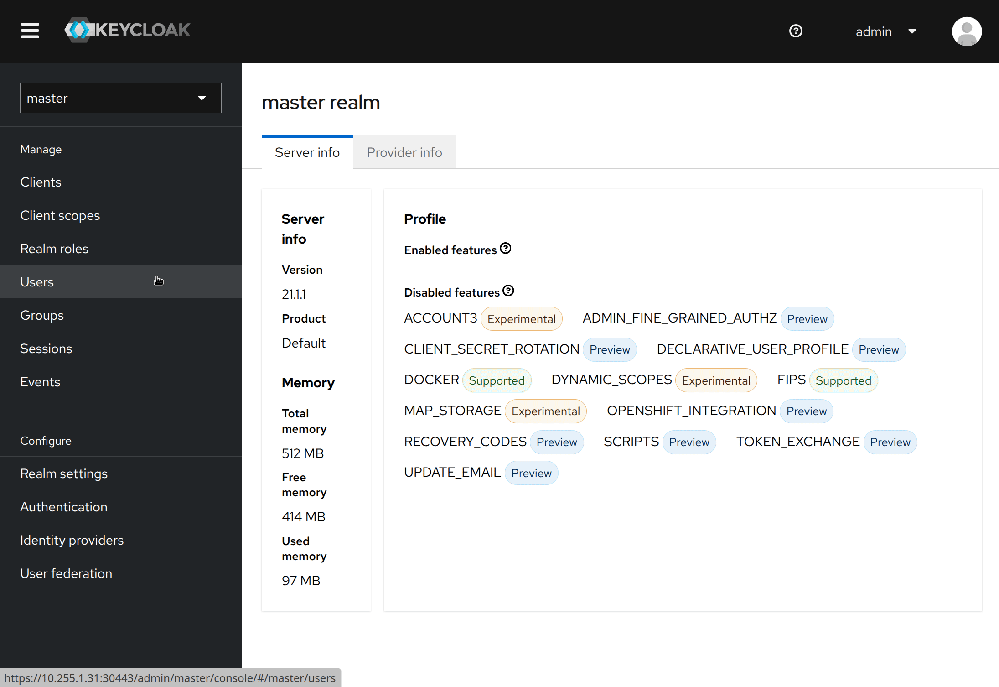
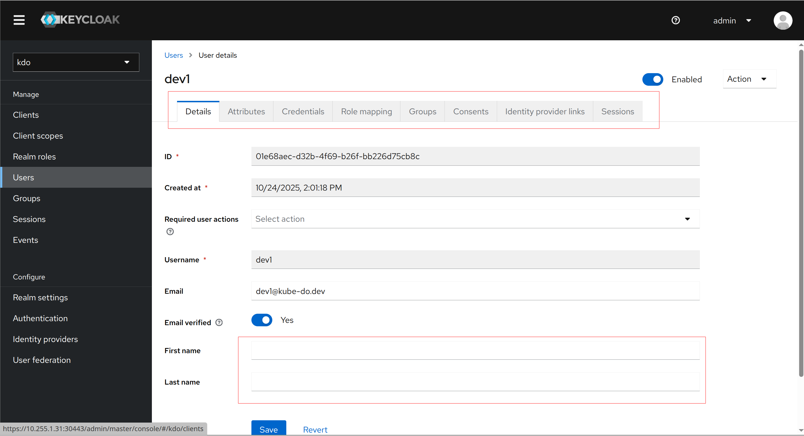
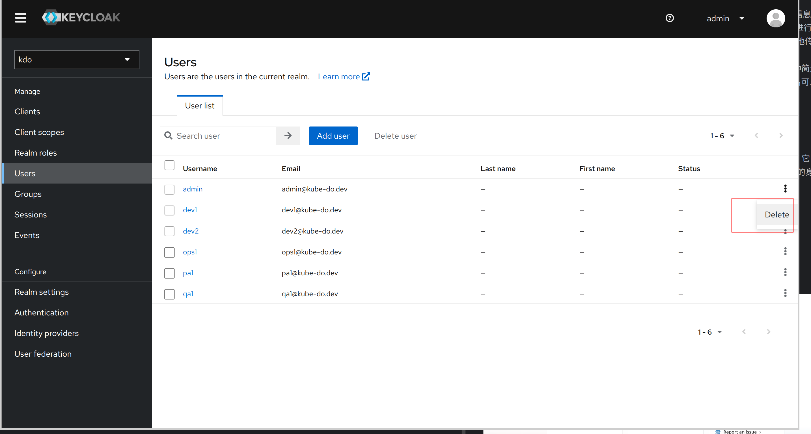

1. TOC
{:toc}

2. 
## 介绍

{: .note }
KDO平台和Kubernetes的身份认证协议是基于[OpenID Connect(OIDC)](#openid-connectoidc介绍)，KDO使用 Keycloak 作为身份认证中心，统一管理对 Kubernetes 集群的访问权限，实现单点登录和基于角色的精细授权。
架构图

##  OpenID Connect（OIDC）介绍
1. OAuth（Open Authorization）是一个关于授权（authorization）的开放网络标准，允许用户授权第三方应用访问他们存储在其他服务提供者上的信息，而不需要将用户名和密码提供给第三方应用。OAuth 在全世界得到了广泛的应用，目前的版本是 2.0 。
2. OpenID Connect (OIDC) 是一种身份验证协议，基于 OAuth 2.0 系列规范。OAuth2 提供了 access_token 来解决授权第三方客户端访问受保护资源的问题，OpenID Connect 在这个基础上提供了 id_token 来解决第三方客户端标识用户身份的问题。
3. OpenID Connect 的核心在于，在 OAuth2 的授权流程中，同时提供用户的身份信息（id_token）给到第三方客户端。id_token 使用JWT（JSON Web Token）格式进行封装，得益于 JWT 的自包含性，紧凑性以及防篡改机制等特点，使得 id_token 可以安全地传递给第三方客户端程序并且易于验证。
4. JSON Web Token（JWT）是一个开放的行业标准（RFC 7519），它定义了一种简洁的、自包含 的协议格式，用于在通信双方间传递 JSON 对象，传递的信息经过数字签名可以被验证和信任。想要了解 JWT 的详细内容参见 JWT（JSON Web Token）。

## Keycloak介绍
Keycloak 是一个开源的、现代的身份和访问管理解决方案，由 Red Hat 开发并维护。它的核心目标是让应用程序和服务能够轻松地获得强大的安全功能，而无需自己实现复杂且易错的身份认证与授权逻辑。
简单来说，Keycloak 充当了你所有应用的 “统一登录中心”。

## Keycloak管理
由于 KDO 使用 Keycloak 作为身份认证中心，所以需要对 Keycloak 进行管理。

[Keycloak 控制台地址](/docs/install#平台组件访问)

1. 访问 Keycloak 控制台,选择`Administration Console`,输入用户名和密码登录

2. 登录后进入 Realm 管理页面，可以看到 Realm 列表，选择 `kdo`，就可以对KDO平台的用户进行管理了

## 用户管理

### 创建用户
1. 登录 Keycloak 控制台，确认Realm是`kdo`, 选择 `Users`，点击 `Add user`，创建用户
2. 用户创建成功后，点击 `Credentials`，设置密码，用户就创建成功了

### 修改用户
1. 登录 Keycloak 控制台，确认Realm是`kdo`, 选择 `Users`，选择 用户，点击 `Edit`

### 删除
1. 登录 Keycloak 控制台，确认Realm是`kdo`, 选择 `Users`，选择 用户，点击 `Delete`

## 用户组管理

### 介绍
用户组（Groups）是Keycloak中用于组织和管理用户的逻辑集合。它们可以帮助你：
**批量管理权限：** 为组分配角色，组内所有用户自动继承
**组织结构映射：** 映射企业中的部门、团队结构
**简化管理：** 减少为每个用户单独配置的工作量

1. 登录 Keycloak 控制台，确认Realm是`kdo`, 选择 `Groups`，创建用户组

### 用户与组关联
分配用户到组,访问管理控制台操作：
Users → 选择用户 → Groups → Join Groups
选择要加入的组