1. TOC
{:toc}

2. 
## 介绍

{: .note }
KDO平台和Kubernetes的身份认证协议是基于[OpenID Connect(OIDC)](#openid-connectoidc介绍)，KDO使用 Keycloak 作为身份认证中心，统一管理对 Kubernetes 集群的访问权限，实现单点登录和基于角色的精细授权。
架构图

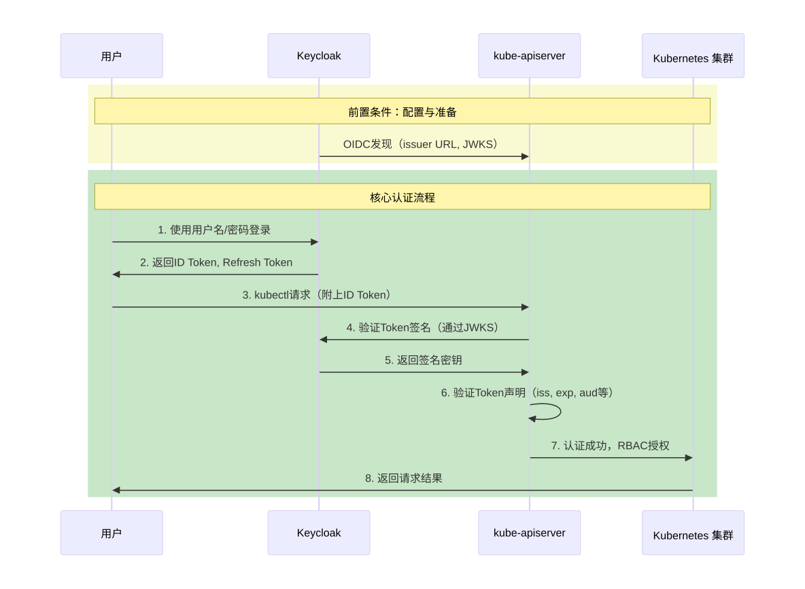

##  OpenID Connect（OIDC）介绍
1. OAuth（Open Authorization）是一个关于授权（authorization）的开放网络标准，允许用户授权第三方应用访问他们存储在其他服务提供者上的信息，而不需要将用户名和密码提供给第三方应用。OAuth 在全世界得到了广泛的应用，目前的版本是 2.0 。
2. OpenID Connect (OIDC) 是一种身份验证协议，基于 OAuth 2.0 系列规范。OAuth2 提供了 access_token 来解决授权第三方客户端访问受保护资源的问题，OpenID Connect 在这个基础上提供了 id_token 来解决第三方客户端标识用户身份的问题。
3. OpenID Connect 的核心在于，在 OAuth2 的授权流程中，同时提供用户的身份信息（id_token）给到第三方客户端。id_token 使用JWT（JSON Web Token）格式进行封装，得益于 JWT 的自包含性，紧凑性以及防篡改机制等特点，使得 id_token 可以安全地传递给第三方客户端程序并且易于验证。
4. JSON Web Token（JWT）是一个开放的行业标准（RFC 7519），它定义了一种简洁的、自包含 的协议格式，用于在通信双方间传递 JSON 对象，传递的信息经过数字签名可以被验证和信任。想要了解 JWT 的详细内容参见 JWT（JSON Web Token）。

## Keycloak介绍
Keycloak 是一个开源的、现代的身份和访问管理解决方案，由 Red Hat 开发并维护。它的核心目标是让应用程序和服务能够轻松地获得强大的安全功能，而无需自己实现复杂且易错的身份认证与授权逻辑。
简单来说，Keycloak 充当了你所有应用的 "统一登录中心"。

## Keycloak管理
由于 KDO 使用 Keycloak 作为身份认证中心，所以需要对 Keycloak 进行管理。

[Keycloak 控制台地址](/docs/install#平台组件访问)

1. 访问 Keycloak 控制台,选择`Administration Console`,输入用户名和密码登录
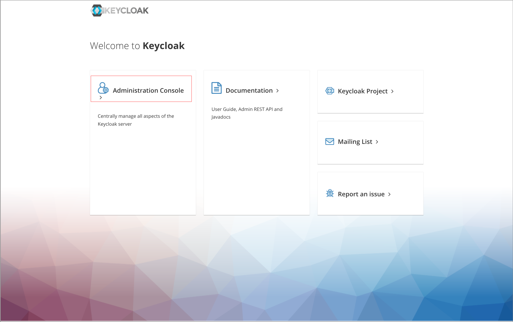

2. 登录后进入 Realm 管理页面，可以看到 Realm 列表，选择 `kdo`，就可以对KDO平台的用户进行管理了
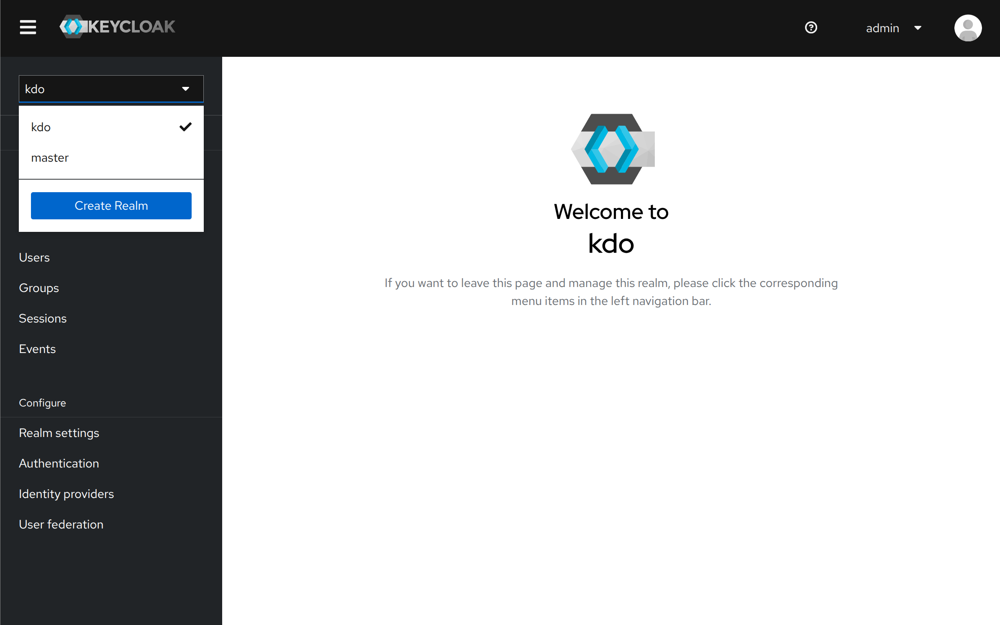

### 控制台导航说明

{: .note }
登录 Keycloak 控制台并选择 `kdo` Realm 后，左侧导航栏包含以下主要功能菜单，后续的用户和用户组管理操作都将在此菜单中进行。

| 菜单 | 说明 |
|------|------|
| **Users** | 用户管理，包括创建、编辑、删除用户及用户密码、角色、会话等管理 |
| **Groups** | 用户组管理，用于组织用户和批量分配权限 |
| **Roles** | 角色管理，定义 Realm 级别的角色 |
| **Clients** | 客户端管理，配置接入 Keycloak 的应用程序（如 `kdo`） |
| **Events** | 事件日志，查看登录、注销等操作记录 |

## 用户管理

### 创建用户
1. 登录 Keycloak 控制台，确认Realm是`kdo`, 选择 `Users`，点击 `Add user`，创建用户
2. 用户创建成功后，点击 `Credentials`，设置密码，用户就创建成功了。
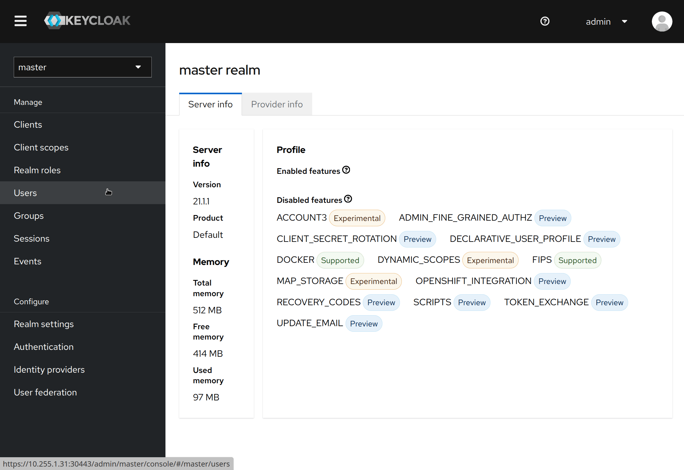

{: .note }
创建用户时需要填写以下信息：

| 字段 | 说明 | 是否必填 |
|------|------|---------|
| **Username** | 用户登录名，唯一标识 | 是 |
| **Email** | 用户邮箱地址 | 否 |
| **First Name** | 用户名 | 否 |
| **Last Name** | 用户姓氏 | 否 |
| **Email Verified** | 邮箱是否已验证，用于控制是否需要邮箱验证后才能登录 | 否 |
| **Enabled** | 用户是否启用，禁用后用户无法登录 | 是（默认开启） |

### 修改用户

1. 登录 Keycloak 控制台，确认Realm是`kdo`, 选择 `Users`，选择 用户，点击 `Edit`
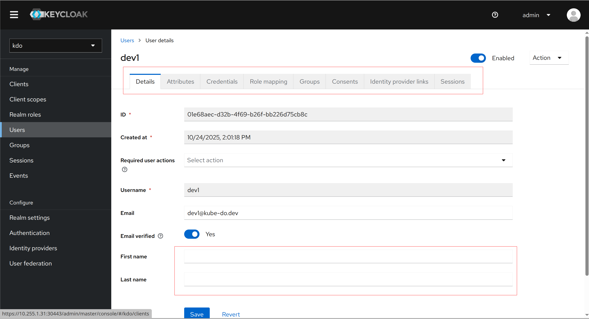

2. 进入用户详情页后，可以看到多个管理标签页：

| 标签页 | 说明 |
|--------|------|
| **Details** | 用户基本信息（用户名、邮箱、姓名、启用状态等） |
| **Credentials** | 密码管理（重置密码、设置临时密码等） |
| **Role Mappings** | 角色分配（Realm 角色和 Client 角色） |
| **Groups** | 用户组关联（加入或退出用户组） |
| **Sessions** | 会话管理（查看活跃会话、强制登出） |
| **Consents** | 授权同意管理 |
| **User Identity Providers** | 第三方身份提供商绑定 |
| **Linked Accounts** | 关联的外部账号 |
| **CustomAttributes** | 自定义属性 |

3. 在 `Details` 标签页中，可以修改用户的以下基本信息：

| 字段 | 说明 |
|------|------|
| **Username** | 用户登录名 |
| **Email** | 邮箱地址 |
| **First Name** | 名 |
| **Last Name** | 姓 |
| **Email Verified** | 邮箱是否已验证 |
| **Enabled** | 用户启用状态 |
| **Required User Actions** | 要求用户执行的操作（如更新密码、验证邮箱等） |

修改完成后，点击 `Save` 保存更改。

### 删除用户
1. 登录 Keycloak 控制台，确认Realm是`kdo`, 选择 `Users`，选择 用户，点击 `Delete`，在Keycloak删除用户后，该用户将无法登录KDO平台。
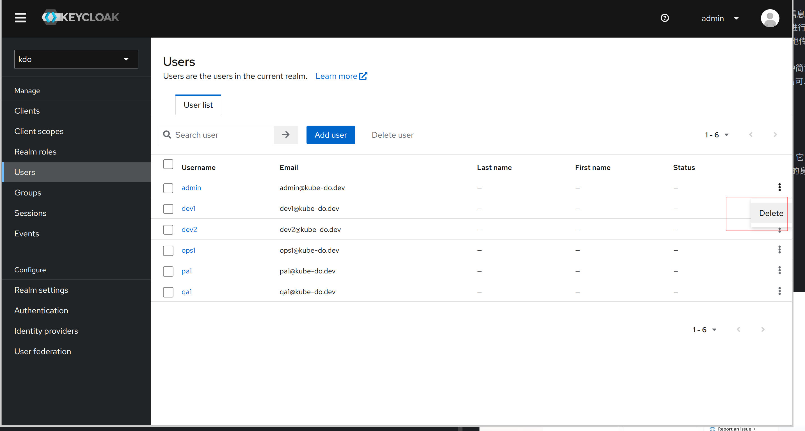

{: .warning }
删除用户操作不可恢复。删除后：
- 该用户将立即无法登录 KDO 平台
- 该用户在 KDO 平台上的所有会话将被终止
- 该用户关联的角色和组关系将被清除
- 已分配给该用户的 Kubernetes RBAC 权限将不再生效

### 密码管理

{: .note }
Keycloak 提供了完整的密码管理功能，包括重置密码、设置临时密码和密码策略配置。管理员可以通过 `Credentials` 标签页对用户密码进行管理。

#### 重置密码

1. 在用户详情页，切换到 `Credentials` 标签页
2. 在 `Set Password` 区域输入新密码
3. 点击 `Set Password` 或 `Save` 完成密码重置

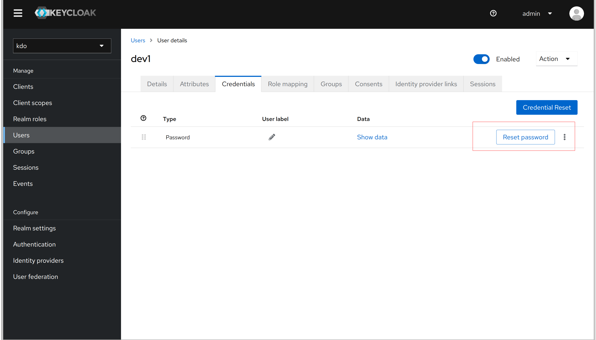

{: .important }
重置密码后，用户之前的所有会话将被强制终止，用户需要使用新密码重新登录。

#### 设置临时密码

1. 在 `Credentials` 标签页的 `Set Password` 区域
2. 勾选 `Temporary` 选项
3. 输入密码后点击 `Set Password`

设置为临时密码后，用户首次登录时会被要求修改密码，只有修改密码后才能正常使用平台。

#### 配置密码策略（管理员）

{: .note }
密码策略可在 Realm 级别配置，影响该 Realm 下所有用户的密码强度要求。

1. 在 Keycloak 控制台，选择左侧菜单 `Realm Settings`（Realm 设置）
2. 切换到 `Security Defenses`（安全防御）标签页
3. 选择 `Brute Force Detection`（暴力破解检测）进行登录失败锁定配置
4. 选择 `Password Policy`（密码策略）配置密码复杂度要求

可配置的密码策略包括：

| 策略 | 说明 |
|------|------|
| **Length** | 密码最小长度 |
| **Digits** | 必须包含的数字个数 |
| **Lowercase Characters** | 必须包含的小写字母个数 |
| **Uppercase Characters** | 必须包含的大写字母个数 |
| **Special Characters** | 必须包含的特殊字符个数 |
| **Not Username** | 密码不能与用户名相同 |
| **Maximum Age** | 密码最大有效期（天） |
| **History** | 不能重复使用最近 N 次使用过的密码 |

### 用户状态管理

#### 启用/禁用用户

{: .warning }
禁用用户后，该用户将无法登录 KDO 平台，但其账号信息、角色分配和组关系会被保留。

1. 在用户详情页的 `Details` 标签页
2. 找到 `Enabled` 开关
3. 关闭开关即可禁用用户，开启即可重新启用
4. 点击 `Save` 保存更改

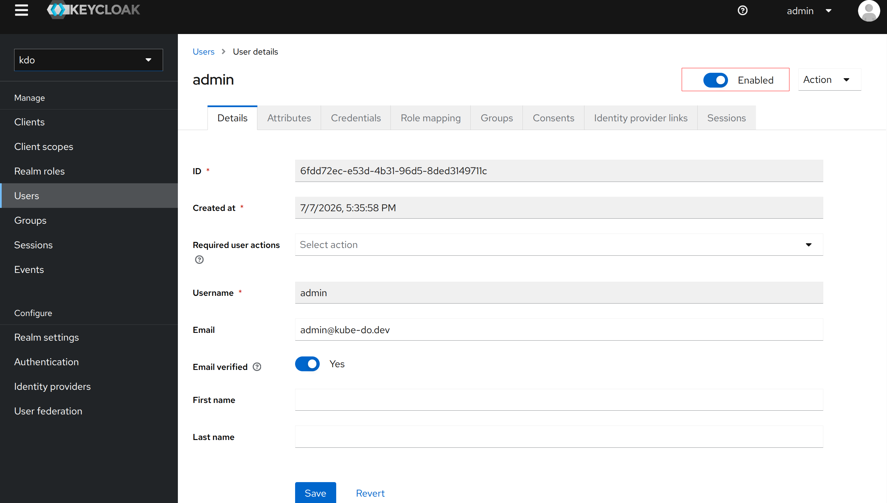

#### 邮箱验证

{: .note }
邮箱验证用于确认用户的邮箱地址是有效的。管理员可以手动标记用户邮箱为已验证状态。

1. 在用户详情页的 `Details` 标签页
2. 找到 `Email Verified` 开关
3. 开启表示邮箱已验证，关闭表示未验证
4. 点击 `Save` 保存更改

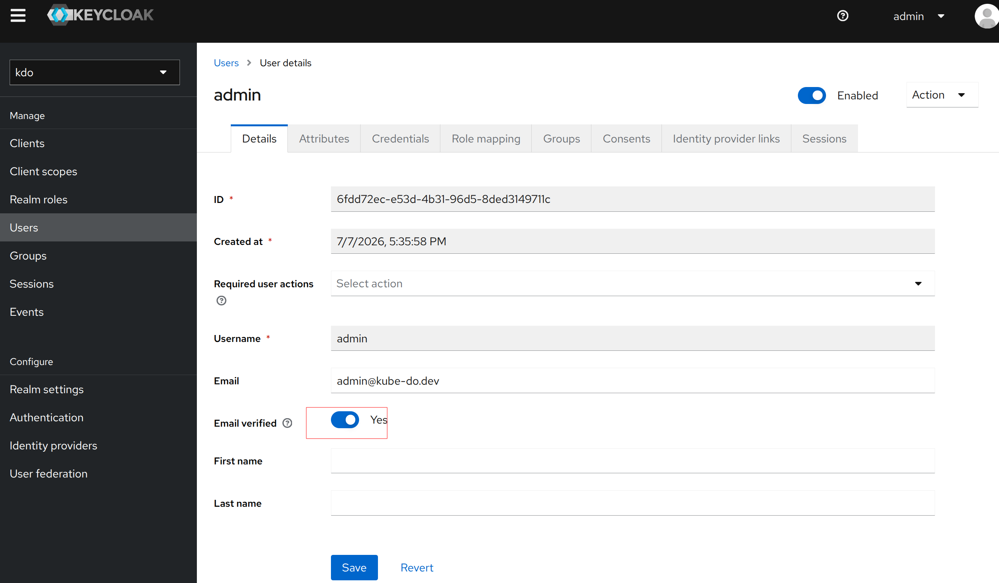

### 角色分配

{: .note }
角色分配用于控制用户在 KDO 平台中的权限。Keycloak 中的角色分为 Realm 角色和 Client 角色两类。Realm 角色是全局角色，Client 角色是针对特定客户端（如 `kdo`）的角色。

#### Realm 角色分配

1. 在用户详情页，切换到 `Role Mappings` 标签页
2. 在 `Realm Roles` 区域，左侧 `Available Roles` 列表中选择要分配的角色
3. 点击 `>>` 按钮将角色移动到 `Assigned Roles` 列表
4. 分配完成后，该用户即获得对应角色的权限

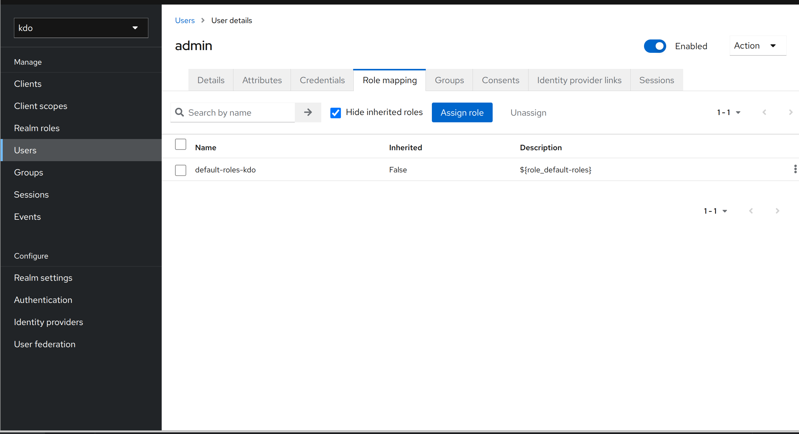

{: .warning }
角色分配直接影响用户在 KDO 平台中的操作权限，请谨慎操作。只有具有管理员权限的用户才能进行角色分配。

#### Client 角色分配

1. 在 `Role Mappings` 标签页，找到 `Client Roles` 区域
2. 选择 `kdo` 客户端
3. 左侧 `Available Roles` 列表中选择要分配的角色
4. 点击 `>>` 按钮将角色移动到 `Assigned Roles` 列表

#### 查看已分配角色

在 `Role Mappings` 标签页中：
- **Realm Roles** — 显示已分配的 Realm 级别角色
- **Client Roles** — 显示已分配的 Client 级别角色（按客户端分组）

已分配的角色会在用户详情页的角色映射中以标签形式展示。

## 用户组管理

### 介绍
用户组（Groups）是Keycloak中用于组织和管理用户的逻辑集合。它们可以帮助你：
**批量管理权限：** 为组分配角色，组内所有用户自动继承
**组织结构映射：** 映射企业中的部门、团队结构
**简化管理：** 减少为每个用户单独配置的工作量

### 创建用户组

1. 登录 Keycloak 控制台，确认Realm是`kdo`, 选择 `Groups`，点击 `Create group`
2. 填写组名称（Name）和可选的描述（Description）
3. 点击 `Save` 完成创建

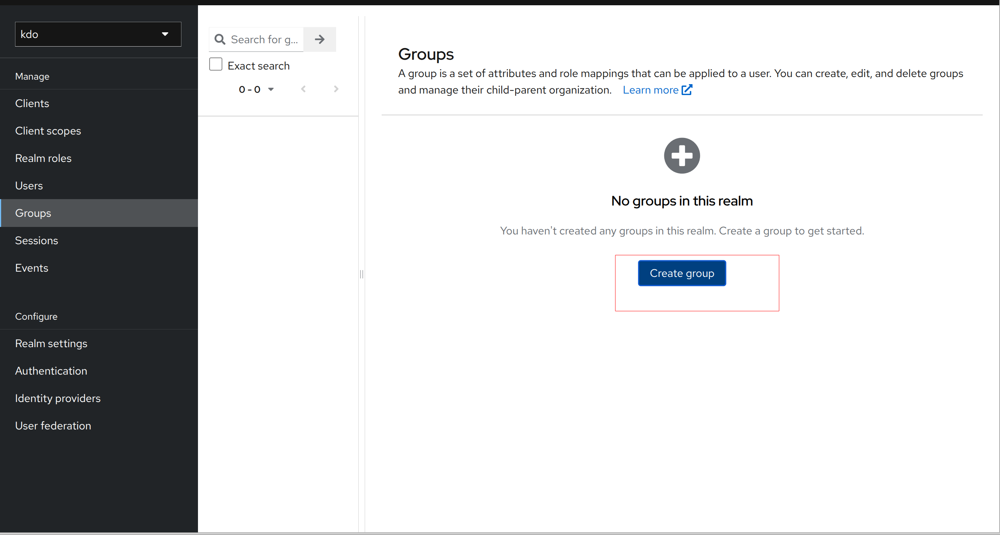

{: .note }
组名称建议使用英文命名，以避免潜在的编码问题。创建后可以添加中文描述以便识别。

### 编辑用户组

1. 在 `Groups` 列表中，点击要编辑的组名称
2. 在组详情页的 `General` 标签页，可以修改组名称和描述
3. 点击 `Save` 保存更改

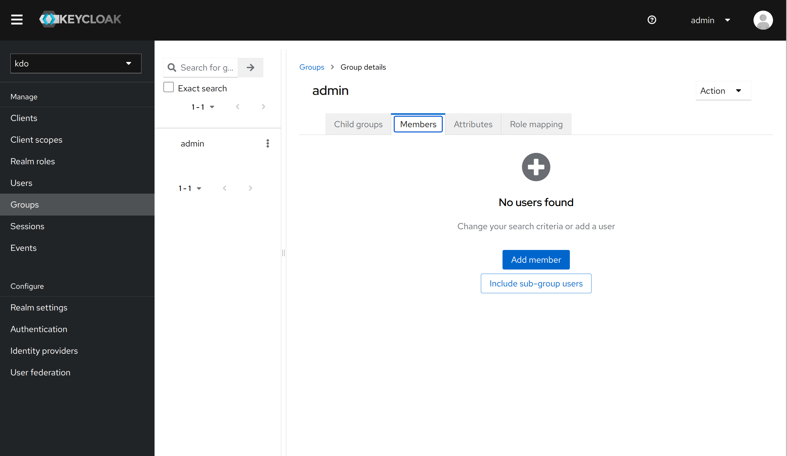

### 删除用户组

1. 在 `Groups` 列表中，选择要删除的组
2. 点击 `Delete` 按钮
3. 在确认弹窗中确认删除

{: .warning }
删除用户组后：
- 该组下的所有用户将自动退出该组
- 为该组分配的角色将不再生效
- 操作不可恢复

### 用户与组关联
分配用户到组,访问管理控制台操作：
`Users → 选择用户 → Groups → Join Groups`
选择要加入的组

#### 将用户加入组

1. 登录 Keycloak 控制台，确认Realm是`kdo`, 选择 `Users`，选择目标用户
2. 切换到 `Groups` 标签页
3. 在 `Available Groups` 列表中选择要加入的组
4. 点击 `>>` 按钮将用户添加到组中
5. 已加入的组会显示在 `Group Membership` 列表中

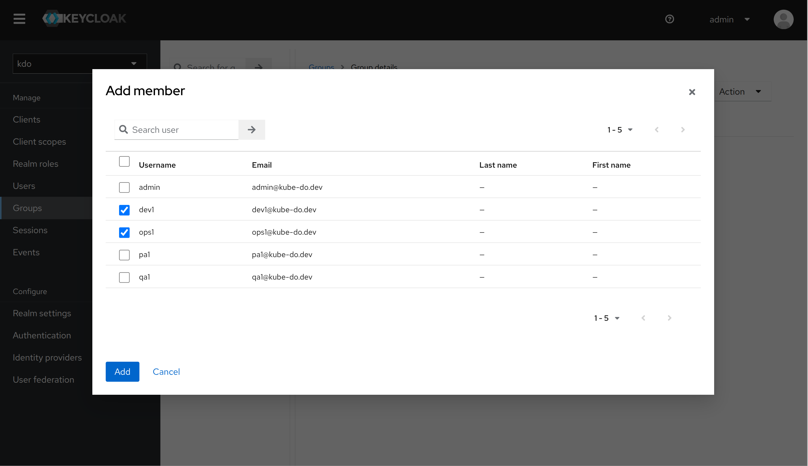

#### 将用户移出组

1. 在用户详情页的 `Groups` 标签页
2. 在 `Group Membership` 列表中选择要退出的组
3. 点击 `<<` 按钮将用户移出该组

{: .note }
用户可以同时属于多个组。组的权限会自动继承给组内的所有用户，无需为每个用户单独配置。

### 组角色分配

{: .note }
为用户组分配角色后，组内所有用户都会自动继承该组的角色权限。这是一种批量授权的有效方式。

1. 登录 Keycloak 控制台，确认Realm是`kdo`, 选择 `Groups`，选择目标组
2. 切换到 `Role Mappings` 标签页
3. 在 `Realm Roles` 区域选择要分配的角色
4. 点击 `>>` 按钮完成分配

{: .important }
组角色分配与用户角色分配的关系：
- 组内用户会同时拥有 **用户直接分配的角色** 和 **组继承的角色**
- 两者是叠加关系，不会互相覆盖
- 如果用户被移出组，该组分配的角色权限将不再对该用户生效

## 会话管理

{: .note }
会话管理用于查看和管理用户的登录会话。管理员可以查看用户的活跃会话，并强制用户登出。

### 查看活跃会话

1. 在用户详情页，切换到 `Sessions` 标签页
2. 该页面显示用户当前所有活跃的登录会话
3. 每个会话显示以下信息：

| 字段 | 说明 |
|------|------|
| **Client** | 登录的应用客户端（如 `kdo`） |
| **IP Address** | 登录时的 IP 地址 |
| **Started** | 会话创建时间 |
| **Last Access** | 最后访问时间 |
| **Expires** | 会话过期时间 |
| **Clients** | 该会话关联的所有客户端 |

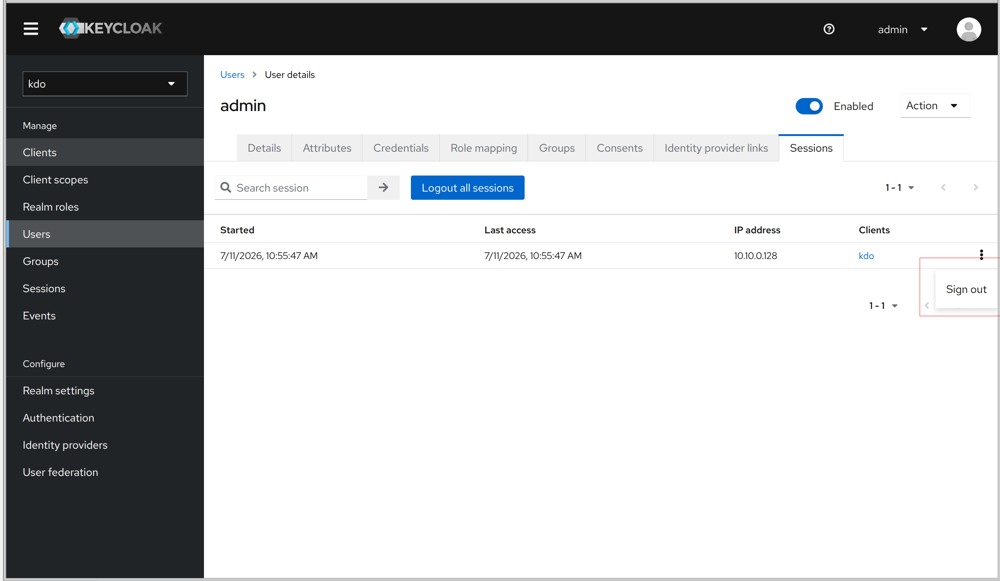

### 强制用户登出

{: .warning }
强制登出将立即终止用户的所有活跃会话，用户需要重新登录才能继续使用平台。

1. 在 `Sessions` 标签页中，找到要终止的会话
2. 点击该会话右侧的 `Logout` 按钮
3. 在确认弹窗中确认登出操作

也可以通过以下方式全局登出用户：
1. 在用户详情页的 `Details` 标签页
2. 点击页面底部的 `Sign out all sessions` 按钮
3. 这将终止该用户的所有活跃会话

{: .note }
以下场景建议强制用户登出：
- 用户账号被盗用或存在安全风险
- 用户忘记登出公共设备
- 密码重置后需要终止旧会话
- 用户角色变更后需要重新认证
