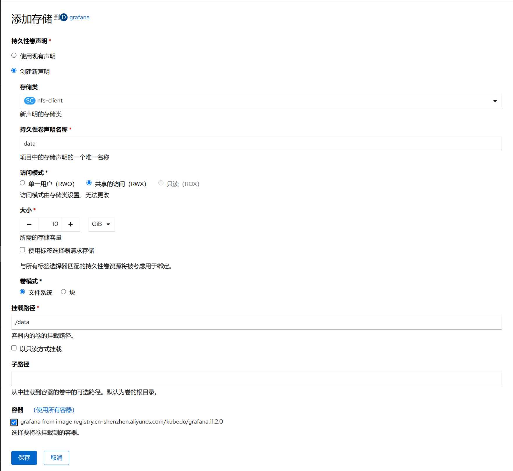

1. TOC
{:toc}

## 介绍
由于容器是一种无状态的服务，所以容器中的文件在宿主机上表现出来的都是临时存放（当容器崩溃或者重启时，容器中的文件会丢失）。
另外，Kubernetes 也需要在 容器组 之间实现数据共享。为了解决这些问题，Kubernetes 与 Docker 一样，也通过使用 数据卷 的方式来实现 数据持久化。
在 Kubernetes 中，数据卷具有明确的生命周期，该生命周期与 容器组 的生命周期相同。即使 容器组 中的容器崩溃或者重启了，其挂载的数据集依然存在。
因此，Kubernetes 中数据卷的生命周期比 容器组 中运行的任何容器的生命周期都要长。Pod 中的容器可以访问挂载的数据卷、读写数据卷中的文件。

## 添加存储到容器组

{: .note }
添加存储到容器组有两种方式，一种是使用现有持久性卷声明(PVC), 另外一种是创建一个新的持久性卷声明

### 使用现有持久性卷声明

如果使用现有的持久性卷声明，一般只需要选择挂载路径即可，如果需要挂载目录的子目录，选择子路径，如果这个容器组有多个容器，选择需要挂载的容器即可。

### [创建持久性卷声明](../../storage#添加持久性卷声明)

