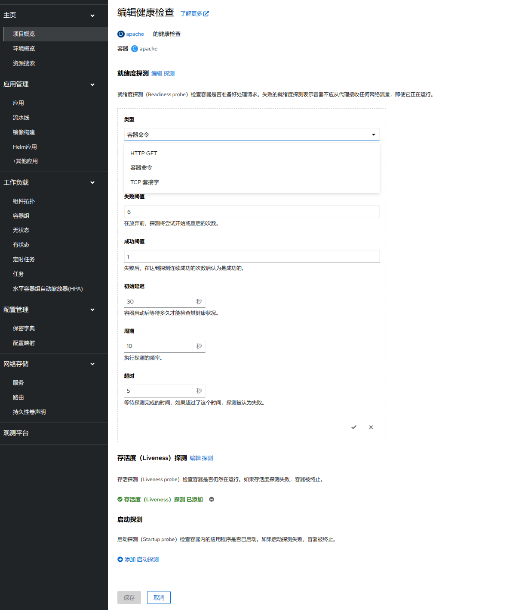
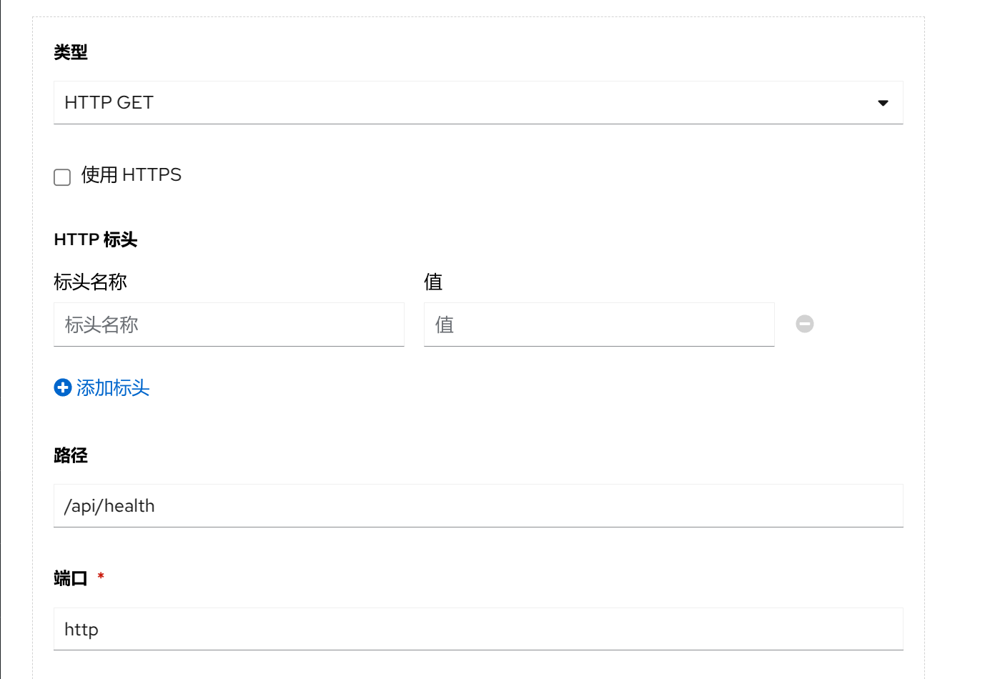
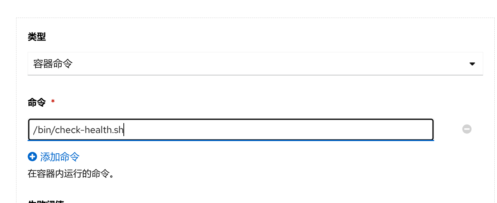
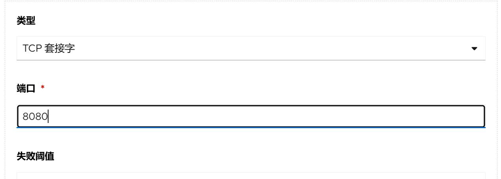

1. TOC
{:toc}

## 探针类型

### 存活探针(Readiness Probe)
存活探针决定何时重启容器。 例如，当应用在运行但无法取得进展时，存活探针可以捕获这类死锁。
如果一个容器的存活探针失败多次，kubelet 将重启该容器。
存活探针不会等待就绪探针成功。 如果你想在执行存活探针前等待，你可以定义初始延迟，或者使用启动探针。

### 就绪探针(Liveness Probe)
就绪探针决定何时容器准备好开始接受流量。 这种探针在等待应用执行耗时的初始任务时非常有用，例如建立网络连接、加载文件和预热缓存。
如果就绪探针返回的状态为失败，Kubernetes 会将该容器组从所有对应服务的端点中移除。
就绪探针在容器的整个生命期内持续运行。

### 启动探针(Startup Probe)
启动探针检查容器内的应用是否已启动。 启动探针可以用于对慢启动容器进行存活性检测，避免它们在启动运行之前就被 kubelet 杀掉。
如果配置了这类探针，它会禁用存活检测和就绪检测，直到启动探针成功为止。
这类探针仅在启动时执行，不像存活探针和就绪探针那样周期性地运行。

## 配置探针

### 探针实现方式

探针有三种方式：

- **HTTP GET**： kubelet 发送一个 HTTP 请求到指定的端口和路径来执行

- **容器命令**： 在容器内执行命令检测

- **TCP套接字**： 使用这种配置时，kubelet 会尝试在指定端口和容器建立TCP连接

### 探针参数
Probe 有很多配置字段，可以使用这些字段精确地控制启动、存活和就绪检测的行为：

- **初始延迟(initialDelaySeconds)**：容器启动后要等待多少秒后才启动启动、存活和就绪探针。 如果定义了启动探针，则存活探针和就绪探针的延迟将在启动探针已成功之后才开始计算。 如果探测周期的值大于初始延迟，则初始延迟将被忽略。默认是 0 秒，最小值是 0。
- **周期(periodSeconds)**：执行探测的时间间隔（单位是秒）。默认是 10 秒。最小值是 1。 当容器未就绪时，存活探针(Readiness Probe) 可能会在除配置的 periodSeconds 间隔以外的时间执行。这是为了让容器组更快地达到可用状态。
- **超时(timeoutSeconds)**：探测的超时后等待多少秒。默认值是 1 秒。最小值是 1。
- **成功阈值(successThreshold)**：探针在失败后，被视为成功的最小连续成功数。默认值是 1。 存活和启动探测的这个值必须是 1。最小值是 1。
- **失败阈值(failureThreshold)**：探针连续失败了 failureThreshold 次之后， Kubernetes 认为总体上检查已失败：容器状态未就绪、不健康、不活跃。 默认值为 3，最小值为 1。 对于启动探针或存活探针而言，如果至少有 failureThreshold 个探针已失败， Kubernetes 会将容器视为不健康并为这个特定的容器触发重启操作。 kubelet 遵循该容器的 terminationGracePeriodSeconds 设置。 对于失败的就绪探针，kubelet 继续运行检查失败的容器，并继续运行更多探针； 因为检查失败，kubelet 将 Pod 的 Ready 状况设置为 false。

[//]: # (- （terminationGracePeriodSeconds）：为 kubelet 配置从为失败的容器触发终止操作到强制容器运行时停止该容器之前等待的宽限时长。 默认值是继承 Pod 级别的 terminationGracePeriodSeconds 值（如果不设置则为 30 秒），最小值为 1。 更多细节请参见探针级别 terminationGracePeriodSeconds。)

