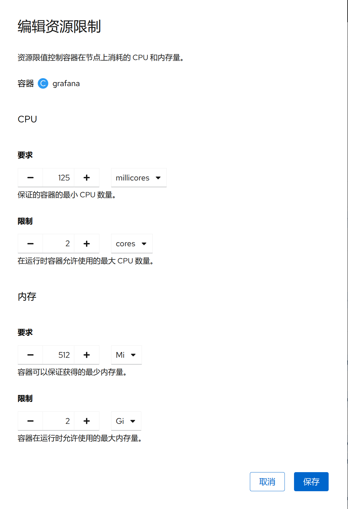

1. TOC
{:toc}

## 介绍

{: .note }
在 Kubernetes 中，要求(requests) 和 要求(limits) 是用于定义容器资源使用量的关键参数。
它们分别指定容器期望使用的最小资源量（requests）和允许的最大资源使用量（limits）。
这些设置对调度、资源分配以及容器的行为有着重要影响。

## Requests和Limit详解

### 要求(Request)

**定义** 要求(requests) 指定了容器需要的最低资源量。这是调度器用来决定哪个节点最适合运行该 Pod 的关键信息。

#### 作用
1. 调度决策：Kubernetes 调度器会确保只有当节点上的可用资源至少等于所有 容器组(Pod) 请求的总和时，才会将 容器组(Pod) 调度到该节点上。
2. 资源预留：即使其他应用没有完全使用其请求的资源，也会为每个 容器组(Pod) 预留它所请求的资源，以保证该 容器组(Pod) 在启动后能够获得所需的资源。
3. 服务质量 (QoS)：根据容器的 requests 和 limits 设置，Kubernetes 会将 容器组(Pod) 分类为不同的 QoS 级别（如 Guaranteed, Burstable, BestEffort），这决定了在资源紧张时哪些 容器组(Pod) 更优先得到资源。

### 要求(Limit)

**定义** 要求(limits) 设定了容器可以使用的最大资源量。一旦容器尝试超过这个限制，Kubernetes 将采取措施限制其资源消耗。

#### 作用

1. 防止资源耗尽：通过设定 limits，你可以防止某个容器无节制地消耗资源，从而保护整个节点和其他 Pod 的稳定性。
2. CPU 超额使用：对于 CPU 资源，如果一个容器在其 requests 之外还有额外的可用资源，它可以利用这些额外资源，直到达到它的 limits。但是，如果系统资源变得紧张，它可能被限制回其 requests 水平。
3. 内存超额使用：对于内存资源，如果容器超过了它的 limits，可能会导致该容器被终止（OOM killed）。

## 编辑资源限制

1. **要求(requests)** 定义了对应容器需要的最小资源量。这句话的含义是，举例来讲，比如对于一个 Spring Boot 业务容器，这里的requests必须是容器镜像中 JVM 虚拟机需要占用的最少资源。如果这里把 pod 的内存requests指定为 10Mi ，显然是不合理的，JVM 实际占用的内存 Xms 超出了 K8s 分配给 pod 的内存，导致 pod 内存溢出，从而 K8s 不断重启 pod 。
2. **限制(limits)** 定义了这个容器最大可以消耗的资源上限，防止过量消耗资源导致资源短缺甚至宕机。特别的，设置为 0 表示对使用的资源不做限制。值得一提的是，当设置limits而没有设置requests时，Kubernetes 默认令requests等于limits。 

进一步可以把requests和limits描述的资源分为 2 类：可压缩资源（例如 CPU ）和不可压缩资源（例如内存）。合理地设置limits参数对于不可压缩资源来讲尤为重要。

## 最佳实践
1. **合理设置:** 应该基于应用程序的实际需求来设置 requests 和 limits。过低的 requests 可能会导致调度问题，而过高的 limits 则可能导致资源浪费。
2. **测试和监控:** 在生产环境中部署之前，建议先在一个测试环境中调整并观察这些值的效果，并结合监控工具持续跟踪资源使用情况。
3. **考虑QoS级别:** 了解不同 QoS 级别的含义，并据此选择合适的 requests 和 limits 设置，以确保关键应用获得足够的资源保障。