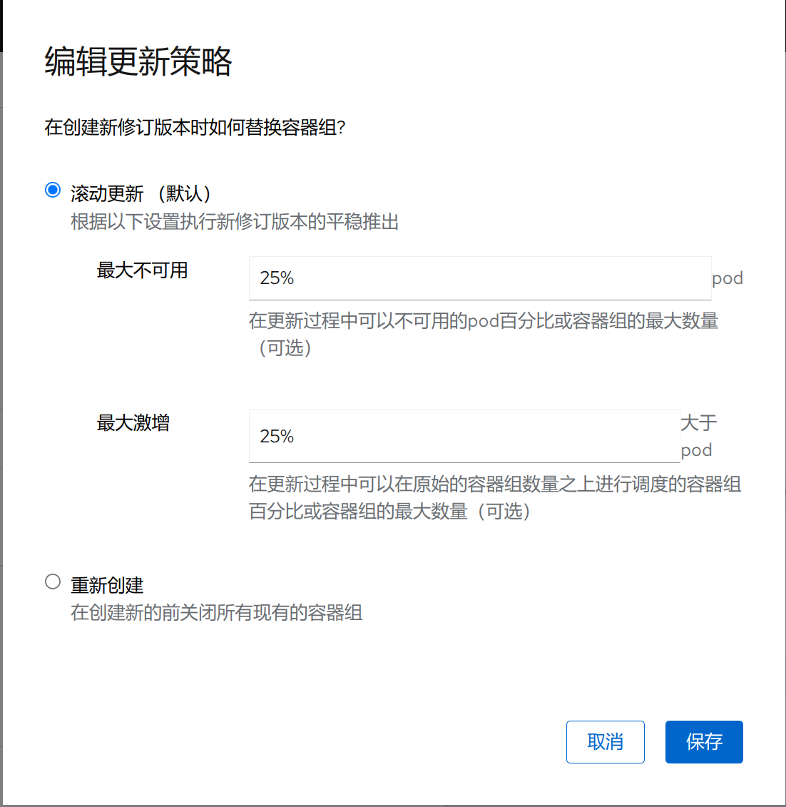

## 介绍
- 在 Kubernetes 中，HorizontalPodAutoscaler(HPA)自动更新工作负载资源 （例如 Deployment 或者 StatefulSet）， 目的是自动扩缩工作负载以满足需求。
- 水平扩缩意味着对增加的负载的响应是部署更多的 Pod。
- 水平 Pod 自动扩缩不适用于无法扩缩的对象（例如：DaemonSet。）
- 在 Kubernetes 控制平面内运行的水平 Pod 自动扩缩控制器会定期调整其目标（例如：Deployment）的所需规模，以匹配观察到的指标， 例如，平均 CPU 利用率、平均内存利用率或你指定的任何其他自定义指标。

## 添加容器组水平自动扩缩(HPA)

