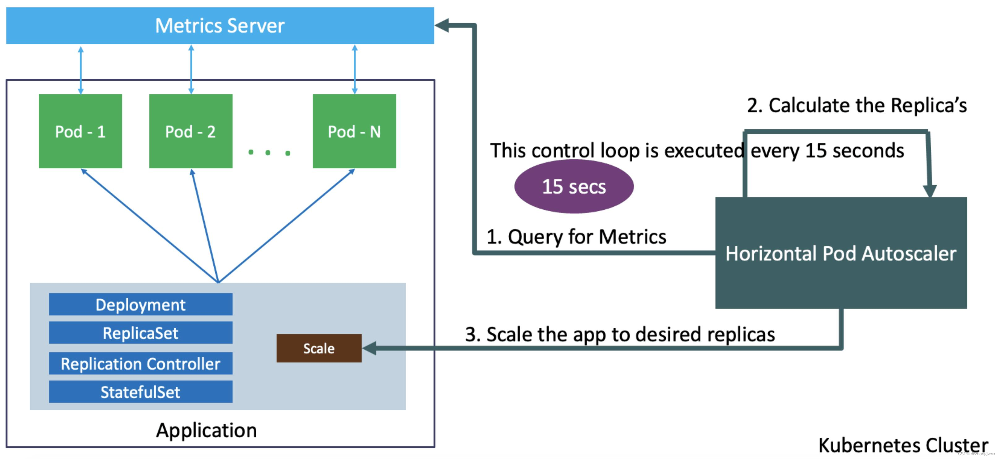
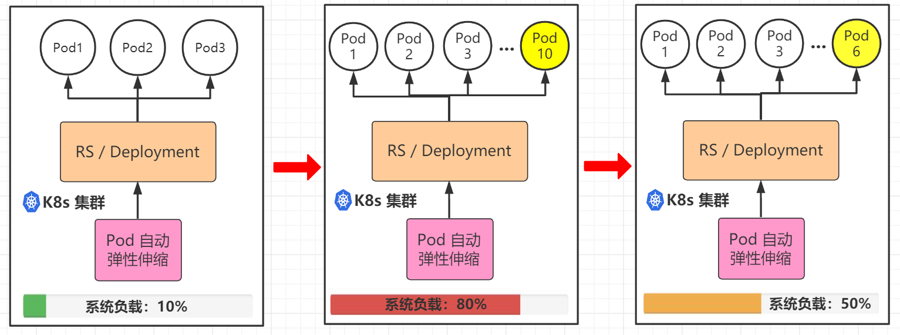

1. TOC
{:toc}

## 介绍

{: .note }
如果您想基于CPU使用率、内存使用率或其他自定义指标实现`容器组(Pod)`的自动扩缩， 建议您为业务容器开启水平伸缩HPA功能 
HPA能够在业务负载急剧飙升时快速扩容多个`容器组(Pod)`副本来缓解压力，也可以在业务负载变小时根据实际情况适当缩容以节省资源，无需您人为干预。 
HPA适用于服务波动较大、服务数量多且需要频繁扩缩容的业务场景，例如电商服务、线上教育、金融服务等。

## 容器组水平自动扩缩的原理
容器组的自动伸缩有两种, 分别是 水平自动伸缩 和 垂直自动伸缩. 水平伸缩, 增加或减少容器组的副本数; 
而自动水平伸缩则是, 根据容器组的 CPU 使用率, 内存或其他自定义指标, 自动地执行容器组的水平伸缩. 
垂直伸缩, 为容器组分配更多或更少的 CPU 和内存; 而自动垂直伸缩则是, 根据容器组的 CPU 使用率, 内存或其他自定义指标, 自动的执行容器组的垂直伸缩. 
目前 KDO 只支持容器组的水平自动伸缩, 所以本文不会涉及太多的 垂直自动伸缩.

## 组件水平自动伸缩

`水平容器组自动扩缩(HPA)` 由两部分组成, HPA 资源 和 HPA 控制器。HPA 资源 定义了组件的行为, 包括指标, 期望值, 和最大最小副本数等。

HPA 控制器, 周期性地检查检查组件所设置的指标; 其周期由` controller manager `的参数 `--horizontal-pod-autoscaler-sync-period` 控制, 默认是 15 秒。

在每个周期中, HPA 控制器通过 mertrics API 查询用户为每个组件设置的指标; 当指标超过或低于期望阈值时, HPA 控制器会调整 `Deployment/Statefulset` 中的副本数, 最后由 `Deployment/Statefulset` 完成组件实例数的增加或减少。

HPA 控制器一般从 `metrics.k8s.io`, `custom.metrics.k8s.io` 和 `external.metrics.k8s.io` 三个聚合 API 观察指标。

`metrics.k8s.io` 这个 API 由 `metrics-server` 提供, 对应的是资源指标(resource metrics), 即 CPU 使用率, CPU 使用量 和 内存使用率, 内存使用量. 也是 KDO 目前支持的指标类型。

`custom.metrics.k8s.io` 对应的是 自定义指标, `external.metrics.k8s.io` 对应的是 外部指标. 比如: 每秒请求数(requests-per-second), 每秒接收的包数(packets-per-second)。
由 `Kube Metrics Adapter`, `Prometheus Adapter`或者是自己实现的遵循了 `Kubernetes metrics API` 定义 的第三方服务提供。自定义指标和外部指标大体上是相同的。

{: .warning } 
水平容器组自动扩缩(HPA)不适用于无法扩缩的对象，例如：`守护进程集(DaemonSet)`。 
在设置HPA之前，资源限制必须设置，参考[资源限制](../edit-resource-limits)

## 容器组水平自动扩缩(HPA)配置

| 菜单        | 说明               |
|:----------|:-----------------|
| 名称        | HPA的名字，一般和工作负载同名 |
| 最小容器组数    | 最少运行的容器组副本数      |
| 最大容器组数    | 最多运行的容器组副本数      |
| CPU使用率(%) | 当CPU达到多少百分百开始扩容  |
| 内存使用率(%)  | 当内存达到多少百分百开始扩容   |

