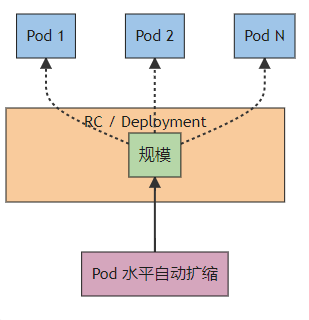
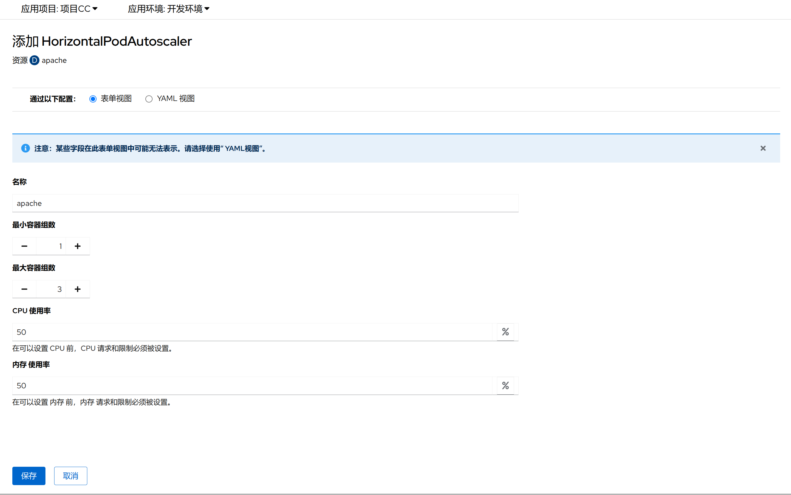

1. TOC
{:toc}

## 介绍

{: .note }
如果您想基于CPU使用率、内存使用率或其他自定义指标实现`容器组(Pod)`的自动扩缩， 建议您为业务容器开启水平伸缩HPA功能 
HPA能够在业务负载急剧飙升时快速扩容多个`容器组(Pod)`副本来缓解压力，也可以在业务负载变小时根据实际情况适当缩容以节省资源，无需您人为干预。 
HPA适用于服务波动较大、服务数量多且需要频繁扩缩容的业务场景，例如电商服务、线上教育、金融服务等。

{: .warning } 
水平容器组自动扩缩(HPA)不适用于无法扩缩的对象（例如：守护进程集(DaemonSet)） 
在设置HPA之前，资源限制必须设置，参考[资源限制](../edit-resource-limits)

## 容器组水平自动扩缩(HPA)配置

| 菜单        | 说明               |
|:----------|:-----------------|
| 名称        | HPA的名字，一般和工作负载同名 |
| 最小容器组数    | 最少运行的容器组副本数      |
| 最大容器组数    | 最多运行的容器组副本数      |
| CPU使用率(%) | 当CPU达到多少百分百开始扩容  |
| 内存使用率(%)  | 当内存达到多少百分百开始扩容   |

