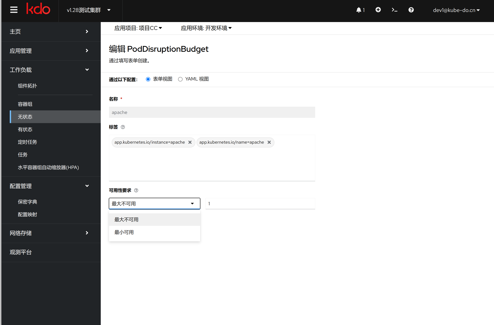

1. TOC
{:toc}

## 介绍

{: .note }
Kubernetes 的 PodDisruptionBudget (PDB) 是一种资源对象，它允许用户定义应用程序可以容忍的中断程度。
通过设置 PDB，你可以确保在计划内维护（例如节点升级、自动缩放等）期间，关键应用始终有一定数量的 Pod 在运行，从而避免服务不可用的情况

## 使用场景
1. **高可用性应用:** 对于需要保证一定水平的服务可用性的应用，比如数据库集群、API 服务器等，可以利用 PDB 来防止由于计划内的操作而导致的服务中断。
2. **批处理作业:** 对于那些即使部分失败也可以接受的任务，可以设置较低的 minAvailable 或较高的 maxUnavailable，以便更灵活地响应集群变化。
3. **节点维护:** 当执行节点级别的维护任务时，如更新操作系统或 Kubernetes 版本，PDB 可以帮助确保只有在安全的情况下才会迁移 Pod。

{: .warning }
PDB 仅适用于自愿中断（voluntary disruptions），如节点排空（drain）。对于非自愿中断（involuntary disruptions），如硬件故障或节点宕机，PDB 不起作用。
如果你的应用没有合适的标签选择器，那么 PDB 将不会生效。
PDB 应该根据实际业务需求和系统架构合理设计，以平衡可靠性和灵活性。

## 配置方式
PDB 可以通过以下两种方式之一来定义：
1. **minAvailable(最小可用):** 指定最小可用 Pod 数量或百分比。
2. **maxUnavailable(最大不可用):** 指定最大不可用 Pod 数量或百分比。

