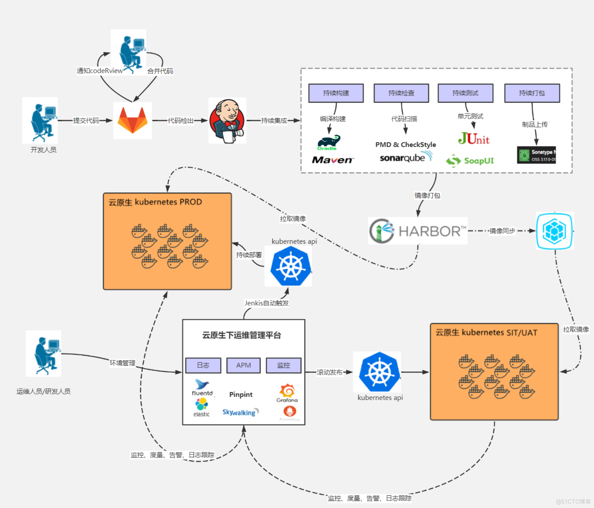

## KDO 是什么

{: .note }
KDO(Kubedo DevOps) 是一个先进的云原生基础设施平台，它极大地简化了企业应用的全生命周期管理，无需深入了解容器、Kubernetes或底层复杂技术。
该平台不仅支持多Kubernetes集群的管理，还为企业提供了一系列强大的功能，包括但不限于应用开发环境、应用市场、微服务架构、应用交付与运维以及应用级多云管理。
基于开源技术，KDO平台在多个关键业务场景中扩展了其功能，尤其是在多云集群管理、微服务治理和应用管理方面进行了深度优化和增强。

## 平台亮点

1. **一键应用自动化:**  只需要一个`Git URL`，不用写 `Dockerfile` 和 `Yaml` 即可完成构建和运行，支持多种语言如 Java、Python、Golang、NodeJS、Php、.NetCore 等。
不需要懂Docker 、Kubernetes等技术，就能将应用部署起来，具备云原生应用的全部特性，并且支持多环境和多集群。[详情](docs/dev/applications/repository#创建应用)
2. **支持三位一体开发的开发体验:** KDO平台支持在桌面IDE、WebIDE以及KDO平台本身这三个环境中对应用进行操作和管理。开发者能够直接在他们偏好的集成开发环境（IDE）中完成大多数操作，从而享受更加流畅和高效的开发体验。
3. **安装手机App一样安装云原生应用:** 各类云原生应用以应用模板的形式存储在应用市场中，便于用户对接各种基础设施或云资源，实现应用的即点即用或一键安装与升级。这种方式不仅简化了部署流程，还提高了应用管理的效率和灵活性，使用户能够快速响应业务需求，无缝集成新的功能和服务
4. **丰富地可观测性:** KDO平台提供了全面的可观测性功能，涵盖了集群监控、节点监控、应用监控以及组件监控。这一全方位的监控体系确保了用户可以实时跟踪平台各个层面的运行状态，及时发现并解决潜在问题，从而保障系统的稳定性和性能。[详情](docs/observability)
5. **应用全生命周期管理:** 支持应用、组件全生命周期管理和运维，如启动、停止、构建、更新、自动伸缩、网关策略管理等，无侵入微服务架构。
6. **开发运维一体化:**  在同一套平台内，KDO同时提供了[开发者界面](./docs/dev)和[管理员界面](./docs/admin)，简化了平台的整体架构并提升了用户体验。通过精心设计的应用级抽象层，普通开发者仅需了解应用的相关属性即可轻松进行应用运维。此外，平台还支持通过插件扩展诸如监控、性能分析、日志管理及安全增强等运维能力，使得开发者能够根据需要灵活增强其应用的管理和维护功能。
7. **安装简单:** 仅需一台普通的Linux机器，即可轻松安装整个KDO平台，快速搭建起一个公司的云原生基础设施平台。这种简洁而强大的部署方式，使得任何规模的团队都能够迅速启动并运行其云原生应用，极大地降低了初始设置的复杂性和成本。[详情](docs/install)
8. **强大的命令行工具** KDO平台同时支持`CloudShell`和`LocalShell`两种命令模式，确保用户能够通过命令行便捷地操作平台。利用LocalShell，开发者可以迅速实现KDO与本地IDE的集成，从而在熟悉的开发环境中高效工作。[详情](docs/terminal)

