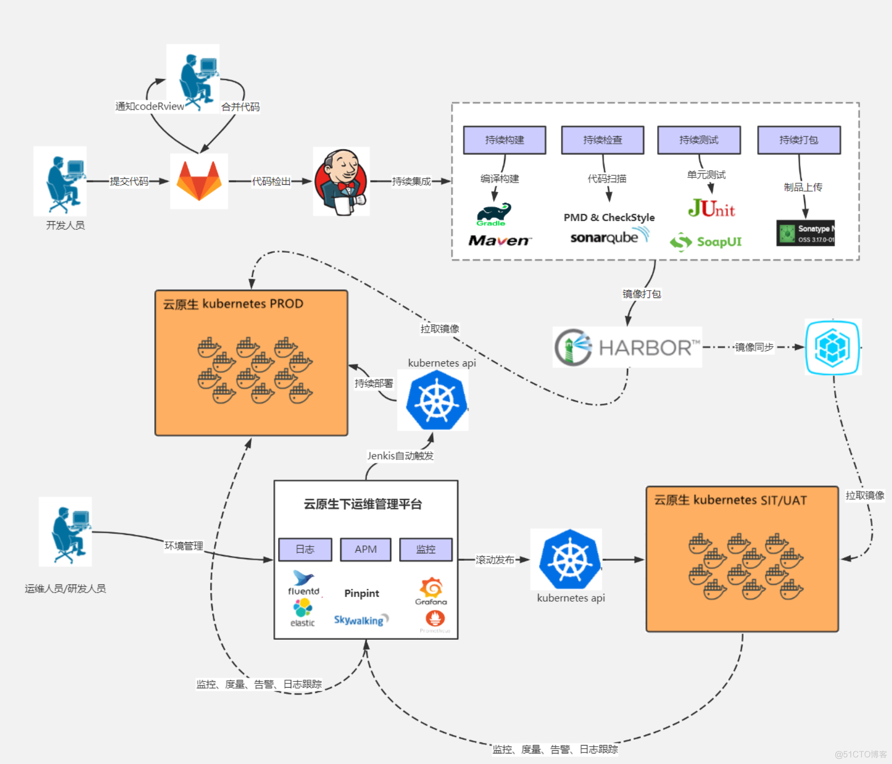

## KDO 是什么

{: .note }
**KDO (Kubedo DevOps)** 是一个先进的云原生基础设施平台，极大地简化了企业应用的全生命周期管理。用户无需深入了解容器、Kubernetes 或底层复杂技术，即可快速部署、管理和运维云原生应用。

**平台特点：**
- ✅ 支持多 Kubernetes 集群统一管理
- ✅ 覆盖开发、测试、生产的完整流程
- ✅ 基于开源技术，深度优化企业场景
- ✅ 应用级多云管理能力

{: .img-responsive }

## 平台亮点

### 1. 一键应用自动化

只需提供 Git 仓库地址，无需手写 Dockerfile 和 YAML，即可完成应用的构建与运行。支持 Java、Python、Golang、NodeJS、PHP、.NET Core 等多种语言。

- 自动识别构建指令
- 多环境、多集群支持
- 详情：[创建应用](/docs/dev/applications/repository/#创建应用)

### 2. 三位一体的开发体验

支持桌面 IDE、WebIDE 和 KDO 平台本身三种环境进行应用管理。开发者可在偏好的集成开发环境中完成绝大多数操作，享受流畅高效的开发体验。

- 本地开发与云端部署无缝衔接
- 详情：[终端访问](/docs/terminal/)

### 3. 应用即点即用

应用市场提供丰富的云原生应用模板（如 MySQL、Redis、Nginx），像安装手机 App 一样一键安装、升级和管理。

- 内置 Helm Chart 仓库
- 支持 OperatorHub 生态
- 详情：[Helm 应用](/docs/dev/applications/helm/)

### 4. 全方位可观测性

集成监控、日志、事件追踪三大支柱，实时掌握集群和应用的运行状态。

- 指标（Prometheus + Grafana）
- 日志（Elasticsearch + Fluent Bit）
- 链路追踪（Jaeger）
- 详情：[可观测性概览](/docs/observability/)

### 5. 应用全生命周期管理

支持从创建到停用的完整流程：启动、停止、构建、更新、自动伸缩、网关策略管理等，提供无侵入的微服务架构治理。

- 详情：[工作负载操作](/docs/dev/workload-actions/)

### 6. 开发运维一体化

在同一平台内提供统一的开发者界面和管理员界面，简化架构，提升体验。

- 开发者专注应用代码
- 管理员管理集群资源
- 详情：[开发者指南](/docs/dev/) · [管理员手册](/docs/admin/)

### 7. 一键部署

仅需一台 Linux 机器，即可全自动化安装 KDO 平台，快速搭建企业级云原生基础设施。

- 30 分钟完成安装
- 详情：[安装指南](/docs/install/kdo/)

### 8. 强大的命令行工具

提供 CloudShell（浏览器内）和 LocalShell（本地集成）两种终端，满足不同场景的 CLI 需求。

- 详情：[终端访问](/docs/terminal/)

### 9. 丰富的应用市场

内置多种应用模板，涵盖数据库、中间件、开发工具等，一键安装到集群。

- 详情：[应用管理](/docs/dev/applications/)

### 10. 智能 AIOps

利用机器学习实现智能告警、容量预测、根因分析，提升平台运维效率。

- 详情：[AIOps 模块](/docs/aiops/)

---

## 🚀 开始使用

准备好体验 KDO 了吗？按照以下步骤快速上手：

### 1. 安装平台

如果你是首次使用，建议先[安装 KDO 平台](/docs/install/kdo/)。

- 支持一对一集群和多集群架构
- 自动化安装脚本，30 分钟完成
- 详细参数说明和环境要求

### 2. 创建第一个应用

平台安装完成后，尝试[创建你的第一个应用](/docs/dev/applications/repository/)：

1. 准备一个 Git 仓库（包含代码和 Dockerfile）
2. 在 KDO 控制台填写 Git URL 和 Token
3. 配置应用端口和资源
4. 提交后自动触发构建和部署

### 3. 探索开发者控制台

了解[开发者界面](/docs/dev/home/)的主要功能：

- **项目概览**：查看团队、应用、资源统计
- **环境概览**：掌握当前环境状态
- **资源搜索**：快速定位工作负载、配置、服务

### 4. 配置可观测性（可选）

为了更好的运维体验，建议配置[监控](/docs/observability/monitoring/)和[日志](/docs/observability/logging/)：

- 查看集群健康状态
- 设置告警规则
- 分析应用性能指标

---

## 📚 文档说明

- **版本**：本文档适用于 KDO v1.x 及以上版本
- **更新**：最后更新于 2026-04-11
- **反馈**：如有问题，请提交 [Issue](https://github.com/kube-do/kdo/issues)

---

## 🔗 常用链接

| 类别 | 链接 |
|------|------|
| 官方站点 | [https://docs.kube-do.cn](/docs/) |
| GitHub 仓库 | [kube-do/kdo](https://github.com/kube-do/kdo) |
| 快速安装 | [/docs/install/kdo/](/docs/install/kdo/) |
| 开发者指南 | [/docs/dev/](/docs/dev/) |
| 管理员手册 | [/docs/admin/](/docs/admin/) |
| API 参考 | [/docs/api/](/docs/api/) |
